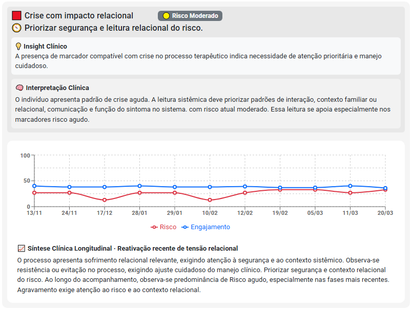
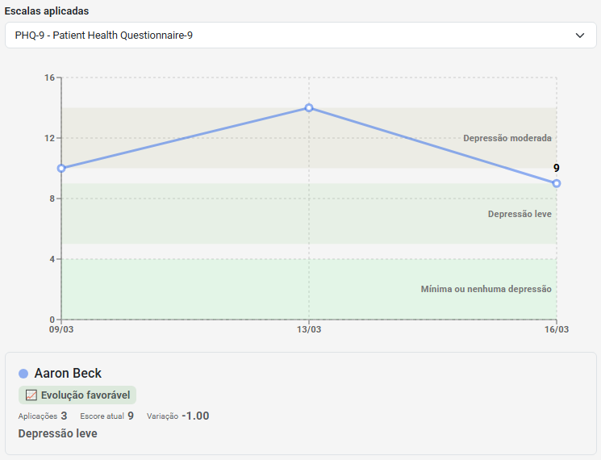

# Integração com Marcadores Clínicos

***🧩 DUAS PERSPECTIVAS. UMA VISÃO CLÍNICA MAIS COMPLETA.***

Durante um acompanhamento clínico, diferentes fontes de informação contribuem para a compreensão da trajetória da pessoa atendida.

Algumas informações surgem a partir da observação clínica realizada pelo profissional.

Outras surgem a partir da percepção do próprio paciente.

Quando essas informações são analisadas de forma integrada, tornam-se uma importante fonte de apoio para o acompanhamento longitudinal.

É justamente essa integração que o eConsult busca oferecer.

---

## O que são Marcadores Clínicos?

Os Marcadores Clínicos são registros estruturados que permitem documentar observações relevantes identificadas durante o processo de acompanhamento.

Eles podem representar aspectos como:

* sintomas observados
* funcionalidade
* engajamento terapêutico
* adesão ao tratamento
* qualidade de vida
* aliança terapêutica
* fatores de risco
* contexto psicossocial

Os marcadores refletem a percepção clínica do profissional ao longo das sessões.

---

## O que são Avaliações Psicológicas?

As avaliações correspondem a instrumentos utilizados para ampliar a compreensão de determinados aspectos do acompanhamento.

Podem incluir:

* escalas científicas validadas
* questionários de rastreamento
* instrumentos de monitoramento
* escalas assistivas
* avaliações próprias da instituição ou profissional

Essas informações representam a percepção relatada pelo paciente ou coletada durante a aplicação do instrumento.

---

## Duas fontes de informação complementares

Marcadores Clínicos e Avaliações não possuem a mesma finalidade.

Eles observam o caso a partir de perspectivas diferentes.

### Marcadores Clínicos

Os Marcadores Clínicos representam a percepção estruturada do profissional ao longo do acompanhamento.

Eles permitem registrar aspectos relevantes observados durante as sessões, transformando observações clínicas em informações organizadas para acompanhamento longitudinal.

Podem refletir elementos como:

* sintomas e sofrimento psicológico
* funcionalidade e qualidade de vida
* engajamento terapêutico
* fatores de risco
* contexto relacional e psicossocial
* evolução observada ao longo do processo

Ao serem registrados continuamente, os marcadores possibilitam visualizar tendências, identificar mudanças relevantes e compreender a trajetória clínica da pessoa atendida de forma mais ampla.

<small>Exemplo de acompanhamento longitudinal baseado em Marcadores Clínicos, permitindo visualizar padrões de evolução, engajamento e fatores de risco ao longo do processo terapêutico.</small>

---

### Avaliações Psicológicas

As Avaliações Psicológicas representam uma importante fonte de informação sobre como a própria pessoa atendida percebe sua condição, seus sintomas e sua evolução ao longo do acompanhamento.

Por meio de instrumentos estruturados, elas permitem monitorar aspectos específicos de forma padronizada e acompanhar mudanças ao longo do tempo.

Podem contribuir para a observação de:

* sintomas e sofrimento psicológico
* qualidade de vida
* funcionalidade
* bem-estar
* fatores de risco
* resposta ao tratamento

Ao serem reaplicadas periodicamente, as avaliações possibilitam visualizar tendências, identificar melhorias ou agravamentos e acompanhar a evolução clínica de forma mais objetiva.

<small>Exemplo de acompanhamento longitudinal utilizando o PHQ-9, permitindo monitorar a evolução dos sintomas depressivos e identificar mudanças ao longo do processo terapêutico.</small>

---

## Quando as informações convergem

Em muitos casos, os resultados das avaliações psicológicas acompanham tendências observadas nos Marcadores Clínicos.

Essa convergência ocorre quando diferentes fontes de informação apontam para uma compreensão semelhante da evolução do caso.

Por exemplo:

* redução dos sintomas relatados pelo paciente acompanhada de menor sofrimento observado em sessão
* melhora dos indicadores de funcionalidade associada a avanços percebidos no processo terapêutico
* aumento do engajamento terapêutico observado tanto em avaliações quanto nos registros clínicos
* diminuição de fatores de risco acompanhada por maior estabilidade emocional e relacional

A convergência entre essas perspectivas fortalece a consistência das evidências clínicas disponíveis, contribuindo para uma compreensão mais ampla da trajetória da pessoa atendida.

Ao longo do acompanhamento, a combinação entre a percepção do paciente e a observação do profissional pode oferecer maior segurança para a identificação de padrões, mudanças relevantes e tendências de evolução clínica.

---

## Quando as informações divergem

Nem sempre as informações seguem a mesma direção.

Um paciente pode apresentar:

* melhora observada pelo profissional
* percepção subjetiva de pouca evolução

Ou ainda:

* redução de sintomas em avaliações
* manutenção de dificuldades observadas em sessão

Essas diferenças não representam erros.

Frequentemente constituem informações clínicas relevantes que merecem atenção e aprofundamento.

---

## Integração ao acompanhamento longitudinal

No eConsult, avaliações e marcadores podem ser analisados de forma integrada ao histórico clínico.

Isso permite:

* visualizar tendências ao longo do tempo
* acompanhar mudanças relevantes
* identificar padrões de evolução
* observar fatores de risco
* compreender diferentes dimensões do processo terapêutico

O foco não está em uma avaliação isolada, mas na trajetória clínica construída ao longo do acompanhamento.

---

## Apoio à Inteligência Clínica Longitudinal

As informações registradas podem contribuir para uma visão mais ampla do caso.

A integração entre:

* anamnese
* registros clínicos
* marcadores clínicos
* avaliações psicológicas
* histórico longitudinal

favorece a construção de evidências clínicas estruturadas para acompanhamento e análise.

---

## Integração com recursos assistidos por IA

Quando utilizadas em conjunto, essas informações podem servir como subsídio para análises assistidas por Inteligência Artificial.

Dependendo do contexto clínico, as informações podem contribuir para:

* formulação de hipóteses clínicas
* análise da evolução
* hipóteses prognósticas
* identificação de fatores relevantes
* apoio ao planejamento terapêutico

As análises possuem caráter assistivo e não substituem a avaliação profissional.

---

## Flexibilidade para diferentes abordagens

Nem todos os profissionais utilizam avaliações psicológicas em sua prática.

Por isso, o eConsult permite diferentes formas de utilização.

O profissional pode trabalhar com:

* apenas Marcadores Clínicos
* apenas Avaliações
* Marcadores e Avaliações de forma integrada

A plataforma adapta-se às necessidades e características de diferentes abordagens clínicas.

---

## Conclusão

A integração entre Marcadores Clínicos e Avaliações Psicológicas amplia as possibilidades de acompanhamento longitudinal.

Ao combinar a percepção clínica do profissional com informações obtidas por instrumentos estruturados, torna-se possível construir uma visão mais abrangente da trajetória do paciente ao longo do tempo.

Mais do que reunir dados, o objetivo é transformar informações dispersas em evidências clínicas que apoiem uma compreensão mais consistente da evolução clínica.
