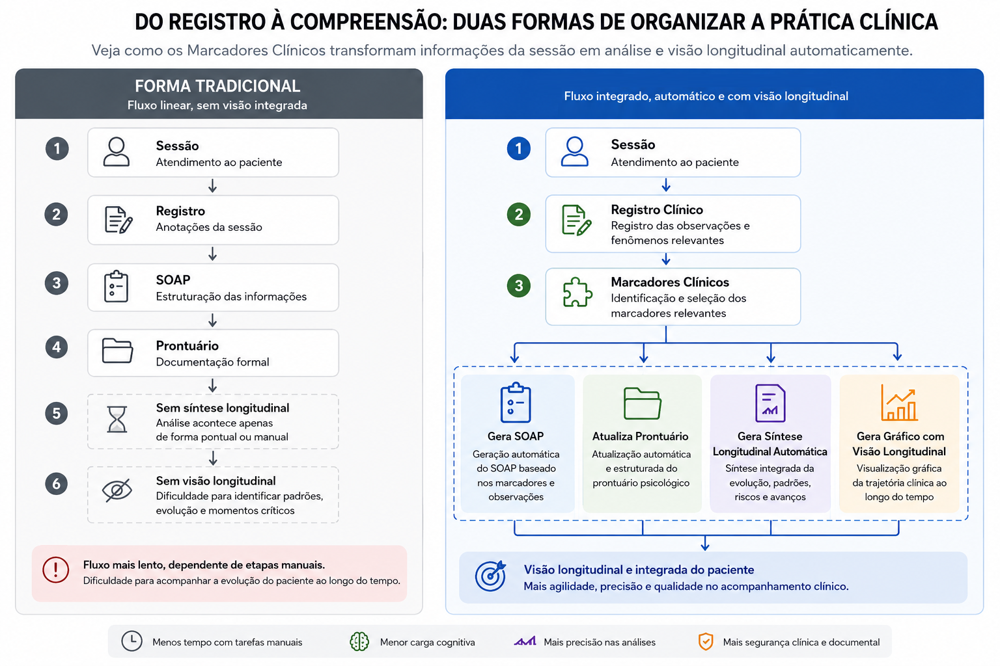

# Leitura Evolutiva do Caso

***📈 COMPREENDENDO A TRAJETÓRIA CLÍNICA ALÉM DOS DADOS ISOLADOS***

Uma avaliação isolada pode indicar um momento.

Um marcador clínico pode registrar uma observação específica.

Um registro clínico pode descrever um evento importante.

Mas compreender a evolução de um caso exige observar como essas informações se relacionam ao longo do tempo.

É justamente esse processo que chamamos de **Leitura Evolutiva do Caso**.

---

## O que é Leitura Evolutiva do Caso?

A Leitura Evolutiva do Caso consiste na análise integrada das informações acumuladas durante o acompanhamento clínico.

Seu objetivo é identificar:

* tendências de evolução
* padrões recorrentes
* períodos de estabilidade
* momentos de agravamento
* respostas ao tratamento
* mudanças relevantes no processo terapêutico

Mais do que analisar eventos isolados, a proposta é compreender a trajetória clínica como um todo.

A figura abaixo ilustra como diferentes fontes de informação podem ser integradas para apoiar uma leitura evolutiva mais ampla do caso clínico.


<small>A Leitura Evolutiva do Caso integra diferentes fontes de informação clínicas — incluindo anamnese, avaliações psicológicas, marcadores clínicos e registros SOAP — para apoiar a compreensão da trajetória da pessoa atendida ao longo do tempo. Essa visão longitudinal favorece a identificação de tendências, padrões de evolução, fatores de risco e elementos relevantes para o raciocínio clínico.</small>

---

## Além das avaliações isoladas

Uma única avaliação pode fornecer informações importantes.

Por exemplo:

```text
PHQ-9 = 9
```

Esse resultado informa o nível atual de sintomas depressivos.

No entanto, sozinho ele não permite compreender:

* como o paciente chegou até esse ponto
* se houve melhora ou piora
* qual foi o impacto das intervenções realizadas
* quais fatores contribuíram para a evolução observada

A leitura evolutiva busca justamente responder essas perguntas.

---

## Leitura Evolutiva na prática

O exemplo abaixo demonstra como diferentes fontes de informação podem ser analisadas de forma integrada ao longo do acompanhamento.

Avaliações, marcadores clínicos, registros e histórico longitudinal contribuem para uma compreensão mais ampla da trajetória clínica da pessoa atendida.

<video controls preload="metadata" poster="/img/thumbs/video-tutorial.jpg" style={{ borderRadius: '30px', margin: '1.5rem 0', maxHeight: '670px', maxWidth: '100%', border: '1px solid whitesmoke', boxShadow: '0 10px 30px rgba(15, 23, 42, 0.10)', overflow: 'hidden', background: '#fff', cursor: 'pointer' }}>
  <source src="/video/leitura-evolutiva-na-pratica.mp4" type="video/mp4" />
  Seu navegador não suporta vídeo.
</video>

:::tip Veja o conceito aplicado na prática

O vídeo demonstra como avaliações, marcadores clínicos, registros e histórico longitudinal podem contribuir para uma compreensão mais ampla da trajetória clínica.

[Saiba mais sobre os recursos de Inteligência Clínica Longitudinal disponíveis no eConsult.](https://econsult.app.br/sistema-clinico-longitudinal-psicologo)

:::

---

## Diferentes fontes de informação

A evolução clínica raramente pode ser compreendida por uma única fonte de dados.

Avaliações, registros clínicos, observações profissionais e marcadores estruturados podem contribuir com perspectivas diferentes sobre a trajetória da pessoa atendida.

O infográfico abaixo ilustra como uma abordagem baseada em registros estruturados e marcadores clínicos pode ampliar a capacidade de análise longitudinal quando comparada a um fluxo tradicional de documentação clínica.



<small>Comparação simplificada entre uma organização tradicional do acompanhamento clínico e uma abordagem baseada em registros estruturados, marcadores clínicos e análise longitudinal integrada.</small>

<br /><br />

:::info Quer aprofundar esses conceitos?

Explore conteúdos sobre prontuário psicológico, evolução clínica, registros SOAP e acompanhamento longitudinal.

👉 [Explorar conteúdos de Prática Clínica](https://documents.econsult.app.br/pratica-clinica/)
:::

Ao longo do acompanhamento, diferentes informações podem ser observadas em conjunto para apoiar uma compreensão mais ampla da evolução clínica.

### Avaliações Psicológicas

Permitem acompanhar:

* sintomas
* qualidade de vida
* funcionalidade
* bem-estar
* fatores específicos monitorados

---

### Marcadores Clínicos

Permitem acompanhar:

* engajamento terapêutico
* fatores de risco
* direção clínica
* contexto relacional
* observações do profissional

---

### Registros Clínicos

Permitem contextualizar:

* acontecimentos relevantes
* intervenções realizadas
* respostas observadas
* eventos significativos do processo terapêutico

---

### Histórico Longitudinal

Permite observar:

* tendências
* padrões de mudança
* momentos críticos
* estabilidade ou progressão

---

## Identificando padrões de evolução

A análise longitudinal pode revelar padrões que dificilmente seriam percebidos em observações isoladas.

Exemplos:

### Evolução Favorável

* redução progressiva dos sintomas
* melhora da funcionalidade
* aumento do engajamento
* diminuição dos fatores de risco

---

### Estabilidade Clínica

* manutenção dos indicadores
* ausência de agravamento
* continuidade do processo terapêutico

---

### Oscilação

* períodos alternados de melhora e piora
* influência de fatores contextuais
* respostas variáveis às intervenções

---

### Agravamento

* aumento dos sintomas
* elevação de fatores de risco
* redução do engajamento
* deterioração da funcionalidade

---

## Quando diferentes informações contam a mesma história

Em muitos casos, avaliações e marcadores clínicos apontam para uma direção semelhante.

Por exemplo:

* melhora dos escores em avaliações
* redução do sofrimento observado em sessão
* aumento do engajamento terapêutico
* evolução favorável registrada nos marcadores

Nessas situações, diferentes fontes reforçam uma mesma compreensão clínica da trajetória do caso.

---

## Quando diferentes informações contam histórias diferentes

Nem sempre as informações convergem.

Um paciente pode relatar melhora dos sintomas enquanto o profissional observa dificuldades persistentes em aspectos relacionais, familiares ou funcionais.

Da mesma forma, uma avaliação pode indicar estabilidade enquanto os registros clínicos revelam mudanças importantes no contexto de vida da pessoa atendida.

Essas diferenças não representam inconsistências.

Frequentemente constituem informações clínicas valiosas que ajudam a ampliar a compreensão do caso.

:::tip Entenda a integração dos dados clínicos

Marcadores clínicos ajudam a contextualizar avaliações, observações e registros ao longo do acompanhamento.

👉 [Saiba mais sobre a integração com marcadores clínicos](/inteligencia-clinica/integracao-com-marcadores-clinicos)

:::
---

## Leitura Evolutiva e Inteligência Clínica Longitudinal

A Inteligência Clínica Longitudinal busca organizar diferentes fontes de informação para apoiar a compreensão da evolução clínica.

<div style={{
  overflowX: "auto",
  whiteSpace: "nowrap",
  paddingBottom: "8px"
}}>
  
</div>
<small style={{marginBottom: "20px"}}>_Exemplo ilustrativo de diferentes visualizações utilizadas para apoiar a compreensão da trajetória clínica ao longo do acompanhamento, incluindo síntese evolutiva, avaliações, indicadores históricos e resumos integrados._</small>


Ao integrar:

* [anamnese](https://documents.econsult.app.br/docs/modelo-anamnese)
* [registros clínicos](https://documents.econsult.app.br/docs/funcionalidades/atendimentos/anotacoes)
* [avaliações psicológicas](https://documents.econsult.app.br/avaliacoes-clinicas/)
* [marcadores clínicos](https://documents.econsult.app.br/pratica-clinica/marcadores-clinicos-psicologia)
* [histórico longitudinal](https://documents.econsult.app.br/pratica-clinica/sistema-acompanhamento-clinico-longitudinal)

torna-se possível construir uma visão mais ampla da trajetória da pessoa atendida.

O foco deixa de ser apenas a observação de dados isolados e passa a ser a compreensão das mudanças ocorridas ao longo do acompanhamento.

:::tip Como isso funciona na prática?

Entenda como o eConsult conecta registros clínicos, marcadores, avaliações e acompanhamento longitudinal em um fluxo integrado.

👉 [Ver como funciona o eConsult](https://documents.econsult.app.br/docs/como-funciona)
:::

---

## Apoio por Inteligência Artificial

Quando essas informações estão estruturadas, podem servir de base para análises assistidas por Inteligência Artificial.

Dependendo do contexto, a IA pode auxiliar na:

* identificação de tendências
* síntese da evolução clínica
* formulação de hipóteses clínicas
* construção de hipóteses prognósticas
* apoio ao planejamento terapêutico

As análises possuem caráter assistivo e não substituem a avaliação profissional.

---

## O papel do profissional

A Leitura Evolutiva do Caso não produz conclusões automáticas.

Ela fornece informações organizadas para apoiar a compreensão da trajetória clínica.

A interpretação dos dados, a formulação de hipóteses e as decisões terapêuticas permanecem sob responsabilidade do profissional.

---

:::info Aplicando esses conceitos na prática

O eConsult foi desenvolvido para apoiar o acompanhamento longitudinal por meio da integração entre avaliações, marcadores clínicos, registros SOAP e análises evolutivas.

👉 [Conheça o Sistema Clínico Longitudinal para Psicólogos](https://econsult.app.br/sistema-clinico-longitudinal-psicologo)

:::

---

## Conclusão

A compreensão da evolução clínica exige mais do que avaliações isoladas ou registros pontuais.

Ao integrar diferentes fontes de informação e observá-las ao longo do tempo, torna-se possível construir uma visão mais consistente da trajetória da pessoa atendida.

A Leitura Evolutiva do Caso representa justamente essa busca por compreender tendências, mudanças e padrões que emergem durante o acompanhamento clínico, contribuindo para uma prática mais estruturada, contextualizada e orientada pela evolução observada ao longo do processo.
