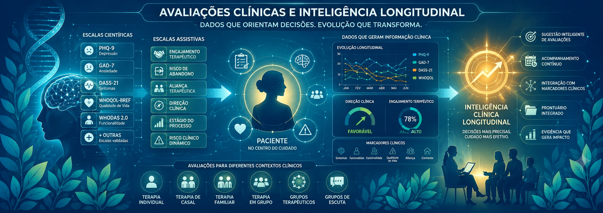
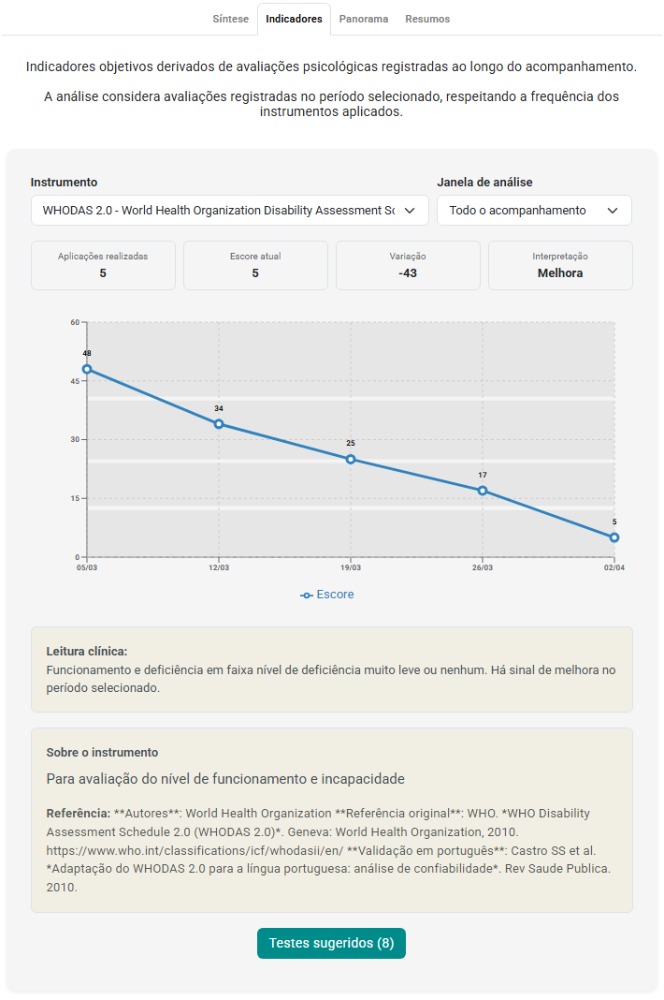

# 📊 Avaliações Clínicas: da Aplicação de Escalas ao Acompanhamento Longitudinal

Aplicar uma escala é relativamente simples.

O desafio está em interpretar os resultados, acompanhar sua evolução ao longo do tempo e transformar essas informações em suporte para a tomada de decisão clínica.

Na prática, muitos profissionais utilizam avaliações apenas como eventos isolados.

Uma escala é aplicada.

Um resultado é obtido.

E o processo termina ali.

Mas o verdadeiro potencial das avaliações surge quando elas passam a fazer parte do acompanhamento clínico longitudinal.

Nesta série você aprenderá como utilizar avaliações clínicas de forma estruturada, desde a escolha dos instrumentos até a análise evolutiva dos resultados ao longo do processo terapêutico.

Você encontrará:

* 📊 Escalas científicas validadas e de uso livre
* 🧠 Escalas assistivas para acompanhamento clínico longitudinal
* 📈 Estratégias de monitoramento da evolução clínica
* 👤 Aplicação em terapia individual
* ❤️ Aplicação em terapia de casal
* 👨‍👩‍👧 Aplicação em terapia familiar
* 👥 Aplicação em grupos terapêuticos e grupos de escuta
* 🧩 Integração com marcadores clínicos
* 🤖 Sugestão inteligente de avaliações
* 🎥 Vídeos demonstrando a utilização prática das avaliações no eConsult

Tudo organizado em uma sequência prática, com exemplos, vídeos e aplicações clínicas.

> O objetivo não é apenas aprender a aplicar escalas.
>
> É compreender como transformar avaliações em acompanhamento clínico longitudinal.

---

## 🗺️ O Mapa das Avaliações Clínicas

Se você já teve dúvidas como:

* "Qual escala devo aplicar neste caso?"
* "Quando devo reaplicar uma avaliação?"
* "Como acompanhar a evolução dos resultados?"
* "Como comparar avaliações realizadas em momentos diferentes?"
* "Como integrar avaliações ao prontuário?"
* "Como utilizar avaliações em terapia de casal, família ou grupo?"
* "Como transformar resultados em informações úteis para o acompanhamento clínico?"

Você não está sozinho.

Essas são algumas das dúvidas mais frequentes na prática clínica.

O problema é que muitos conteúdos ensinam apenas como aplicar instrumentos específicos.

Explicam o PHQ-9.

Ou explicam o GAD-7.

Ou mostram como calcular uma pontuação.

Mas raramente explicam como essas informações podem ser utilizadas ao longo de todo o processo terapêutico.

Na prática, as avaliações fazem parte de um fluxo maior:

```text
📋 Aplicação
      ↓
📊 Resultado
      ↓
📝 Interpretação
      ↓
📈 Comparação Histórica
      ↓
🧩 Integração Clínica
      ↓
🔄 Acompanhamento Longitudinal
```

Cada etapa possui uma função específica.

* 📋 A aplicação coleta informações estruturadas
* 📊 O resultado quantifica aspectos relevantes
* 📝 A interpretação contextualiza os dados
* 📈 A comparação permite observar mudanças
* 🧩 A integração amplia a compreensão clínica
* 🔄 O acompanhamento longitudinal transforma dados em informação clínica útil

Quando essas etapas não estão conectadas, as avaliações tendem a se tornar apenas registros isolados.

Quando fazem parte de uma estrutura integrada, passam a contribuir para uma compreensão mais ampla da trajetória clínica.

---

## 🎯 O Maior Equívoco Sobre Avaliações

Um dos equívocos mais comuns é acreditar que avaliações servem apenas para triagem.

Na realidade, a utilidade clínica de uma avaliação pode variar ao longo do processo terapêutico.

### 📋 Triagem Inicial

Ajuda a identificar sintomas, sofrimento psicológico e áreas que merecem maior atenção clínica.

---

### 📈 Monitoramento

Permite observar mudanças entre diferentes momentos do acompanhamento.

---

### 🔄 Acompanhamento Longitudinal

Possibilita compreender tendências, padrões e trajetórias clínicas ao longo do tempo.



<small>Exemplo de acompanhamento longitudinal da aplicação da avaliação WHODAS 2.0 em cinco momentos distintos</small>

---

### 🧩 Apoio ao Raciocínio Clínico

As avaliações não substituem o julgamento profissional.

Mas podem complementar observações clínicas, hipóteses e decisões terapêuticas.

---

## 🧠 Dois Tipos de Avaliação

No eConsult, as avaliações são organizadas em dois grandes grupos.

### 📊 Avaliações Científicas

Instrumentos amplamente utilizados para rastreamento, monitoramento e acompanhamento clínico.

Exemplos:

* PHQ-9
* GAD-7
* SRQ-20
* DASS-21
* AUDIT
* WHOQOL-BREF
* WHODAS 2.0
* PCL-5

---

### 🧠 Escalas Assistivas

Instrumentos estruturados para apoiar a observação clínica longitudinal.

Exemplos:

* Engajamento Terapêutico
* Risco de Abandono
* Aliança Terapêutica
* Direção Clínica
* Estágio do Processo Terapêutico
* Risco Clínico Dinâmico

Enquanto as avaliações científicas medem construtos específicos, as escalas assistivas ajudam a estruturar aspectos observados ao longo do acompanhamento.

---

## 📚 Explore os Conteúdos

### 📊 Escalas Científicas

Conheça os principais instrumentos disponíveis, suas aplicações, interpretação e limitações.

👉 Ver escalas

---

### 👤❤️👨‍👩‍👧👥 Contextos Clínicos

Aprenda como utilizar avaliações em terapia individual, casal, família e grupo.

👉 Ver contextos clínicos

---

### 🧠 Inteligência Clínica Longitudinal

Entenda como avaliações, marcadores clínicos e acompanhamento evolutivo podem trabalhar juntos.

👉 Ver conteúdos de inteligência clínica

---

### 📈 Acompanhamento Longitudinal

Aprenda estratégias para transformar aplicações isoladas em acompanhamento clínico contínuo.

👉 Ver acompanhamento longitudinal

---

## 🚀 Além da Aplicação de Escalas

A maioria dos sistemas permite aplicar avaliações.

Poucos ajudam o profissional a acompanhar sua evolução ao longo do tempo.

No eConsult, as avaliações podem ser integradas ao prontuário, relacionadas aos marcadores clínicos e utilizadas como parte de uma estratégia de acompanhamento longitudinal.

O objetivo não é apenas armazenar resultados.

É apoiar uma compreensão mais ampla da trajetória clínica da pessoa atendida.
