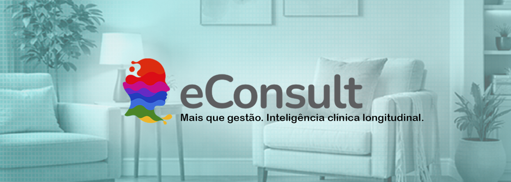

# Bem-vindo ao eConsult

## Inteligência Clínica para quem leva a prática a sério

A prática clínica contemporânea exige muito mais do que organização básica. Psicólogos e profissionais da saúde mental lidam diariamente com decisões clínicas complexas, acompanhamento longitudinal de pacientes, demandas administrativas e exigências éticas crescentes.

Nesse contexto, planilhas improvisadas e sistemas genéricos deixam de ser suficientes.

O **eConsult** nasce como uma plataforma de **Inteligência Clínica Longitudinal**, desenvolvida para apoiar o raciocínio clínico, organizar a prática profissional e qualificar o acompanhamento do paciente ao longo do tempo — sem perder a simplicidade operacional do dia a dia.

Inicialmente concebido para a Psicologia clínica, o eConsult evoluiu para atender profissionais que realizam **acompanhamentos estruturados, contínuos e centrados no cuidado individualizado**.

---

## Mais do que gestão: suporte real à prática clínica

O eConsult não é apenas um sistema administrativo.

Ele foi projetado a partir das rotinas reais do consultório para:

- estruturar o registro clínico  
- apoiar a leitura longitudinal do caso  
- organizar indicadores relevantes do paciente  
- reduzir a sobrecarga operacional do profissional  

A plataforma adapta a experiência conforme o perfil de uso, mantendo uma interface clara, responsiva e orientada à prática baseada em dados clínicos.

---

## Tudo o que sua prática precisa — integrado

Com o eConsult, você centraliza em um único ambiente:

- 📋 **Prontuário clínico estruturado e longitudinal**
- 🧠 **Marcadores clínicos e análise evolutiva do paciente**
- 📅 **Gestão de agenda com lembretes automáticos**
- 💰 **Financeiro integrado (faturas, recibos e relatórios)**
- 👥 **Gestão de pacientes e grupos terapêuticos**
- 📊 **Painéis analíticos de acompanhamento**

Tudo acessível via navegador, sem instalação, com experiência fluida em desktop e dispositivos móveis.

---

## Tecnologia avançada, com simplicidade de uso

O eConsult combina robustez técnica com usabilidade clínica:

- ✅ Plataforma 100% em nuvem  
- 🔄 Atualizações contínuas e automáticas  
- ⚙️ Infraestrutura escalável e confiável  
- 💡 Interface pensada para a rotina do consultório  
- 🚀 Implantação imediata, sem complexidade técnica  

---

## Segurança e conformidade como princípios

A proteção das informações clínicas é tratada como prioridade estrutural.

O eConsult adota:

- 🔒 **Criptografia de dados**
- 👤 **Controle de acesso por perfil**
- 💾 **Backups automáticos**
- 📜 **Aderência às diretrizes da LGPD**
- 🧾 **Rastreabilidade e integridade dos registros**

Seu prontuário permanece protegido, íntegro e sob seu controle.

---

## Mais clareza clínica. Menos sobrecarga operacional.

Ao automatizar rotinas administrativas e estruturar a informação clínica, o eConsult permite que você:

- ganhe tempo  
- reduza retrabalho  
- acompanhe melhor seus pacientes  
- tome decisões com mais segurança  

O foco volta para onde deve estar: **a qualidade do cuidado clínico**.

---

## Descubra o que o eConsult pode fazer pela sua prática

Organize sua rotina, fortaleça seu raciocínio clínico e eleve o nível do seu acompanhamento profissional com uma plataforma construída para a realidade da clínica contemporânea.

---

  

<h7 style={{textAlign: "center", margin: "0px"}}>
  Inteligência Clínica Longitudinal para quem cuida de pessoas com responsabilidade
</h7>