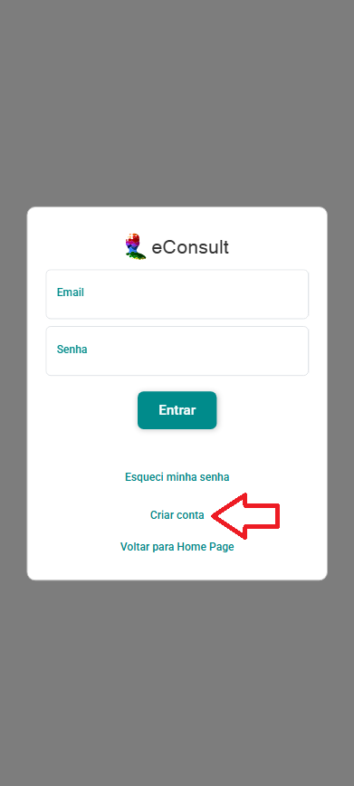

# Criar uma nova conta

Criar uma conta no eConsult é um processo simples e essencial para acessar todas as funcionalidades oferecidas. Aqui estão os passos gerais para criar uma conta:

1. Acesse o site econsult.app.br do seu navegador.
2. Na página de login, clique em “Criar Conta”.

    

3. O sistema exibirá uma tela com um formulário para o cadastro de uma conta.

    

4. Insira as informações solicitadas, como: nome completo, sexo, e-mail, telefone, celular, CPF e crie uma senha segura. Certifique-se de que todos os dados estão corretos e clique em Salvar.

5. Após salvar, o sistema exibirá uma tela solicitando um código de acesso. Você receberá esse código por e-mail.

    

6. Preencha o campo código de acesso com o código enviado para o seu e-mail.

7. Novamente na página de login, insira seu e-mail e senha, e clique em “Entrar” para acessar o eConsult.

Criar uma nova conta é o primeiro passo para aproveitar todas as vantagens e funcionalidades oferecidas pelo eConsult. Siga os passos acima e comece a explorar!

:::tip Dica de Segurança
**Senha Forte:** Crie uma senha forte, combinando letras maiusculas e minúsculas, números e caracteres especiais.
:::

:::note Benefícios de criar uma conta no eConsult
- **Acesso Personalizado:** Ter uma conta permite acessar funcionalidades personalizadas e salvar suas preferências.
- **Segurança:** Contas protegidas por senha garantem que apenas você tenha acesso às suas informações.
- **Comunicação Direta:** Facilita a comunicação direta com o serviço, recebendo notificações e atualizações importantes.
:::

