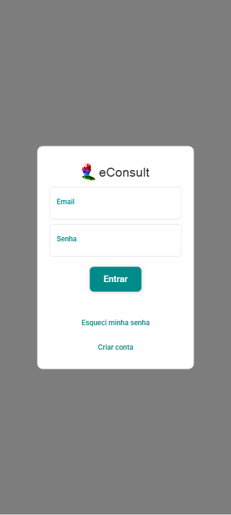

# Fazer login no eConsult

A tela de login permite que usuários registrados acessem sua conta no sistema eConsult de forma segura.

1. Informe o seu e-mail cadastrado no eConsult.

2. Digite sua senha de acesso.

3. Após preencher os campos de email e senha, clique no botão "Entrar" para acessar o sistema.

Se os dados estiverem corretos, você será redirecionado para o Painel Inicial do sistema.

:::warning Atenção
- Os campos e-mail e senha diferenciam letras maiúsculas de minúsculas (são case-sensitive).
:::