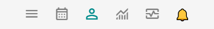
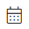
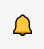

# Explorando o Menu Tarefas

O Menu Tarefas proporciona acesso às funcionalidades que você utilizará com maior frequência no seu dia a dia. Ele organiza as ferramentas e seções mais relevantes para sua rotina, facilitando o acesso rápido às tarefas e informações que você precisa regularmente. Isso torna o uso do sistema mais ágil.

Na versão desktop, encontra-se na parte superior esquerda da tela. Já na versão mobile fica na parte inferior da tela. Veja:

|Atalho|Destino|
|--------------|-------------|
|  | Abre o [Menu Principal](/docs/iniciando/interface-navegacao/menu-principal) |
|  | Abre o [Painel Atendimentos](/docs/funcionalidades/atendimentos/visao) |
|  | Abre o [Painel Lembretes de Atendimentos](/docs/funcionalidades/lembretes/visao) |
|  | Abre o [Painel Cliente](/docs/funcionalidades/area-cliente/visao-area-cliente) |
|  | Abre o [Painel Resultados](/docs/funcionalidades/resultados/visao) |
|  | Abre o [Painel Alertas](/docs/funcionalidades/alertas/visao) |
