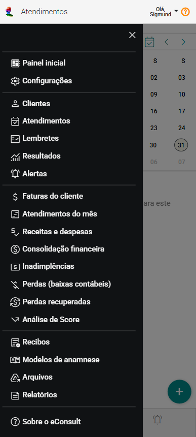

# Explorando o Menu Principal

O Menu Principal do eConsult é a interface central que organiza e disponibiliza as principais funcionalidades de maneira intuitiva e estruturada. Ele é dividido em diversas seções essenciais para a gestão e operação eficiente.

O Menu Principal pode ser acessado através do botão  no menu [Tarefas](/docs/iniciando/interface-navegacao/menu-tarefas).

|Menu|Destino|
|--------------|-------------|
| **Painel inicial** | Abre o [Painel Inicial](#) |
| **Configurações** | Abre o [Painel Configurações](#) |
|--------------|-------------|
| **Clientes** | Abre o [Painel Clientes](#) |
| **Atendimentos** | Abre o [Painel Atendimentos](#) |
| **Lembretes** | Abre o [Painel Lembretes](#) |
| **Resultados** | Abre o [Painel Resultados](#) |
| **Alertas** | Abre o [Painel Alertas](#) |
|--------------|-------------|
| **Faturas do cliente** | Abre o [Painel Faturas do Cliente](#) |
| **Atendimentos do mês** | Abre o [Painel Atendimentos do Mês](#) |
| **Receitas e despesas** | Abre o [Painel Receitas e Despesas](#) |
| **Consolidação financeira** | Abre o [Painel Consolidação Financeira](#) |
| **Inadimplências** | Abre o [Painel Inadimplências](#) |
| **Perdas (baixas contábeis)** | Abre o [Painel Perdas (Baixas Contábeis)](#) |
| **Perdas recuperadas** | Abre o [Painel Perdas Recuperadas](#) |
| **Análise de score** | Abre o [Painel Análise de Score](#) |
|--------------|-------------|
| **Recibos** | Abre o  |
| **Modelos de anamnese** | Abre o [Painel Modelos de Anamnese](#) |
| **Arquivos** | Abre o [Painel Arquivos](#) |
| **Relatórios** | Abre o [Painel Relatórios](#) |
|--------------|-------------|
| **sobre o eConsult** | Abre a [Página principal deste manual](/) |
