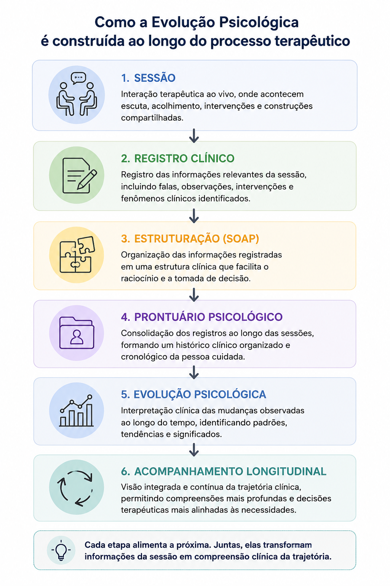

# Como funciona o eConsult

O eConsult foi desenvolvido para ajudar profissionais da saúde a organizar sua rotina profissional e acompanhar todo o processo de atendimento em um único ambiente.

Na plataforma, você pode gerenciar agenda, pessoas atendidas, prontuário, registros clínicos, documentos, financeiro e evolução dos acompanhamentos.

Mais do que armazenar registros isolados, o eConsult conecta informações ao longo do tempo para construir uma **visão longitudinal da trajetória clínica** de cada pessoa, casal, família ou grupo acompanhado.



<small>A evolução clínica não surge de um único atendimento. Ela é construída progressivamente a partir das sessões, registros, estruturação das informações e acompanhamento contínuo da trajetória da pessoa atendida.</small>

---

## Entenda a jornada clínica

### 1. Cadastre o contexto de atendimento

O primeiro passo é criar o contexto que será acompanhado.

Você pode trabalhar com:

-   Atendimento Individual
-   Terapia de Casal
-   Terapia Familiar
-   Grupos Terapêuticos

Cada modalidade possui sua própria estrutura de acompanhamento,
permitindo organizar atendimentos, informações clínicas, financeiro,
documentos e evolução ao longo do tempo.

### 2. Organize seus atendimentos

Após o cadastro, você poderá:

-   criar agendamentos
-   organizar sessões recorrentes
-   acompanhar frequência
-   registrar pagamentos
-   controlar remarcações e desmarcações
-   estruturar sua rotina profissional

A partir daí, o eConsult passa a reunir as informações relacionadas ao
acompanhamento em um único histórico.

### 3. Registre cada atendimento

Durante ou após as sessões, você pode registrar:

-   observações clínicas
-   anotações profissionais
-   informações relevantes
-   registros estruturados
-   evoluções
-   anotações no formato SOAP

Esses registros permanecem vinculados ao acompanhamento e ajudam a
construir progressivamente o prontuário.

### 4. Utilize marcadores clínicos

Os marcadores clínicos funcionam como pontos de observação que ajudam a
estruturar aspectos relevantes percebidos ao longo das sessões.

Você poderá acompanhar elementos relacionados a:

-   evolução clínica
-   engajamento
-   fatores de risco
-   fatores de proteção
-   prioridades terapêuticas
-   padrões observados

Os marcadores não substituem o registro clínico. Eles complementam as
anotações e facilitam a identificação de mudanças e recorrências ao
longo do processo terapêutico.

### 5. Acompanhe a evolução longitudinal

À medida que os atendimentos e registros são realizados, o eConsult
organiza o histórico do acompanhamento.

Isso permite observar:

-   tendências clínicas
-   mudanças de padrão
-   recorrências
-   períodos de melhora
-   momentos críticos
-   evolução do processo terapêutico

Em vez de analisar cada sessão isoladamente, o profissional passa a ter
uma visão mais ampla da trajetória da pessoa, casal, família ou grupo
acompanhado.

### 6. Construa o prontuário continuamente

No eConsult, o prontuário pode ser construído progressivamente ao longo
do acompanhamento.

As informações registradas durante os atendimentos passam a formar um
histórico clínico organizado e contextualizado.

O prontuário pode reunir:

-   registros clínicos
-   anotações SOAP
-   evoluções
-   marcadores clínicos
-   documentos relacionados
-   histórico dos atendimentos

Assim, o prontuário deixa de ser apenas um registro pontual e passa a
acompanhar a evolução do processo ao longo do tempo.

### 7. Consolide e compartilhe informações

Quando necessário, você poderá:

-   consolidar períodos clínicos
-   organizar documentos
-   gerar registros estruturados
-   gerar documentos a partir de modelos
-   compartilhar informações autorizadas

As informações permanecem relacionadas ao histórico do acompanhamento,
facilitando sua recuperação e contextualização.

---

## Como a Inteligência Artificial auxilia

Nos planos que disponibilizam recursos de Inteligência Artificial, a IA
atua como uma ferramenta de apoio ao profissional.

A partir das informações registradas no acompanhamento, ela pode
auxiliar em atividades como:

-   estruturação e qualificação dos registros clínicos
-   organização e síntese das informações do prontuário
-   contextualização do histórico longitudinal
-   identificação de padrões e tendências
-   geração assistida de hipóteses diagnósticas
-   geração assistida de hipóteses prognósticas
-   análise da evolução do tratamento
-   elaboração assistida de hipóteses para o plano de tratamento

A disponibilidade e os limites desses recursos dependem do plano
utilizado.

Também é possível, nos planos compatíveis, conectar uma conta OpenAI
própria para utilização dos recursos de IA conforme as condições
disponíveis para essa integração.

::: note
As análises produzidas por Inteligência Artificial possuem caráter
assistivo.

A IA não substitui avaliação, julgamento ou decisão profissional. O
profissional responsável pelo atendimento mantém autonomia e
responsabilidade sobre os registros e decisões clínicas.
:::

---

## Segurança e controle profissional

O eConsult foi desenvolvido para apoiar a organização e continuidade das
informações relacionadas à prática profissional.

A plataforma permite manter registros, documentos, atendimentos e
informações clínicas organizados dentro do contexto de cada
acompanhamento.

O profissional mantém o controle sobre seus registros e sobre as
informações disponibilizadas às pessoas atendidas.

---

## Fluxo resumido

``` text
Cadastro da pessoa, casal, família ou grupo
        ↓
Agendamentos e atendimentos
        ↓
Registros clínicos
        ↓
Marcadores clínicos
        ↓
Acompanhamento longitudinal
        ↓
Prontuário
        ↓
Documentos e consolidação das informações
```

---

## Como funcionam os planos

### Comece gratuitamente

Você pode começar a utilizar o eConsult pelo plano **FREE**, sem período
de avaliação e sem prazo para acabar.

Não é necessário cadastrar-se em um plano pago para continuar utilizando
a plataforma.

O FREE já permite organizar grande parte da rotina profissional e
clínica, incluindo recursos como:

-   agenda e gestão de atendimentos
-   cadastro de indivíduos, casais, famílias e grupos terapêuticos
-   prontuário eletrônico personalizável
-   registros clínicos
-   marcadores clínicos
-   acompanhamento e visão longitudinal
-   gestão financeira
-   faturas e recibos
-   controle de inadimplência
-   documentos a partir de modelos
-   dashboards, indicadores e relatórios

Você pode permanecer no plano FREE pelo tempo que quiser.

### Escolha o plano de acordo com sua necessidade

O eConsult possui quatro planos:

#### FREE - Para começar

Permite utilizar gratuitamente os principais recursos de gestão do
consultório e acompanhamento clínico.

É uma opção para quem deseja organizar sua prática profissional no
eConsult sem assumir uma assinatura paga.

#### PRO - Gestão completa do consultório

Além dos recursos disponíveis no FREE, acrescenta funcionalidades como:

-   biblioteca de modelos personalizáveis de anamnese
-   avaliações psicológicas integradas
-   portal relacional para pessoas atendidas
-   gestão de arquivos integrada ao Google Drive
-   integrações com serviços externos
-   envio de mensagens pelo WhatsApp
-   gestão de modelos de documentos

#### PLUS - Gestão completa com recursos avançados

Inclui os recursos dos planos anteriores e amplia a utilização da
plataforma com:

-   cadastro e gestão de assistentes
-   recursos de Inteligência Artificial incluídos no plano
-   maior capacidade para automação e apoio à análise clínica

#### PREMIUM - Operação avançada e IA ilimitada

É o plano mais completo do eConsult.

Além dos recursos dos demais planos, inclui:

-   Inteligência Artificial sem os limites mensais dos planos inferiores
-   transcrição de relato clínico em áudio
-   emissão de notas fiscais por integração com Focus NFe
-   recursos voltados a uma operação mais avançada do consultório

### Avaliações psicológicas

Os planos **PRO, PLUS e PREMIUM** incluem uma biblioteca com mais de 45
escalas e instrumentos de acompanhamento integrados ao prontuário.

Esses instrumentos podem ser utilizados de forma estruturada e seus
resultados passam a fazer parte do acompanhamento longitudinal da pessoa
atendida.

### Inteligência Artificial

Os recursos de Inteligência Artificial variam conforme o plano.

O plano FREE não inclui recursos de IA.

O PLUS disponibiliza uma quantidade mensal de utilizações de recursos
assistidos por IA, enquanto o PREMIUM oferece utilização ilimitada
desses recursos dentro das condições do plano.

Nos planos PRO e PLUS, também é possível conectar opcionalmente uma
conta OpenAI própria. Quando essa integração é utilizada, os limites da
IA fornecida diretamente pelo eConsult deixam de ser aplicáveis ao uso
realizado por meio da conta integrada.

### Integrações

Algumas funcionalidades do eConsult utilizam integrações com serviços
externos.

Dependendo do plano, podem estar disponíveis integrações com:

-   Google Drive
-   OpenAI
-   Mercado Pago
-   PIX
-   Daily.co
-   Focus NFe

Alguns desses serviços podem possuir condições, configurações ou
cobranças próprias, independentes da assinatura do eConsult.

---

## Compare os planos

Você não precisa contratar um plano pago para começar.

Utilize o FREE e, quando surgir a necessidade de avaliações
psicológicas, integrações, portal relacional, assistentes, Inteligência
Artificial ou outros recursos avançados, escolha o plano mais adequado à
sua rotina.

👉 [Veja a comparação completa dos planos e
preços](https://econsult.app.br/plans)

---

## Como funciona a cobrança

O plano **FREE não possui cobrança**.

Nos planos pagos, a cobrança é realizada de acordo com o plano e o
período contratado.

Na página de planos você poderá consultar as condições atualizadas de:

-   valores
-   períodos disponíveis
-   recursos incluídos
-   limites de utilização
-   alteração de plano

👉 [Veja nossos planos e preços](https://econsult.app.br/plans)

---

## Posso mudar de plano?

Sim.

Você pode alterar seu plano conforme as necessidades da sua prática
profissional.

Ao realizar um **upgrade**, a mudança para o novo plano ocorre
imediatamente e o valor correspondente ao período ainda disponível é
aproveitado na conversão.

Em um **downgrade**, o valor restante da assinatura vigente é convertido
proporcionalmente em tempo adicional no novo plano.

::: note
O eConsult preserva o valor já adquirido em uma assinatura.

Em alterações de plano, os créditos correspondentes ao período ainda
vigente são convertidos proporcionalmente para o novo plano escolhido.

Não há devolução do valor já contratado; o saldo existente é compensado
por meio da conversão em período de utilização.
:::

------------------------------------------------------------------------

## Posso voltar para o FREE?

Sim.

A contratação de um plano pago não impede que você utilize novamente o
plano FREE posteriormente.

Caso não queira renovar seu plano pago, você poderá continuar utilizando
o eConsult no plano FREE, respeitando os recursos disponíveis nesse
plano.

Isso significa que você **não precisa deixar de utilizar o eConsult
simplesmente porque decidiu não continuar com uma assinatura paga**.

------------------------------------------------------------------------

## Posso excluir minha conta?

Sim.

Se preferir encerrar definitivamente sua utilização do eConsult, você
poderá solicitar a exclusão da conta.

Antes de excluir definitivamente seus dados, verifique se existem
informações ou documentos que precisam ser preservados conforme suas
responsabilidades profissionais.

------------------------------------------------------------------------

## Preciso instalar algum programa?

Não.

O eConsult pode ser utilizado diretamente pelo navegador.

Além disso, quando disponível para o dispositivo, você poderá instalar o
aplicativo para acessar a plataforma com mais praticidade em:

-   computadores
-   tablets
-   smartphones

------------------------------------------------------------------------

## Comece agora

Você pode criar sua conta e começar pelo plano FREE.

Depois, escolha o cenário que mais se aproxima da sua prática
profissional:

### Atendimento Individual

👉 [Aprenda a criar seu primeiro prontuário
individual.](/docs/iniciando/guias-praticos/primeiros-passos-individual)

### Terapia de Casal

👉 [Aprenda a estruturar e acompanhar relações
terapêuticas.](/docs/iniciando/guias-praticos/primeiros-passos-casal)

### Terapia Familiar

👉 [Aprenda a organizar acompanhamentos familiares
longitudinalmente.](/docs/iniciando/guias-praticos/primeiros-passos-familia)

### Grupo Terapêutico

👉 [Aprenda a registrar e acompanhar processos
grupais.](/docs/iniciando/guias-praticos/primeiros-passos-grupo)

👉 [Continue para os guias da seção **Iniciando no
eConsult**.](/docs/iniciando-econsult)