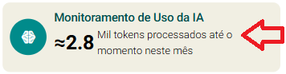
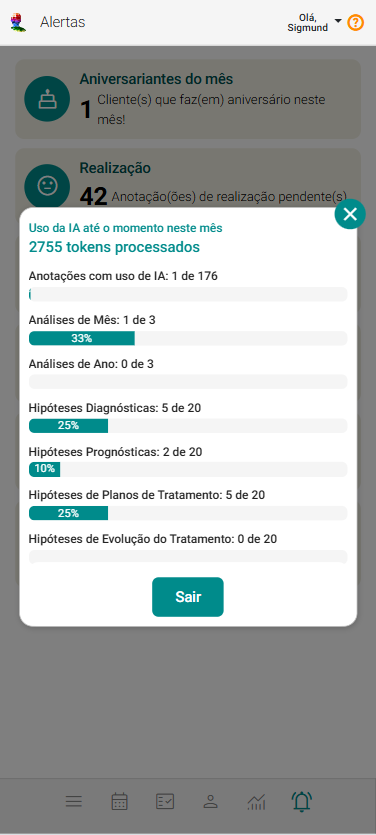

# Inteligência Artificial no eConsult  
***Mais tempo para o cuidado, mais inteligência para o atendimento.***

A **Inteligência Artificial (IA)** do eConsult foi desenvolvida para **apoiar profissionais da saúde** na tomada de decisão clínica, elaboração de anotações e gestão estratégica do consultório.

Com atuação contextualizada, a IA **se adapta à especialidade** (psicologia, nutrição, terapia integrativa, entre outras), oferecendo suporte técnico e prático **sem substituir a autonomia do profissional**.

---

## Segurança e Compromisso com a LGPD

O eConsult segue rigorosamente as diretrizes da Lei Geral de Proteção de Dados (LGPD), assegurando a privacidade e a segurança das informações de profissionais, clientes e grupos terapêuticos.

Todas as informações confidenciais são protegidas com algoritmos de criptografia de última geração, impedindo acessos não autorizados, mesmo em caso de incidentes de segurança.

**Monitoramento e segurança contínuos**

O sistema conta com camadas adicionais de proteção, incluindo auditorias internas, protocolos de prevenção contra ataques cibernéticos e monitoramento em tempo real para detecção e bloqueio de atividades suspeitas.

**Anonimização de dados para análises externas**

Antes de qualquer uso externo, os dados passam por processos de anonimização, eliminando qualquer possibilidade de identificação direta ou indireta dos profissionais, clientes e grupos terapêuticos.

Com a anonimização, essas informações deixam de ser classificadas como dados pessoais pela LGPD, o que dispensa a necessidade de autorizações adicionais por parte do paciente, sem comprometer a segurança ou a conformidade legal.

:::note  
**Recomendação:** Mesmo não sendo necessária autorização adicional do paciente, recomendamos que o profissional informe os pacientes que a plataforma utiliza IA e que os dados são tratados de forma anonimizada, garantindo transparência, segurança e confiança.  
:::

---

## Como a IA atua no eConsult

A IA **não toma decisões por conta própria**: ela **sugere hipóteses, organiza informações e gera insights** para apoiar o profissional.

### Principais Recursos

##### ✔ **Anotações Inteligentes e Contextualizadas**  
- Interação em formato de chat para **resumir, revisar ou expandir anotações durante o atendimento**.  

##### ✔ **Suporte a Diagnósticos e Prognósticos**  
- Sugere hipóteses diagnósticas e prognósticas baseadas em dados do prontuário, avaliações psicológicas e engajamento do paciente.  
- Apoia o raciocínio clínico com agilidade e segurança.
- No caso de grupos terapêuticos a IA considera os dados do grupo e dos membros do grupo para elaborar as hipóteses. 

##### ✔ **Análise e Sugestão de Plano de Tratamento**  
- Com base na abordagem terapêutica e histórico clínico, gera sugestões personalizadas para o plano de tratamento.  

##### ✔ **Evolução do Tratamento**  
- Analisa progresso do paciente, identifica padrões e recomenda ajustes quando necessário.

##### ✔ **Relatórios Mensais e Anuais com Insights Estratégicos**  
- Mensais: análise de produtividade, engajamento e resultados financeiros.  
- Anuais: visão consolidada para planejamento de longo prazo.  

---

## Limites de Uso da IA no eConsult

Os limites de uso variam conforme o plano contratado:

| **Recurso**                         | **Trial**      | **Pro** | **Plus**      | **Premium**   |
|-------------------------------------|---------------|---------|--------------|--------------|
| Anotações assistidas por IA        | 22/mês        | 0       | 176/mês      | Ilimitado    |
| Análises mensais e anuais          | 1 de cada     | 0       | 3 de cada    | Ilimitado    |
| Geração de hipóteses diagnósticas  | Até 10/mês    | 0       | Até 20/mês   | Ilimitado    |
| Geração de hipóteses prognósticas  | Até 10/mês    | 0       | Até 20/mês   | Ilimitado    |
| Geração de propostas de planos terapêuticos | Até 10/mês    | 0       | Até 20/mês   | Ilimitado    |
| Geração de propostas de evoluções de tratamento | Até 10/mês    | 0       | Até 20/mês   | Ilimitado    |

:::tip  
**Importante:** Ao integrar sua conta da OpenAI ao eConsult, os limites passam a depender dos créditos adquiridos diretamente na OpenAI, garantindo uso ilimitado no sistema, independentemente do plano contratado.  
:::

---

## Monitoramento de Consumo em Tokens

**Tokens** são unidades de texto processadas pela IA. Cada interação envolve:

- **Tokens de entrada:** texto enviado pelo usuário.  

- **Tokens de saída:** resposta gerada pela IA.  

#### Exemplo de Uso Mensal:

- 8 anotações/dia (~400 tokens cada)  

- 1 análise mensal (~900 tokens)  

- 1 análise anual (~900 tokens)  

- 20 hipóteses diagnósticas (~6.000 tokens)  

- 20 hipóteses prognósticas (~6.000 tokens)  

Consumo estimado: **~85.000 tokens/mês**.  

---

## Acompanhar o uso da IA no eConsult

   1. Acesse o painel *Alertas* e clique em *Monitoramento de Uso de IA*

      

   2. Clique em *Monitoramento de Uso da IA*. O sistema mostrará:

      

---

## Por que a IA do eConsult é única no mercado?

1. **Anotações Inteligentes e Contextualizadas**
   - Personalização por especialidade (psicologia, nutrição, terapias integrativas, etc) e propósito (relato, queixa, evolução, etc).  
   - Reduz tempo de registro clínico, mantendo qualidade técnica.  

2. **Suporte Clínico Completo**  
   - Sugestões para diagnósticos, prognósticos, plano de tratamento e evolução terapêutica.  

3. **Relatórios Estratégicos**  
   - Mensais e anuais, com insights clínicos e financeiros.  

4. **Transparência no Uso**  
   - Comunicação clara sobre limites, consumo e boas práticas.  

5. **Foco Ético**  
   - Apoio ao profissional, sem substituir decisões clínicas.  

---

#### Comparativo com Outros Sistemas

**Outros sistemas:**  
- IA genérica, limitada a lembretes ou "autocompletar".  
- Sem integração com prontuário ou contexto clínico.  
- Sem relatórios analíticos avançados.  

**eConsult:**  
- IA adaptada por especialidade e abordagem.  
- Suporte clínico real + gestão estratégica.  
- Interação para resumos e revisões considerando propósitos.  
- Relatórios inteligentes (mensais e anuais).  

:::tip  
**Diferencial Real:** A IA do eConsult acompanha todo o ciclo do atendimento, não apenas como recurso isolado, mas como **assistente clínico e estratégico**.  
:::

---

**O eConsult é a escolha certa para quem busca mais eficiência, controle e profissionalismo na gestão de atendimentos.**

> Pronto para transformar sua rotina?
> Experimente gratuitamente e descubra por que o eConsult é o sistema que se adapta a você — e não o contrário.
> [Clique aqui e comece agora mesmo.](https://econsult.app.br/multidisciplinar)
