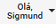

# Sobre Conta

Manter os dados cadastrais atualizados é essencial para garantir a precisão das informações e a eficiência no atendimento.

O Painel Conta envolve a atualização de diversas informações, como dados gerais da conta, assinaturas, endereços, foto de perfil, logotipo e assistentes.

Para acessar o **Painel Conta**, acione a opção  no topo da tela e em seguida clique na imagem da conta . O sistema abrirá o painel conforme mostrado abaixo:

## Abas do Painel Conta

| Ícone | Aba |
|---|---|
|  | **Dados Gerais:** Permite o cadastro de seus dados gerais. |
|  | **Assinatura:** Onde você faz a gestão das suas assinaturas do eConsult. |
|  | **Endereços:** Onde você cadastra o seu endereço principal e demais endereços (se for o caso). |
|  | **Foto Perfil:** Permite o cadastro da sua foto de perfil. |
|  | **Logotipo:** Permite o cadastro do seu logotipo. |
|  | **Assistentes:** Permite o cadastro de seus assistentes. |

