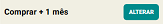

# Assinatura

Ao criar uma nova conta no eConsult, você recebe automaticamente a assinatura **TRIAL**.

Uma assinatura TRIAL oferece um período de teste gratuito por tempo limitado. Esse tipo de assinatura permite que os usuários experimentem todas as funcionalidades do produto antes de decidir pela compra de uma assinatura paga.

Para adquirir ou ver informações de suas assinaturas, acesse a opção correspondente a **Assinatura** no menu **Conta**, localizada no canto superior direito da tela.

Na tela **Assinatura** é possível ver informações da sua assinatura atual e ainda adquirir novos períodos pagos.

:::note Vantagens da Assinatura eConsultTRIAL
- **Teste Completo:** Permite que os usuários explorem todas as funcionalidades do eConsult, ajudando a determinar se ele atende às suas necessidades.
- **Sem Compromisso Inicial:** Os usuários podem experimentar o produto sem a necessidade de um investimento financeiro imediato, reduzindo o risco de insatisfação.
- **Facilidade de Decisão:** Ao utilizar a versão TRIAL, os usuários podem tomar uma decisão mais informada sobre a aquisição da assinatura paga.
:::

## Assinatura eConsultTRIAL

- **Cadastro:** O usuário cria uma conta no eConsult, fornecendo informações básicas (não são solicitadas informações de pagamento).
- **Período de teste:** O usuário tem acesso completo ao eConsult por um período de 30 dias.
- **Conversão:** Ao final do período TRIAL, o usuário pode optar por adquirir uma assinatura paga (eConsultPRO) para continuar utilizando o sistema.

## Assinatura eConsultPRO

A assinatura eConsultPRO possui validade definida. 

Ao término desse período, o sistema solicitará a renovação para continuar com o uso da plataforma. 

Você pode escolher entre diferentes planos de assinatura — mensal, trimestral, semestral ou anual — de acordo com sua preferência de periodicidade e investimento.

## Comprar um período de assinatura eConsultPRO

1. Acione a opção ALTERAR em .

2. O sistema abrirá uma tela contendo os períodos que você pode adquirir.

    

3. Clique sobre o período desejado (exemplo 3 meses).

4. O sistema atualiza a tela mostrando o período solicitado.

    

5. Clique na opção COMPRAR .

6. O sistema abrirá tela de pagamento (PIX).

    

7. Proceda o pagamento em sua instituição financeira.

:::warning   
O eConsult **não solicita informações de pagamento**, como cartão de crédito. Os pagamentos das assinaturas PRO são realizados **exclusivamente via PIX** no momento da aquisição. A vigência da assinatura é imediata após a confirmação do pagamento.
:::

