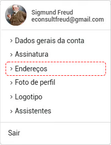
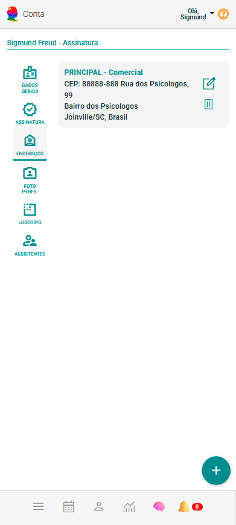
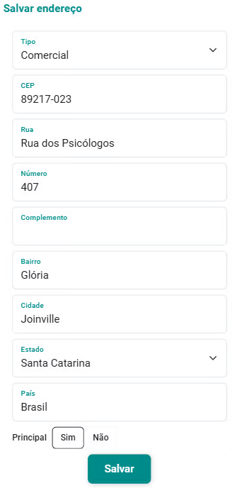

# Endereços

O eConsult permite o cadastro de um endereço principal e múltiplos endereços secundários. 

No entanto, apenas o endereço principal é utilizado para a emissão de documentos.

O cadastro de endereços é essencial para que o eConsult possa emitir documentos corretamente, como recibos e prontuários.

Para incluir ou ver informações de endereços cadastrados, acesse a opção correspondente a **Endereços** no menu **Conta**, localizada no canto superior direito da tela.

Uma vez acionada esta opção o sistema abrirá a tela de visualização dos endereços da sua conta.

## Incluir um novo endereço

1. Acione o botão **Incluir Novo Endereço** .

2. O sistema abrirá tela com formulário de cadastro de novo endereço.

3. Preencha os campos "Tipo", "CEP", "Rua", "Número", "Complemento", "Bairro", "Cidade", "Estado", "País" e informe se este endereço será o seu principal ou não. 

4. Acione o botão **Incluir**.

:::note Endereço estrangeiro
Se, no campo **Tipo**, você selecionar **Estrangeiro** (endereço fora do Brasil), o sistema ajustará o formulário para exigir a informação de País e permitirá que você insira um endereço estrangeiro no campo correspondente.
:::

## Alterar um endereço

1. Acione o botão  no *card* do endereço que deseja alterar.

2. O sistema abrirá tela com formulário de cadastro de alteração do endereço.

    

3. Altere os campos "Tipo", "CEP", "Rua", "Número", "Complemento", "Bairro", "Cidade", "Estado", "País"  e informe se este endereço será o seu principal ou não. Por último acione o botão **Salvar**.

**OU, NO CASO DE ESTRANGEIRO**

3. Altere os campos "Endereço", "País" e informe se este endereço será o seu principal ou não. Por último acione o botão **Salvar**.

## Excluir um endereço

1. Acione o botão  no *card* do endereço que deseja excluir.

2. Confirme a operação acionando a opção **Sim**.