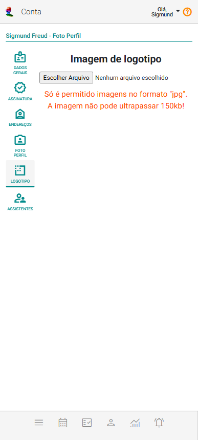

# Logotipo

O logotipo é o símbolo gráfico que representa sua organização. Ele é um dos principais elementos de identidade visual e desempenha um papel crucial na comunicação da essência e valores da marca ao público.

No eConsult, o logotipo será incluído em todos os relatórios e documentos, como prontuários e recibos.

Para incluir ou alterar o registro de logotipo, acesse a opção correspondente a **Logotipo** no menu **Conta**, localizada no canto superior direito da tela.

O sistema mostrará a tela **Logotipo**.

## Incluir logotipo

1. Acione a opção **Escolher Arquivo** .

2. Selecione um arquivo de imagem do seu dispositivo.

3. Clique no botão **Enviar** .

## Alterar logotipo

1. Acione o botão **Alterar** .

2. Acione a opção **Escolher Arquivo** .

3. Selecione um arquivo de imagem do seu dispositivo.

4. Clique no botão **Enviar** .

:::warning   
Só é permitido imagens no formato **"jpg"**. A imagem não pode ultrapassar **150kb**!
:::