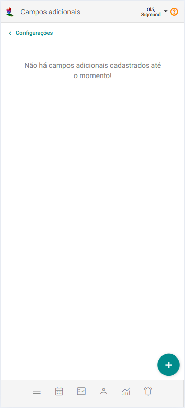
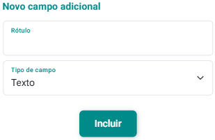
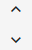

# Campos Adicionais para Clientes

O cadastro de **Campos Adicionais para Clientes** é uma funcionalidade que permite expandir as informações padrão registradas sobre cada cliente ou grupo de atendimento, oferecendo uma visão mais detalhada e adaptada às suas necessidades específicas. Essa personalização serve para aprimorar o cadastro de clientes.

## Incluir Campo Adicional para Clientes

1. No painel "Configurações", acione a opção .

2. O sistema abrirá a tela "Campos Adicionais para Clientes".

    

3. Acione o botão **Incluir Campo Adicional** .

4. O sistema abrirá o formulário de cadastro de novo campo adicional.

    

5. Preencha os campos "Rótulo" e "Tipo".

6. Acione o botão "Incluir" .

## Alterar Campo Adicional para Clientes

1. No painel "Configurações", acione a opção .

2. O sistema abrirá a tela "Campos Adicionais para Clientes".

3. Acione o botão  no *card* do campo adicional que se quer alterar.

4. O sistema abrirá o formulário de cadastro de alteração de campo adicional.

5. Altere os campos "Rótulo" e "Tipo".

6. Acione o botão "Salvar" .

## Excluir Campo Adicional para Clientes

1. No painel "Configurações", acione a opção .

2. O sistema abrirá a tela "Campos Adicionais para Clientes".

3. Acione o botão  no *card* do campo adicional que se quer excluir.

4. Confirme a exclusão acionando o botão **Sim**.

:::tip

Use  

Você pode usar os botões de ordenação na lista de campos adicionais para organizar os campos conforme suas preferências, facilitando o acesso e a visualização das informações de forma mais prática e personalizada.
:::

