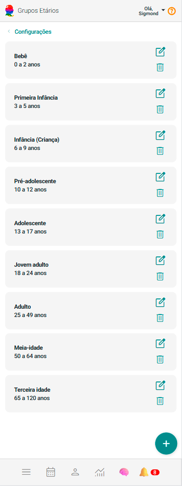
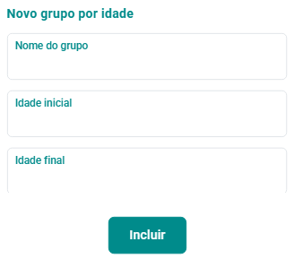

# Grupos de Clientes por Idade

O cadastro de Grupos de Clientes por Idade é uma ferramenta para entender e segmentar sua base de clientes por grupos baseados em idade. Dividir os clientes em grupos etários permite uma abordagem mais direcionada e personalizada, trazendo diversos benefícios para a gestão e estratégia do seu negócio.

## Incluir Grupo de Cliente por Idade

1. No painel "Configurações", acione a opção .

2. O sistema abrirá a tela "Grupos por Idade".

    

3. Acione o botão **Incluir Grupo de Clientes** .

4. O sistema abrirá o formulário de cadastro de novo grupo de clientes por idade.

    

5. Preencha os campos "Nome do grupo", "Idade inicial" e "Idade final".

6. Acione o botão "Incluir" .

## Alterar Grupo de Cliente por Idade

1. No painel "Configurações", acione a opção .

2. O sistema abrirá a tela "Grupos por Idade".

3. Acione o botão  no *card* do grupo por idade que se quer alterar.

4. O sistema abrirá o formulário de cadastro de alteração de grupos de clientes por idade.

5. Altere os campos "Nome do grupo", "Idade inicial" e "Idade final".

6. Acione o botão "Salvar" .

## Excluir Grupo de Cliente por Idade

1. No painel "Configurações", acione a opção .

2. O sistema abrirá a tela "Grupos por Idade".

3. Acione o botão  no *card* do grupo de cliente por idade que se quer excluir.

4. Confirme a exclusão acionando o botão **Sim**.

