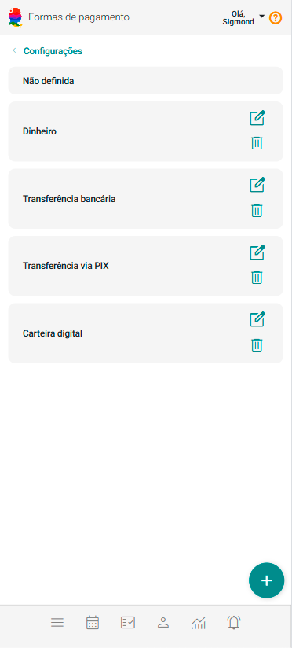
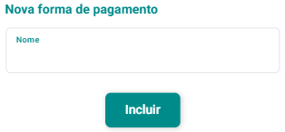

# Formas de Pagamento

O cadastro de Formas de Pagamento no eConsult é uma etapa crucial para o gerenciamento eficiente das transações financeiras da sua organização. Esse processo permite registrar os diversos métodos pelos quais os clientes podem efetuar pagamentos, assim como os métodos utilizados para o registro de pagamento das suas despesas. Dessa forma, todas as operações, tanto de receitas quanto de despesas, são devidamente documentadas e organizadas no sistema, assegurando um controle financeiro mais preciso.

## Incluir Forma de Pagamento

1. No painel "Configurações", acione a opção .

2. O sistema abrirá a tela "Formas de Pagamento".

    

3. Acione o botão **Incluir Forma de Pagamento** .

4. O sistema abrirá o formulário de cadastro de nova forma de pagamento.

    

5. Preencha o campo "Nome" (um nome dado por você sobre a forma de pagamento).

6. Acione o botão "Incluir" .

## Alterar Forma de Pagamento

1. No painel "Configurações", acione a opção .

2. O sistema abrirá a tela "Formas de Pagamentos".

3. Acione o botão  no *card* da forma de pagamento que se quer alterar.

4. O sistema abrirá o formulário de cadastro de alteração de forma de pagamento.

5. Altere o campo "Nome".

6. Acione o botão "Salvar" .

## Excluir Forma de Pagamento

1. No painel "Configurações", acione a opção .

2. O sistema abrirá a tela "Formas de Pagamento".

3. Acione o botão  no *card* da forma de pagamento que se quer excluir.

4. Confirme a exclusão acionando o botão **Sim**.

:::note
**Integração com Pix:** Caso o eConsult esteja integrado ao seu PIX, essa opção será exibida automaticamente na lista de formas de pagamento disponíveis no sistema. É importante destacar que a forma de pagamento 'PIX' se aplica exclusivamente a intenções de recebimento por atendimentos. Ela será utilizada para o pagamento de despesas e nem para a quitação de atendimentos, pois, neste último caso, trata-se de uma efetivação e não de uma intenção.

**Integração com Mercado Pago:** Caso o eConsult esteja integrado à plataforma 'Mercado Pago', essa opção será exibida automaticamente na lista de formas de pagamento disponíveis no sistema. É importante destacar que a forma de pagamento 'Mercado Pago' se aplica exclusivamente a intenções de recebimento de valores relacionados a atendimentos. Ela não será utilizada para o pagamento de despesas nem para a quitação de atendimentos, pois, neste último caso, trata-se de uma efetivação e não de uma intenção.
:::

