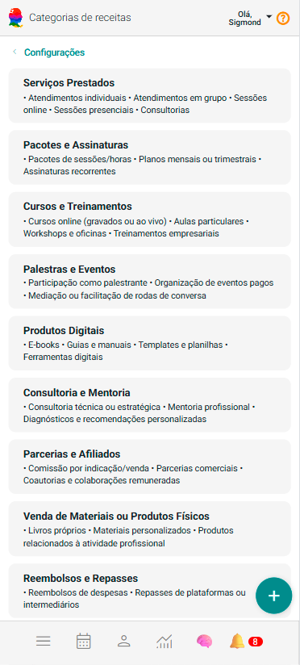
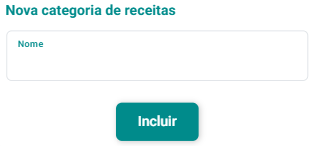

# Categorias de Receitas

As Categorias de Receitas no eConsult é uma ferramenta para a organização e a gestão financeira do seu negócio. Ela permite classificar e agrupar as diferentes fontes de receita, oferecendo uma visão clara e detalhada dos ganhos gerados por suas atividades. Isso facilita não apenas o acompanhamento do fluxo de caixa, mas também a análise financeira, o planejamento estratégico e a tomada de decisões informadas.

## Incluir Categoria de Receitas

1. No painel "Configurações", acione a opção .

2. O sistema abrirá a tela "Categorias de Receitas".

    

3. Acione o botão **Incluir Categoria de Receitas** .

4. O sistema abrirá o formulário de cadastro de nova categoria de receitas.

    

5. Preencha o campo "Nome" (um nome dado por você sobre a categoria de receitas).

6. Acione o botão "Incluir" .

## Alterar Categoria de Receitas

1. No painel "Configurações", acione a opção .

2. O sistema abrirá a tela "Categorias de Receitas".

3. Acione o botão  no *card* da categoria de receitas que se quer alterar.

4. O sistema abrirá o formulário de cadastro de alteração de categoria de receitas.

5. Altere o campo "Nome".

6. Acione o botão "Salvar" .

## Excluir Categoria de Receitas

1. No painel "Configurações", acione a opção .

2. O sistema abrirá a tela "Categorias de Receitas".

3. Acione o botão  no *card* da categoria de receitas que se quer excluir.

4. Confirme a exclusão acionando o botão **Sim**.

