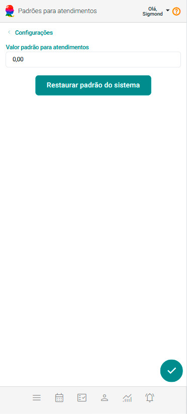

# Padrões para Atendimentos

A definição de Padrões de Atendimento permite que o sistema sugira automaticamente opções relacionadas, tornando o processo mais ágil e padronizado.

Hoje o sistema permite configurar somente o campo "Valor Padrão para Atendimentos".

## Configurar Valor Padrão para Atendimentos

1. No painel "Configurações", acione a opção "Padrões para Atendimentos".

    

1. Preencha o campo "Valor Padrão para Atendimentos".

1. Acione o botão "Salvar" .

    :::note
    O valor inserido neste campo será sugerido automaticamente como valor de atendimento ao cadastrar um novo cliente.
    :::