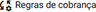
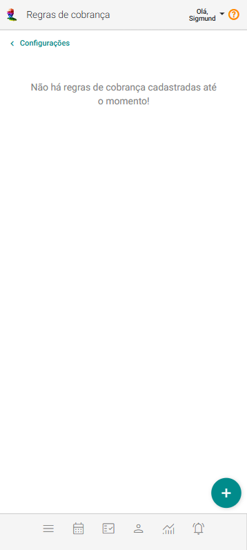
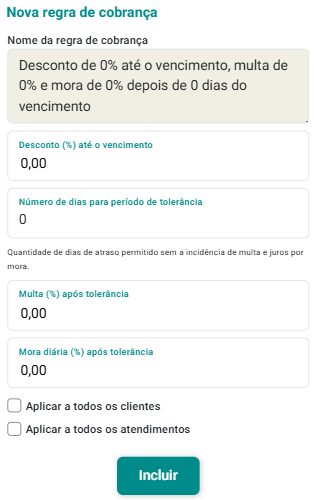
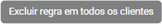
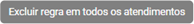

# Regras de Cobrança

Permite a inclusão de regras que definem como serão aplicados descontos, juros e multas nas transações de pagamentos dos clientes.

Por meio dessas regras, é possível configurar, por exemplo, o percentual de desconto para pagamento antecipado, bem como critérios para incidência de juros e mora em casos de atraso.

Essas configurações são cadastradas previamente e podem ser associadas aos clientes conforme a política comercial da sua organização, garantindo padronização e controle no processo de faturamento.

## Incluir uma nova Regra de Cobrança

1. No painel "Configurações", acione a opção .

2. O sistema abrirá a tela "Regras de Cobrança".

    

3. Acione o botão **Incluir Nova Regra de Cobrança** .

4. O sistema abrirá o formulário de cadastro de nova regra de cobrança.

    

5. Preencha o campo "Desconto (%) até o vencimento" com o percentual que será concedido ao cliente que realizar o pagamento até a data de vencimento.

6. Preencha o campo "Número de dias para período de tolerância" com a quantidade de dias, contados a partir da data de vencimento, durante os quais o cliente poderá efetuar o pagamento sem a incidência de juros (mora diária) ou multa.

7. Preencha o campo "Número de dias para período de tolerância" com a quantidade de dias, contados a partir da data de vencimento, durante os quais o cliente poderá efetuar o pagamento sem a incidência de juros (mora diária) ou multa.

8. Preencha o campo "Multa (%) após tolerância" com o percentual de multa que será aplicado sobre o valor devido caso o pagamento seja realizado após o período de tolerância.

9. Preencha o campo "Mora diária (%) após tolerância" com o percentual de juros que será cobrado por dia de atraso, a partir do fim do período de tolerância.

10. Marque a opção "Aplicar a todos os clientes" caso queira que esta regra seja válida para todos os clientes, de forma automática.

11. Marque a opção 'Aplicar a todos os atendimentos' caso deseje que esta regra seja aplicada automaticamente a todos os atendimentos não pagos.

12. Acione o botão "Incluir" .

## Alterar Regra de Cobrança

1. No painel "Configurações", acione a opção .

2. O sistema abrirá a tela "Regras de Cobrança".

3. Acione o botão  no *card* da regra de cobrança que deseja alterar.

4. O sistema abrirá o formulário de cadastro de alteração de regra de cobrança.

5. Altere o campo "Desconto (%) até o vencimento" com o percentual que será concedido ao cliente que realizar o pagamento até a data de vencimento.

6. Altere o campo "Número de dias para período de tolerância" com a quantidade de dias, contados a partir da data de vencimento, durante os quais o cliente poderá efetuar o pagamento sem a incidência de juros (mora diária) ou multa.

7. Altere o campo "Número de dias para período de tolerância" com a quantidade de dias, contados a partir da data de vencimento, durante os quais o cliente poderá efetuar o pagamento sem a incidência de juros (mora diária) ou multa.

8. Altere o campo "Multa (%) após tolerância" com o percentual de multa que será aplicado sobre o valor devido caso o pagamento seja realizado após o período de tolerância.

9. Altere o campo "Mora diária (%) após tolerância" com o percentual de juros que será cobrado por dia de atraso, a partir do fim do período de tolerância.

10. Marque a opção "Aplicar a todos os clientes" caso queira que esta regra seja válida para todos os clientes, de forma automática.

11. Marque a opção 'Aplicar a todos os atendimentos' caso deseje que esta regra seja aplicada automaticamente a todos os atendimentos não pagos.

12. Acione o botão "Salvar" .

## Excluir Regra de Cobrança

1. No painel "Configurações", acione a opção .

2. O sistema abrirá a tela "Regras de Cobrança".

3. Acione o botão  no *card* da regra de cobrança que deseja excluir.

4. Confirme a exclusão acionando o botão **Sim**.

:::note Como excluir regras de todos os clientes e/ou atendimentos?

Uma vez que exista pelo menos uma regra cadastrada, o eConsult mostrará as seguintes opções:

- : Permite excluir a regra de todos os clientes, ou seja, todos os clientes passarão a não ter uma regra de cobrança.
- : Permite excluir a regra de todos os atendimentos, ou seja, todos os atendimentos passarão a não ter uma regra de cobrança.