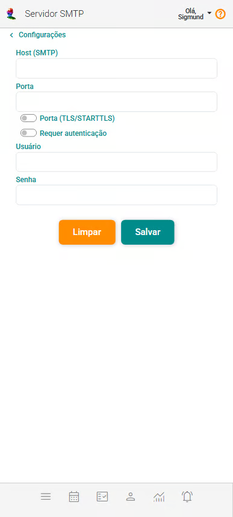
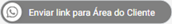

# Servidor SMTP

**O servidor SMTP (Simple Mail Transfer Protocol) é responsável pelo envio de e-mails. Ele atua como um intermediário, encaminhando as mensagens do remetente para o servidor de destino.**

Para configurá-lo, normalmente são necessários: o endereço do servidor, a porta, os dados de autenticação e o protocolo de segurança (SSL/TLS).

Consulte a documentação do seu provedor de e-mail (como Gmail, Outlook, Yahoo Mail, entre outros) para obter as informações necessárias e, em seguida, preencha os campos da tela "Servidor SMTP" para configurar a integração do eConsult com o seu servidor de e-mail.

:::note Por que configurar meu SMTP no eConsult?

Ao realizar essa configuração, além do botão **WhatsApp** , será mostrado o botão **E-mail** nos grupos de botões de mensagem em diversos *cards* do sistema. São os *cards*:

| *Card* | com SMTP configurado | Sem SMTP configurado |
|---|---|---|
|*Cards* do painel **Clientes**|||
|Painel **Alertas**, *cards* de **Confirmação**|||
|Painel **Alertas**, *cards* de **Atendimentos Prováveis**|||
|Painel **Alertas**, *cards* de **Aniversariantes do Mês**|||

Além disso, quando a configuração SMTP estiver ativa, o botão será exibido na tela de Pagamentos Emitidos para transações realizadas via Mercado Pago ou PIX que ainda não foram confirmadas. Esse botão permite o envio de um e-mail ao cliente contendo o QR Code (no caso de PIX) ou o link de pagamento (no caso de Mercado Pago).

:::