# Google Drive

**Configure a integração do eConsult com o seu Google Drive para criar um sistema de armazenamento e gerenciamento de arquivos totalmente centralizado e eficiente. Essa integração permite que todos os seus documentos, relatórios, imagens e outros tipos de arquivos sejam facilmente armazenados, acessados e compartilhados diretamente através da plataforma eConsult.**

Além de simplificar o acesso, essa integração também facilita a organização, permitindo que você categorize e armazene seus arquivos de forma estruturada e lógica, de acordo com suas necessidades. Com tudo centralizado no seu Google Drive, você garante que todos os seus arquivos estejam protegidos e sincronizados em tempo real, com backups automáticos, prevenindo a perda de informações.

A página Google Drive pode ser acessada através do [Painel Configurações](/docs/category/painel-configurações). 

Uma vez aciona a opção será mostrada a seguinte tela:

    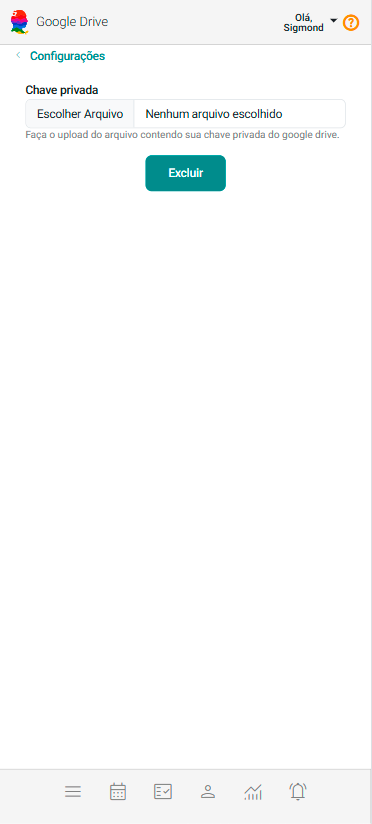

:::note Por que configurar meu Google Drive no eConsult? 

Essa configuração permitirá que o eConsult se conecte ao seu Google Drive, facilitando o armazenamento, a gestão e o compartilhamento de arquivos diretamente pela plataforma. Uma vez feita a configuração o sistema passa a mostrar:

- **Opção Arquivos no menu Principal:** Permite a gestão de arquivos dos clientes.
- **Aba Arquivos no cadastro do Cliente:** Permite a gestão de arquivos do cliente.
- **Mostra o botão Anexar Arquivos 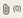 nos cards de Atentimento:** Permite fazer uma gestão de arquivos por atendimento.

:::

## Integrar eConsult com o seu Google Drive

:::warning

    Faça esta configuração em um notebook ou desktop, assim você terá mais facilidade de visualização e interação.

:::

1. Crie um Projeto no seu Google Cloud Console

    1. Acesse o Google Cloud Console (https://console.cloud.google.com/welcome/new).

    1. Faça o seu login de acesso.

        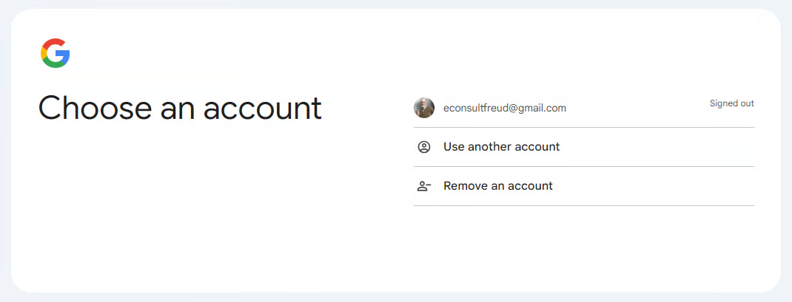

    1. Clique em "Select a Project"  no canto superior esquerdo da tela e, em seguida, em "New Project" .

    1. Nomeie o projeto com "eConsult" e clique em "Create".

    1. Selecione o projeto criado "eConsult".

1. Habilite a API do Google Drive

    1. Dentro do Google Cloud Console, com o projeto selecionado, vá até o menu lateral e clique em "API & Services" > "Library".

        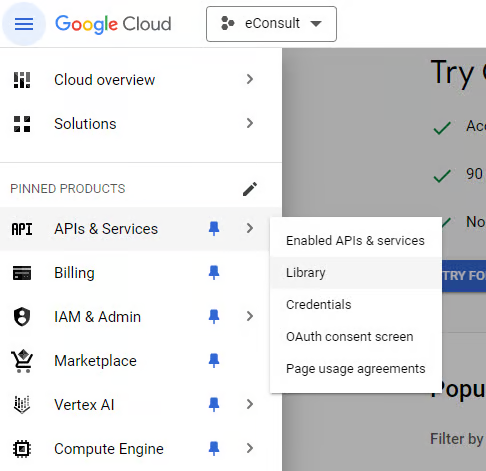

    1. Na barra de pesquisa, digite "Google Drive API" e acione a tecla "Enter".

        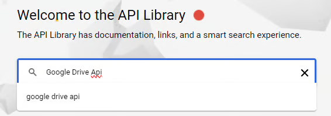

    1. Clique em "Google Drive API" e depois em "Enable" para ativar a API para o seu projeto.

        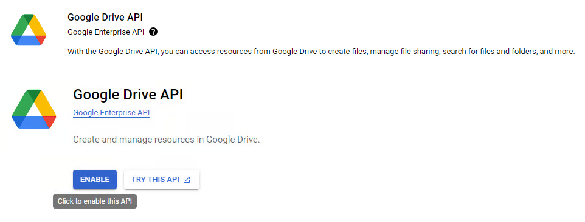

1. Crie Credenciais para a API

    1. Após habilitar a API, vá para "Credentials" no menu lateral.

        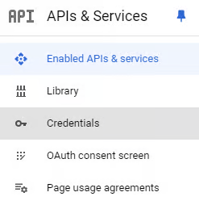

    1. Clique em "Create Credentials" e selecione "Service account".

        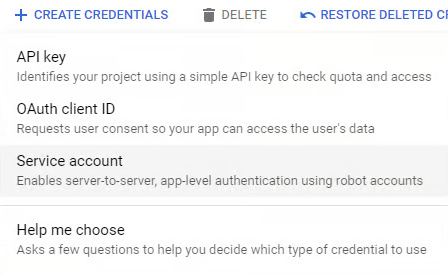

    1. Preencha o campo "Service account name" com o nome "eConsult".

        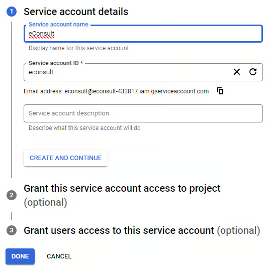

    1. Acione o botão "Done".

1. Crie o arquivo com chave privada de acesso a API do Google Drive

    1. Clique no "Service account" criado.

        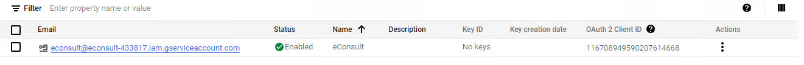

    1. Acione a opção "Keys", clique no botão "Add key" e depois "Create new key".

        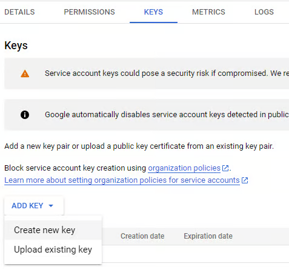

    1. Selecione a opção "Json" e clique no botão "Create".

    1. Será feito um download do arquivo contendo sua chave privada para sua pasta de downloads do seu computador.

        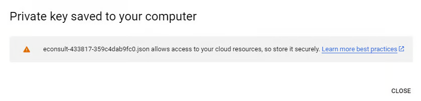

1. Configure a Integração no eConsult

    1. No eConsult, no painel **Configurações**, acesse a opção **Google Drive**.

    1. Clique na opção "Escolher Arquivo", selecione o arquivo contendo sua chave privada na sua pasta de downloads e clique na opção "Abrir".

        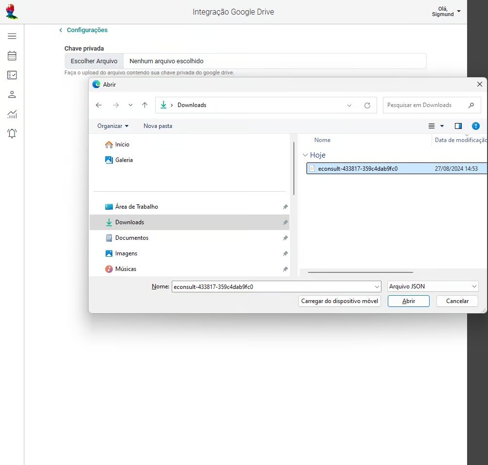

    1. Clique no botão "Copiar".

        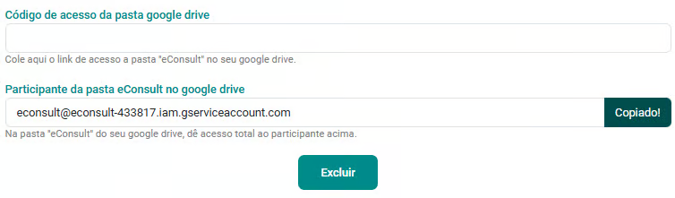

    1. Abra o seu Google Drive (https://drive.google.com/drive/home).

        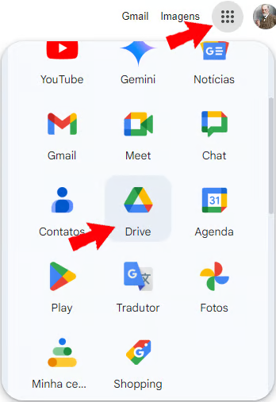

    1. Clique em "New" em seguida "NewFolder".

        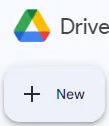

        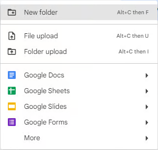

    1. Preencha o campo "New Folder" com o nome "eConsult" e clique no botão "Create".

        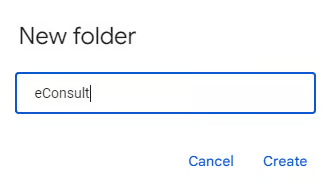

    1. Clique na opção "Share".

        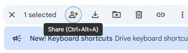

    1. No campo "Add people, groups, and calendar events" cole o texto copiado da tela do eConsult e acione a opção "Send".

        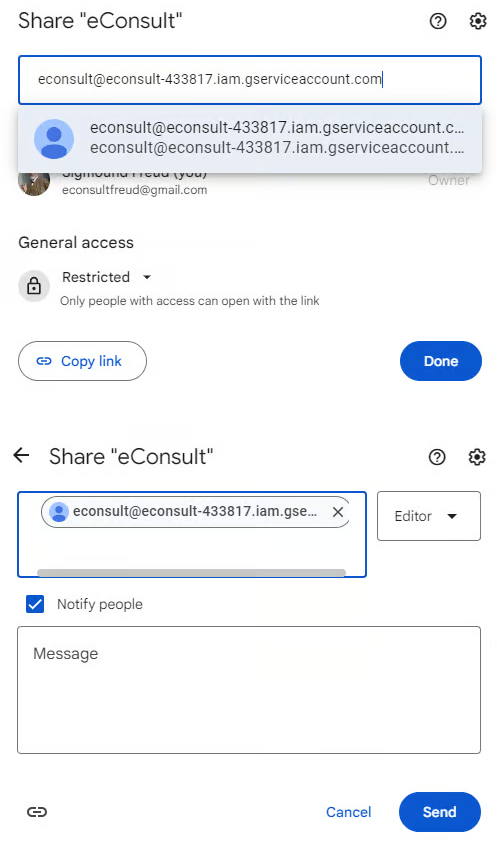

    1. Clique novamente na opção "Share".

    1. Acesse a opção "Restricted".

        

    1. Marque a opção "Anyone with the link".

        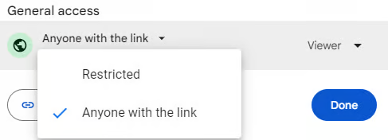

    1. Acione o botão "Copy link" em seguida "Done".

        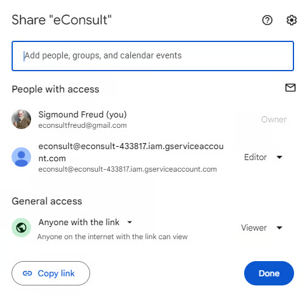

        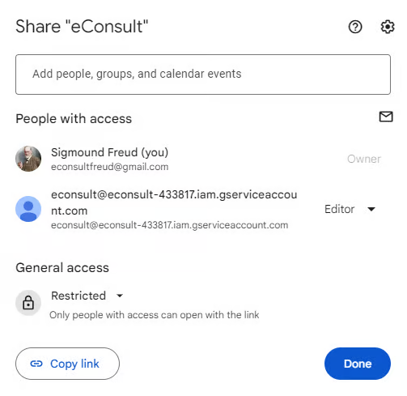

    1. Na tela do eConsult cole o link copiado no campo "Código de acesso da pasta google drive" e acione o botão "Salvar".

        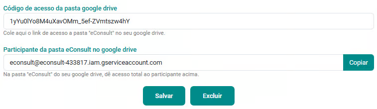

    Pronto! Sua integração está criada.

    :::note Manutenção e Monitoramento

    - Periodicamente, monitore a integração para garantir que esteja funcionando corretamente e que os tokens de autenticação estejam atualizados.
    - Caso haja problemas de acesso, verifique as credenciais e os escopos configurados.

    :::