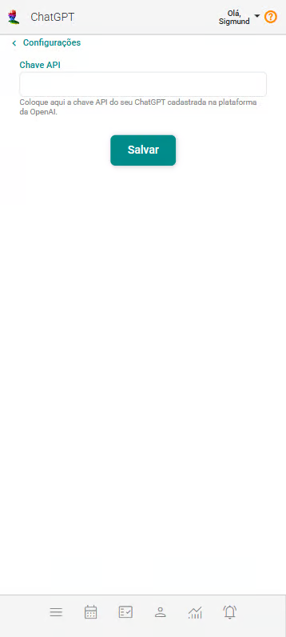

# ChatGPT

**Configure facilmente a integração do eConsult com o ChatGPT e incorpore inteligência artificial ao seu ambiente de trabalho, tornando seus processos mais eficientes e dinâmicos — tudo isso sem a necessidade de conhecimentos técnicos avançados.**

Essa configuração é simples e acessível (não requer conhecimentos avançados de informática), permitindo que você aproveite os recursos avançados do ChatGPT diretamente na plataforma eConsult. Com isso, é possível gerar textos, resumos de informações e contar com suporte em tarefas administrativas de forma prática e inteligente.

Além de agilizar rotinas, a integração pode ser personalizada conforme suas necessidades, proporcionando uma experiência mais intuitiva e adaptada ao seu contexto de atendimento. O uso da IA contribui para aumentar a produtividade e aprimorar a comunicação com seus clientes, equipe e parceiros.

A página ChatGPT pode ser acessada através do [Painel Configurações](#) opção **ChatGPT**.

Uma vez acionada a opção **ChatGPT** o sistema abrirá a seguinte tela:

:::note Por que integrar seu ChatGPT com o eConsult?

Essa integração ativará funcionalidades que utilizam a inteligência artificial do ChatGPT para apoiar suas atividades. São as funcionalidades:

- **Anotação de Atendimento:** Ao incluir ou editar uma Anotação de Atendimento, o sistema exibirá o botão  que abre uma tela de edição de texto com suporte à elaboração de conteúdo utilizando a inteligência artificial do ChatGPT.
- **Painel Resultados:** Na aba Mês, será mostrado, ao final da tela, o botão Faser Análise . Este botão permite gerar uma análise dos resultados do mês com insights utilizando a inteligência artificial do ChatGPT.
- **Painel Resultados:** No painel Resultados será mostrada a aba Ano. Nela, você poderá analisar os resultados dos anos encerrados com insights gerados pela inteligência artificial do ChatGPT.

:::

## Configurar a integração do seu ChatGPT no eConsult

1. Crie ou acesse sua conta na OpenAI
    
    - Acesse: https://platform.openai.com/​

    - Clique em "Sign Up" para criar uma conta ou "Log In" se já tiver uma no canto superior direito da tela.

        

1. Vá até a seção de API Keys
    
    - Após fazer login, vá para: https://platform.openai.com/account/api-keys​

1. Gere uma nova chave
    
    - Clique no botão “+ Create new secret key”.
    
        
    
    - Dê um nome para identificar sua chave (ex: “Minha Chave para eConsult”).
    
        
    
    - Clique em "Create secret key" .

1. Copie a chave

    - Copie a chave exibida logo após criá-la .
    
        :::warning Você não poderá vê-la novamente depois de sair da página.
            - Guarde em local seguro, como um gerenciador de senhas ou arquivo de configuração local.
        :::

1. Configure a Integração no eConsult

    - No eConsult, no painel Configurações, acesse a opção "Integrações / ChatGPT".
    
    - Preencha o campo Chave API com a chave copiada anteriormente.
    
        
    
    - Acione o botão Salvar .
    
Pronto! Sua integração está feita.

Para que esta integração funcione, é necessário adicionar créditos ao projeto criado na plataforma OpenAI.

## Inserir créditos na plataforma OpenAI

1. A OpenAI poderá apresentar duas opções:

1. **Prepaid credits (pré-pago)** → cliente insere o valor desejado (ex.: US$ 10, US$ 20, etc) e os créditos vão sendo consumidos.

1. **Usage limits (pós-pago com limite)** → cliente define um limite máximo de gasto mensal (ex.: US$ 50), e os valores serão cobrados conforme o uso.

(Obs: atualmente, para a maioria das contas novas no Brasil, a OpenAI está liberando mais o modelo "pós-pago com limite de uso", mas isso pode variar.)

### Sugestão de crédito inicial

Para o caso de uso típico de um psicólogo (geração de textos), recomendamos iniciar com um crédito de US$10 a US$20 (R$50 a R$100), que costuma ser mais do que suficiente.

Os créditos podem ser adicionados a qualquer momento, portanto, você pode começar com R$50 e, caso necessário, inserir valores adicionais conforme o uso evoluir.

Como o serviço funciona através da API da OpenAI, você não precisa pagar uma assinatura mensal. Você apenas adiciona créditos de acordo com o uso que fizer.

### Configurar pagamento

1. No menu lateral, acesse "Billing" (Faturamento).

1. Clique em "Payment Methods".

1. Adicione um cartão de crédito internacional válido.

### Monitorar uso

- O consumo pode ser acompanhado em tempo real no painel "Usage".

- Caso atinja o limite, o cliente pode adicionar mais crédito a qualquer momento.