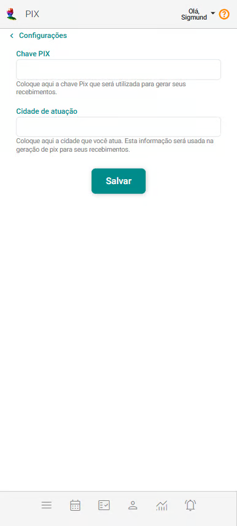
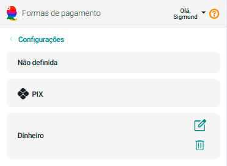
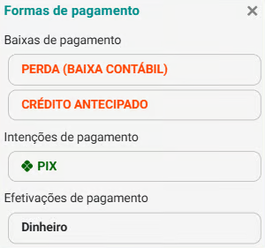
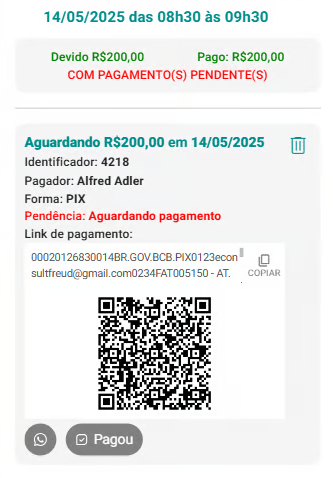

# PIX

**Configure a integração com o seu PIX na plataforma eConsult para facilitar transações financeiras e otimizar o processo de cobrança e recebimento em seu ambiente de trabalho.**

Essa integração permite que você receba pagamentos de forma rápida e segura diretamente pelo sistema, eliminando etapas manuais e reduzindo o tempo de processamento.

Além de oferecer mais agilidade nas operações, a funcionalidade permite gerar QR Codes para pagamentos e acompanhar o status de cada transação em tempo real.

Com a integração PIX, você melhora a gestão financeira, reduz a inadimplência e proporciona uma experiência de pagamento mais prática e moderna para seus clientes.

A página de configuração do PIX pode ser acessada através do [Painel Configurações](/docs/funcionalidades/configuracoes/visao-configuracoes) opção **PIX**.

Uma vez acionada a opção **PIX** o sistema abrirá a seguinte tela:

:::note Por que configurar meu PIX no eConsult?

    Com essa configuração, o eConsult poderá gerar QR Codes de pagamento vinculados ao seu PIX, facilitando para que seus clientes realizem os pagamentos de forma prática e segura. 
    
    Após a conclusão da configuração, o sistema passará a exibir:
    
    - **Configuração de Formas de Pagamento:** exibe automaticamente a opção PIX, indicando que ela agora está disponível como uma forma de pagamento no sistema.

        

    - Nas telas de pagamento: a opção PIX passa a ser exibida como uma forma disponível para a intenção de pagamento.

        
    
    - Nas telas de pagamento: após a seleção do PIX como intenção de pagamento, o sistema gera um QR Code com o link correspondente, que pode ser compartilhado com o cliente via WhatsApp ou E-mail (se tiver integração SMTP). Além disso, é exibido o botão 'Pagou', permitindo registrar quando o cliente efetivar o pagamento.

        

        :::note

            É importante destacar que o status do pagamento permanecerá como 'Aguardando Pagamento' até que você registre manualmente no sistema que o cliente efetuou o pagamento. Por isso, recomenda-se orientar o cliente a enviar o comprovante assim que realizar o pagamento, já que a atualização do status não é feita de forma automática.
        :::

## Configurar su PIX no eConsult

1. Cadastre as informações de seu PIX no eConsult

    - No eConsult, no painel Configurações, acesse a opção "PIX".
    - Preencha os campos Chave PIX (com sua chave pix) e Cidade de Atuação (com o nome da cidade onde você atua).
    - Acione o botão Salvar .

Pronto! Sua integração está feita.