# Mercado Pago

**Configure a integração do seu Mercado Pago com a plataforma eConsult para ampliar suas opções de pagamento e facilitar a gestão financeira do seu negócio.
Essa integração permite que você receba pagamentos de forma prática e segura por meio da conta Mercado Pago, diretamente pelo sistema eConsult, otimizando o processo de cobrança e reduzindo tarefas manuais.**

Além de aumentar a agilidade nas operações, a funcionalidade permite a geração de links de pagamento personalizados, acompanhamento do status das transações de forma automática e centralização das informações financeiras em um só lugar.

Com a integração ao Mercado Pago, você oferece mais flexibilidade aos seus clientes, reduz a inadimplência e proporciona uma experiência de pagamento moderna e confiável.

A página de configuração Mercado Pago pode ser acessada através do [Painel Configurações](/docs/category/painel-configurações) opção **Mercado Pago**.

Uma vez acionada a opção **Mercado Pago** o sistema abrirá a seguinte tela:

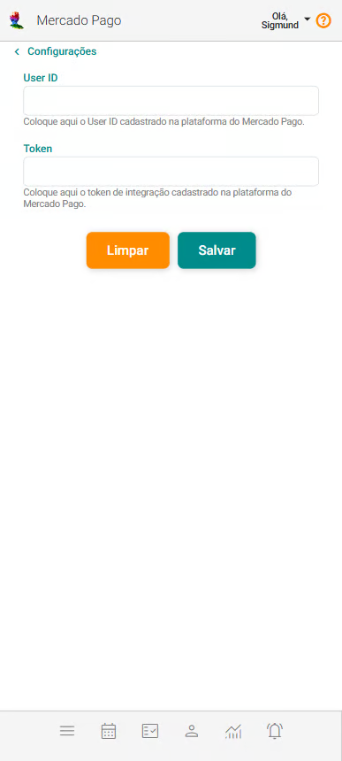

:::note Por que configurar meu Mercado Pago no eConsult?

    Com essa configuração, o eConsult poderá gerar links de pagamento vinculados ao seu Mercado Pago, facilitando para que seus clientes realizem os pagamentos de forma prática e segura. 

    Após a conclusão da configuração, o sistema passará a exibir:
    
    - **Configuração de Formas de Pagamento:** exibe automaticamente a opção Marcado Pago, indicando que ela agora está disponível como uma forma de pagamento no sistema.

        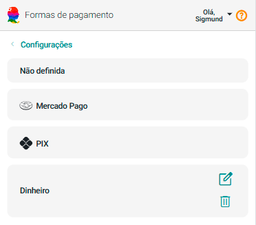

    - **Nas telas de pagamento:** a opção Mercado Pago passa a ser exibida como uma forma disponível para a intenção de pagamento.

        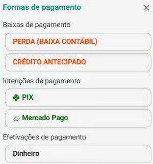

    - **Nas telas de pagamento:** após a seleção do Mercado Pago como forma de pagamento, o sistema gera um link correspondente que pode ser compartilhado com o cliente via WhatsApp ou por e-mail (caso haja integração SMTP). Além disso, é exibido o botão 'Pagou', permitindo o registro manual do pagamento assim que o cliente o realizar.

        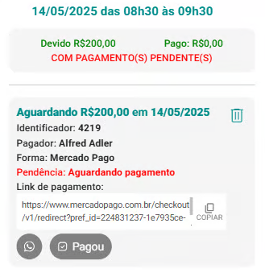

    :::note
        É importante destacar que o status do pagamento será atualizado automaticamente assim que o cliente efetuar o pagamento, desde que o webhook do eConsult esteja devidamente cadastrado na plataforma do Mercado Pago. Caso contrário, o status permanecerá como 'Aguardando Pagamento' até que o registro seja feito manualmente no sistema.
:::

## Configurar meu Mercado Pago no eConsult

1. Crie uma conta no Mercado Pago (se ainda não tiver)

    - Acesse: https://www.mercadopago.com.br​.

    - Crie uma conta de **vendedor (business)**, pois é necessário para gerar links de pagamento.

1. Crie uma Aplicação no Mercado Pago

    - Acesse o **Painel de Desenvolvedores do Mercado Pago** (https://www.mercadopago.com.br/developers/panel/app).

    - Clique em "Criar Aplicação" .

    - Dê um nome, como exemplo: ```Integra eConsult```.

    - Escolha a opção "Pagamentos Online" (obrigatório).

    - Em "Você está usando uma plataforma de e-commerce" marque "Não".

    - Em "Qual produto você está integrando?" escolha a opção "CheckoutPro".

    - Em "Modelo de integração" não selecione nada.

    - Marque a opção "Eu autorizo o uso dos meus dados pessoais conforme a Declaração de Privacidade e certifico que minha conta usa as ferramentas do Mercado Pago de acordo com os Termos e condições".

    - Marque a opção "Não sou robô".

    - Acione o botão Criar Aplicação.

        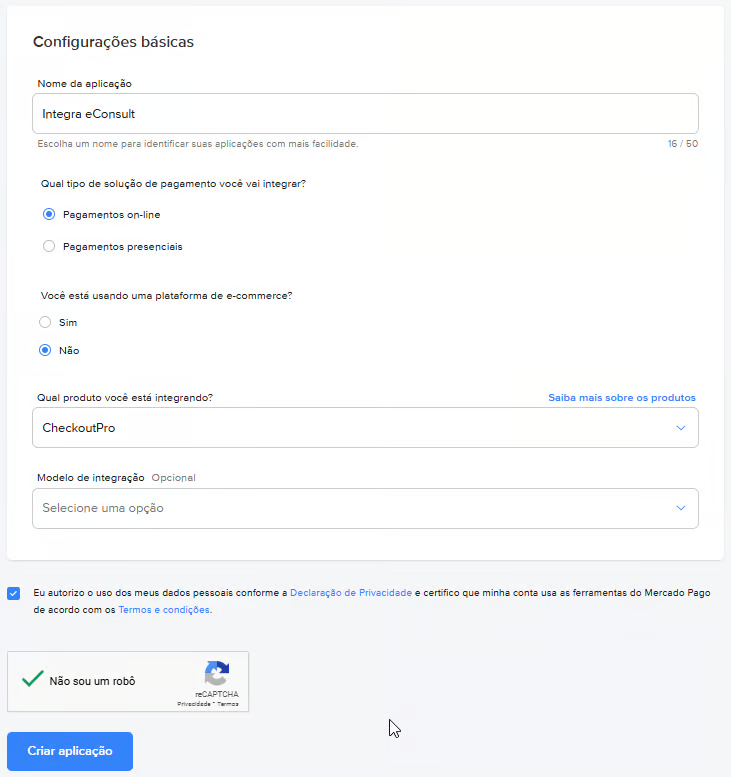

1. Obter "User ID" e "Token" ("Access Token")

    - No painel da aplicação, vá até a aba "Credenciais de produção".

        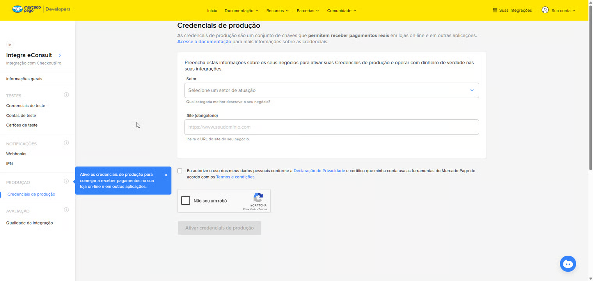

    - Preecha os campos:
    
        - Setor com "Outros".
        
        - Site com "https://econsult.app.br/".

    - Marque as opções "Eu autorizo" e "Não sou Robô".

    - Acione o botão "Ativar credenciais de produção" .

        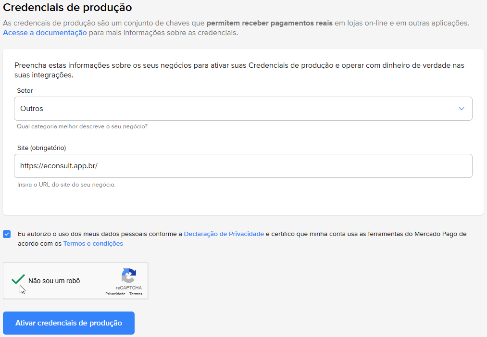

    - Será mostrada a seguinte tela com suas credenciais.

        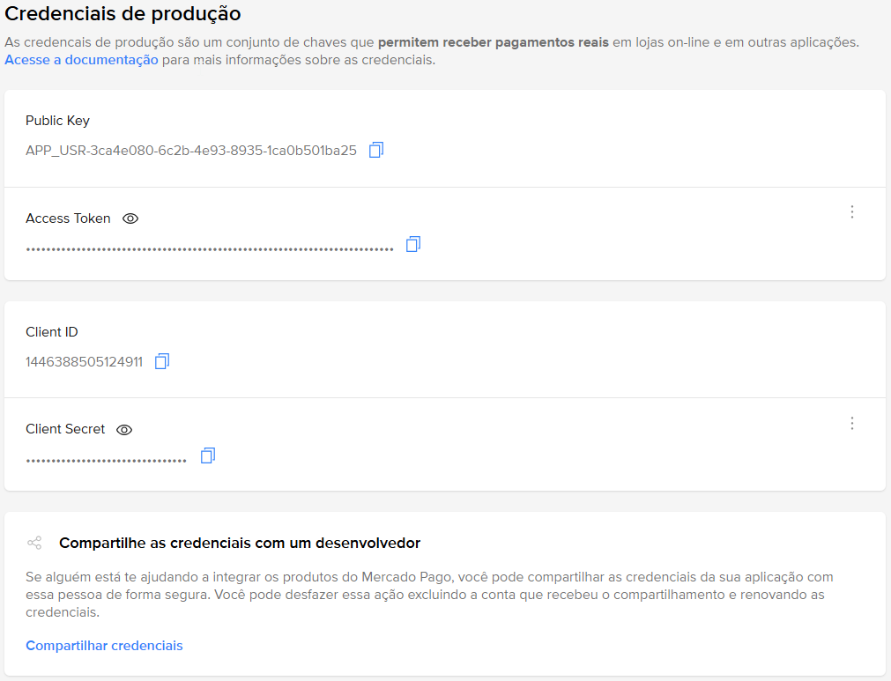

1. Configurar no eConsult

    - No Mercado Pago, vá até a aba "Informações Gerais" e clique no botão  de User ID para copiar o valor correspondente.

        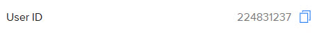

    - No eConsult, na tela "Configurações" /" Mercado Pago", peencha o campo "User ID" com o valor copiado anteriormente.
    
    - Volte para o Mercado Pago, na aba "Credenciais de produção", clique no botão  "Access Token" para copiar o valor correspondente.

        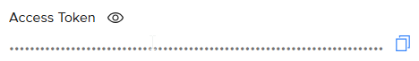
    
    - No eConsult, na tela "Configurações" / "Mercado Pago", peencha o campo "Token" com o valor copiado.

    - Acione o botão Salvar .

        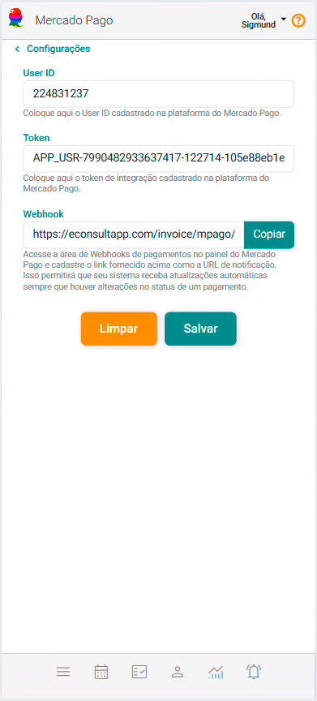

1. Configurando Webhook

    - No eConsult, na tela "Configurações" / "Mercado Pago", acione o botão 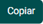 do campo Webhook.

        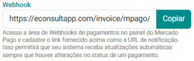

    - Vá para o Mercado Pago, e abra a aba "Webhooks".

        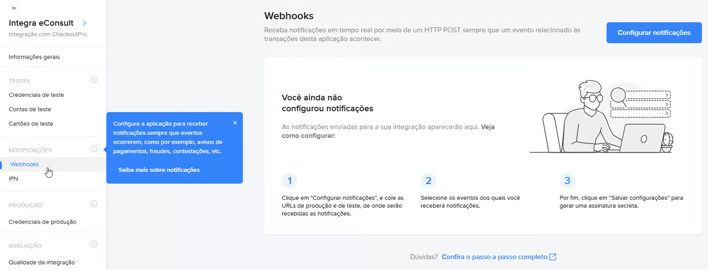.
 
    - Clique no botão "Configurar notificações" .
    
    - Abrirá a tela "Configurar Notificações Webhooks".

    - Clique na opção "Modo de Produção".

        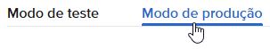.

    - Preencha o campo "URL de produção" com a url "https://econsultapp.com/invoice/mpago/webhook" (copiado anteriormente).

        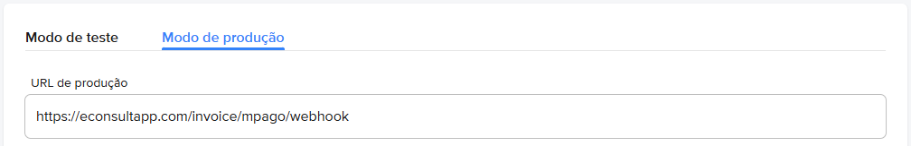.

    - Marque a opção "Pagamentos" e acione o botão "Salvar configurações".

        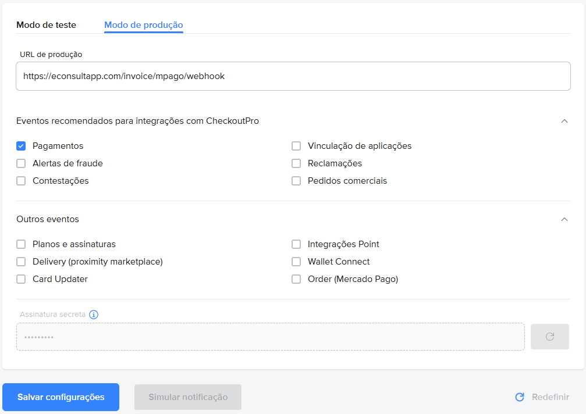.

Pronto! Sua integração está feita.