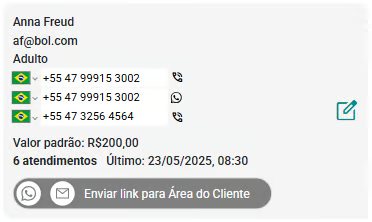

# Sobre Clientes e Grupos de Atendimento

**O painel Clientes e Grupos de Atendimento do eConsult é uma ferramenta estratégica e indispensável para a gestão eficaz de informações cruciais no ambiente corporativo. Desenvolvido para atender às demandas de organizações que lidam com múltiplos atendimentos e perfis de clientes, esse painel possibilita a centralização, organização e rápida consulta de dados relevantes, promovendo maior agilidade nos processos operacionais.**

Por meio de uma interface intuitiva e funcional, o painel permite o acesso facilitado a informações detalhadas sobre os clientes, bem como à estruturação de grupos de atendimento conforme critérios personalizados. Isso garante maior controle, melhor distribuição de demandas e uma visão unificada das relações com os clientes, o que resulta em um fluxo de trabalho mais eficiente e integrado.

Além disso, ao reunir todos os dados em um único ambiente, o painel contribui significativamente para a redução de erros, aumento da produtividade e tomada de decisões mais assertivas, tornando-se uma peça-chave para organizações que buscam excelência na gestão de atendimentos e no relacionamento com o cliente.

## *Cards* de clientes e de grupos de atendimento

O painel Clientes e Grupos de Atendimento do eConsult oferece uma visão completa e organizada de todos os clientes e grupos de atendimento cadastrados, incluindo tanto os ativos quanto os inativos. Com uma navegação intuitiva e funcional, as informações são apresentadas em uma estrutura clara, por meio de uma lista de *cards*, que facilita a visualização, o acesso rápido e o gerenciamento eficiente dos dados.

*Exemplo de card de um Cliente*

*Exemplo de card de um Grupo de Atendimento*Cada *card* apresenta informações essenciais de forma concisa, incluindo o "Nome" do cliente ou grupo de atendimeto, "Email", "Grupo etário", "Telefones", "Valor Padrão de Atendimento", "Número de Atendimentos Vinculados", e a "Data do Último Atendimento Agendado". Essa estrutura facilita a consulta rápida e eficiente dos principais dados de cada cliente ou grupo, permitindo que os profissionais acessem as informações necessárias com apenas um olhar.

Os *cards* também oferecem funcionalidades adicionais que tornam a gestão de clientes e grupos completa. É possível, por exemplo, realizar ações de comunicação direta, como o envio de mensagens por WhatsApp  ou a realização de ligações telefônicas , tudo diretamente a partir do painel. Essas funcionalidades garantem uma gestão centralizada e eficiente, permitindo interações rápidas e personalizadas com os clientes e com os grupos de atendimento.

Além disso, nos *cards*, está disponível a opção "Enviar link para a Área do Cliente" . Essa funcionalidade permite que você compartilhe com seu cliente — ou com o responsável por um grupo de atendimento — um link exclusivo de acesso à "Área do Cliente", enviado via WhatsApp  ou E-mail  (este último se a integração SMTP estiver ativa).

O cliente ou grupo poderá acessar diversas informações relevantes, previamente definidas por você no cadastro individual. Essa abordagem facilita a comunicação, aumenta a transparência e oferece mais autonomia para o cliente ou grupo, ao mesmo tempo em que preserva seu controle sobre os acessos.

:::note
    Mais informações sobre a Área do Cliente, [clique aqui](#).
:::

## Informações e botões que podem constar nos *cards* de Clientes e Grupos de Atendimento

Sendo:

1. **Nome do Cliente ou Grupo de Atendimento:** Exibe o nome do cliente ou do grupo.
1. **Grupo Etário do Cliente:** Informa o grupo etário do cliente ou grupo.
1. **Celular (Chamada Direta):** Número de celular com link para realizar chamadas diretamente pelo dispositivo.
1. **Celular (WhatsApp):** Número de celular com link direto para contato via WhatsApp.
1. **Telefone Fixo (Chamada Direta):** Número de telefone fixo com link para realizar chamadas diretamente pelo dispositivo.
1. **Valor Padrão de Atendimento:** Informa o valor padrão cadastrado para os atendimentos do cliente ou grupo.
1. **Atendimentos Agendados:** Indica a quantidade de atendimentos agendados para o cliente ou grupo até o momento.
1. **Perdas Registradas:** Mostra o número de perdas (baixas contábeis registradas) associadas ao cliente ou grupo.
1. **Data do Último Atendimento:** Exibe a data do último atendimento agendado. Se for superior a 30 dias, a data será exibida em vermelho.
1. Dispensas de Cobrança: Indica o número de dispensas de cobrança registradas para o cliente (dispensa de cobrança ocorre quando o atendimento não é pago e o valor é zerado manualmente).
1. **Envio de Link Área do Cliente via WhatsApp:** Botão que permite enviar o link de acesso a Área do Cliente via WhatsApp para o cliente ou grupo de atendimento.
1. **Envio de Link Área do Clientevia E-mail:** Botão que permite enviar o link de acesso a Área do Cliente por e-mail (disponível apenas se houver uma integração SMTP configurada).
1. **Editar Cadastro:** Botão que abre a tela de cadastro do cliente em modo de edição.

## Filtros da lista de *cards*

A lista de cards no painel Clientes e Grupos do eConsult foi desenvolvida para oferecer uma navegação ágil e eficiente. Para isso, o sistema disponibiliza diversas opções de filtragem, que permitem localizar rapidamente um cliente ou grupo específico. Entre os critérios disponíveis, estão:

- **Filtro por nome:** Digite parte ou o nome completo no campo de busca para encontrar o cliente ou grupo desejado.
- **Filtro por inatividade:** É possível exibir apenas registros ativos ou inativos, facilitando a gestão de atendimentos e a revisão de cadastros.
- **Filtro por letra inicial:** Selecione a primeira letra do nome para visualizar somente os registros que iniciam com aquele caractere.

Essas opções de filtragem tornam a experiência de uso mais fluida, permitindo aos profissionais localizar, acessar e gerenciar os registros com rapidez e precisão, mesmo em bases de dados com grande volume de informações.

## Sobre inclusão de clientes ou grupos de atendimento

A inclusão de um cliente ou grupo é feita por meio do botão **Incluir novo cliente ou grupo** , disponível no Painel "Clientes e Grupos". Para realizar o cadastro inicial, é necessário informar apenas o "nome" e o "sexo", o que permite um registro rápido — ideal para situações que exigem agilidade. Os demais dados podem ser preenchidos posteriormente, conforme sua necessidade e conveniência.

## Sobre edição de clientes ou grupos de atendimento

A edição (ou alteração) dos dados cadastrais de clientes ou grupos é realizada de forma simples e direta. Para isso, utilize o botão  localizado no canto direito de cada *card* da lista de clientes e grupos.

Ao clicar nesse botão , será aberta a tela de cadastro correspondente, já em modo de edição, permitindo atualizar todas informações do cliente ou grupo.

Essa funcionalidade foi pensada para proporcionar agilidade e praticidade, permitindo ajustes rápidos diretamente na visualização principal dos registros.

## Sobre exclusão de clientes e grupos de atendimento

O eConsult não permite a exclusão definitiva de clientes ou grupos, em conformidade com a Lei Geral de Proteção de Dados (LGPD). Essa medida tem como objetivo preservar a integridade das informações e garantir a rastreabilidade do histórico de atendimentos.

Em vez disso, o sistema oferece a opção de inativar um cliente ou grupo. Ao ser inativado:

- O cliente ou grupo deixa de estar disponível para novos agendamentos;
- Todas as informações históricas são mantidas, permitindo acesso contínuo a registros, análises e relatórios;
- A reativação pode ser feita a qualquer momento, se for necessário retomar os atendimentos.

Essa abordagem assegura conformidade legal, além de garantir segurança, transparência e consistência nos dados do sistema.

