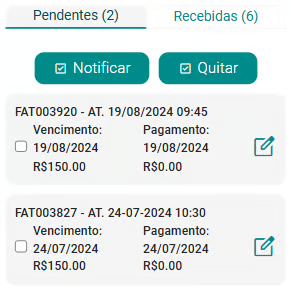
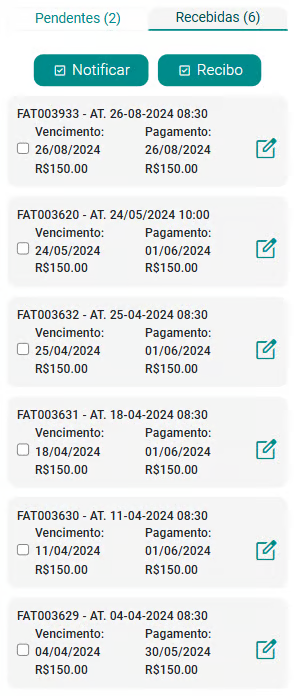
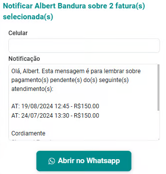
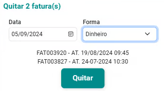

# Aba Faturas

A aba Faturas no eConsult é uma ferramenta essencial para a gestão financeira e o controle das transações realizadas com os clientes. Nesta aba, você encontrará um conjunto completo de funcionalidades que ajudam a organizar, visualizar e gerenciar todas as faturas associadas aos atendimentos.

Para cada atendimento cadastrado no sistema, uma fatura correspondente é gerada automaticamente. Essas faturas incluem informações essenciais para o controle financeiro e a gestão de pagamentos.

Cada fatura é composta basicamente pelos seguintes elementos:

- **Valor de Vencimento:** O montante a ser cobrado pelo atendimento prestado. Este valor é registrado na fatura e serve como base para o controle financeiro.

- **Data de Vencimento:** A data limite para o pagamento da fatura. Ajuda a determinar o prazo em que o pagamento deve ser efetuado.

- **Valor de Pagamento:** O valor pago até o momento, podendo ser parcial ou total.

- **Data de Pagamento:** A data em que o pagamento foi efetivamente realizado em sua totalidade. Esta informação é registrada na fatura assim que o pagamento em sua totalidade é confirmado.

Com esses dados, o sistema permite verificar o status das faturas, indicando se estão:

- **Pendentes:** Faturas que ainda não foram pagas em sua totalidade e estão aguardando o pagamento total da fatura.

- **Recebidas:** Faturas cujo pagamento em sua totalidade foi efetuado e registrado, indicando que a transação financeira foi concluída.

Essa organização facilita o acompanhamento das transações financeiras, ajudando a manter o controle sobre pagamentos pendentes e recebidos, garantindo uma gestão eficiente das finanças associadas aos atendimentos.

Sendo assim, na aba Faturas, você encontrará duas sub-abas distintas para um gerenciamento mais detalhado:

- **Sub-aba "Pendentes":** Nesta seção, são listadas todas as faturas que ainda não foram quitadas integralmente. A sub-aba oferece uma visão clara dos valores pendentes e das respectivas datas de vencimento, facilitando o acompanhamento das faturas em aberto e permitindo uma gestão eficiente dos pagamentos, sejam eles próximos do vencimento ou já em atraso.

    

- **Sub-aba "Recebidas":** Nesta seção, estão registradas todas as faturas cujo pagamento já foi confirmado. Ela exibe informações detalhadas, como a data do pagamento e o valor recebido, facilitando a verificação das transações concluídas e o controle financeiro eficiente.

    

Na sub-aba "Pendentes", você dispõe de duas funções essenciais para o gerenciamento das faturas em aberto:

- **Função "Notificar":** Permite enviar notificações diretamente pelo WhatsApp aos clientes sobre os pagamentos pendentes selecionados. Ao ativar essa função, é possível disparar uma mensagem personalizada, alertando o cliente sobre a necessidade de quitação das faturas marcadas. Essa comunicação direta torna o lembrete rápido e eficiente, facilitando a recuperação de pagamentos.

    
    
- **Função "Quitar":** Para registrar o pagamento integral das faturas, você pode usar a função Quitar. Ao acioná-la, o sistema exibe uma tela com as informações necessárias, solicitando a data de recebimento e a forma de pagamento. Após a confirmação, as faturas selecionadas são transferidas da lista de pendentes para a sub-aba Recebidas, atualizando o status e garantindo um controle financeiro preciso e atualizado.

    

    :::warning 
    Se na quitação o sistema não listar nenhuma forma de pagamento, significa que não existem formas de pagamento cadastradas. Utilize a tela de [cadastro de formas de pagamento](#) para corrigir isso.
    :::

Na sub-aba Recebidas, você conta com duas funções essenciais para o gerenciamento das faturas já quitadas:

- **Notificar:** Permite informar o cliente, via WhatsApp, que o pagamento das faturas selecionadas foi recebido e registrado. Essa comunicação mantém o cliente atualizado e fortalece a transparência no relacionamento.

- **Recibo:** Com essa função, você pode gerar um recibo oficial para o cliente, contemplando as faturas selecionadas. Esse documento formaliza o pagamento de forma clara e profissional, auxiliando no controle e na prestação de contas.

:::note Edição de faturas
Utilize a opção  localizada nos *cards* de faturas, tanto pendentes quanto recebidas, para realizar alterações nas informações da fatura. Com essa opção, é possível:
- Efetuar pagamentos totais ou parciais.
- Excluir pagamentos já feitos, caso necessário.
:::

Essas funcionalidades são fundamentais para manter o registro financeiro sempre atualizado e organizado, além de promover uma comunicação clara e transparente com o cliente. Ao facilitar o acompanhamento dos pagamentos e a emissão de comprovantes, elas contribuem para fortalecer a confiança no relacionamento e assegurar um fluxo administrativo mais eficiente e profissional.