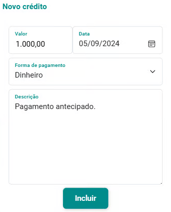
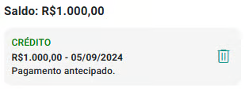
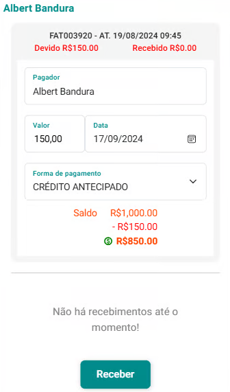
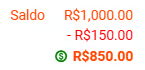
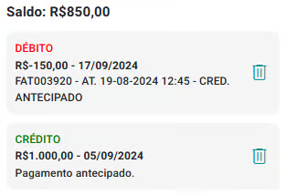
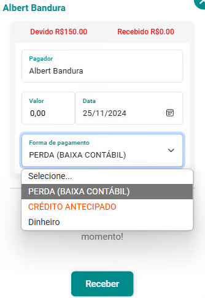
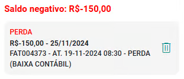

# Aba Créditos e Perdas

A aba Créditos e Perdas oferece funcionalidades para o gerenciamento de créditos antecipados e perdas financeiras, garantindo um controle financeiro preciso e confiável.

- **Créditos Antecipados:** São valores recebidos de clientes ou grupos independentemente da prestação dos serviços. Esses créditos podem ser utilizados como forma de pagamento em atendimentos futuros, proporcionando flexibilidade e praticidade para os clientes. O sistema registra detalhadamente cada transação, assegurando que os créditos sejam devidamente contabilizados e descontados conforme sua utilização, com total transparência e rastreabilidade.

- **Perdas:** Referem-se a valores de atendimentos realizados, mas que não foram recebidos e são considerados irrecuperáveis. O sistema identifica, registra e categoriza essas perdas, permitindo um acompanhamento detalhado e auxiliando na análise financeira e na tomada de decisões estratégicas para reduzir a inadimplência.

## Incluir crédito antecipado

1. Na aba "Créditos e Perdas", acione a opção "Incluir crédito antecipado" .

1. O sistema abrirá a tela de cadastro "Novo crédito".

    

1. Preencha os campos "Valor", "Data", "Forma de Pagamento" e "Descrição" (opcional).

1. Acione o botão "Incluir" .

1. A aba mostrará um extrato atualizado já com o crédito cadastrado.

    

## Excluir crédito antecipado

1. Na aba "Créditos e Perdas", acione a opção  no *card* respectivo do crédito que deseja excluir.

1. Confirme a exclusão clicando no botão "Sim".

Você pode selecionar um atendimento ou fatura qualquer e proceder um pagamento utilizando a opção "CRÉDITO ANTECIPADO" no campo "Forma de Pagamento".

## Pagar um atendimento utilizando um "CRÉDITO ANTECIPADO"

1. Em um *card* de fatura pendente na aba "Faturas", acione o botão .

1. Preencha os campos "Valor" e "Data".

1. No campo "Forma de Pagamento" selecione a opção "CRÉDITO ANTECIPADO".

    

1. O sistema mostrará o saldo do cliente, o valor do pagamento e o saldo restante antes da realização da transação.

    

1. Acione a opção "Receber" para confirmar a transação.

1. Vá para a aba "Créditos Antecipados".

1. Você perceberá que o pagamento constará como "DÉBITO" na listagem, e que o "SALDO" foi atualizado.

    

## Excluir um débito de um "CRÉDITO ANTECIPADO"

1. Na aba "Créditos e Perdas", no *card* do débito respectivo, acione a opção .

2. Confirme a exclusão clicando em "Sim".

## Perdas Financeiras

No caso de identificação de uma **perda financeira relacionada a um atendimento**, ou seja, quando se confirma que o cliente não efetuará o pagamento, é necessário realizar a baixa contábil desse valor.

Esse processo consiste em registrar oficialmente a baixa contábil no sistema, removendo o valor da lista de contas a receber e classificando-o como uma perda. Essa ação é fundamental para manter a contabilidade atualizada e refletir de forma precisa a situação financeira da empresa, evitando distorções nos relatórios financeiros.

Para registrar uma determida perda (baixa contábil), você deve selecionar um atendimento ou fatura qualquer e proceder um registro utilizando a opção "PERDA (BAIXA CONTÁBIL)" no campo "Forma de Pagamento". 

## Incluir uma perda (baixa contábil)

1. Em um *card* de fatura pendente na aba "Faturas", acione o botão .

1. Preencha os campos "Valor" e "Data".

1. No campo "Forma de Pagamento" selecione a opção "PERDA (BAIXA CONTÁBIL)".

    

1. Acione a opção "Receber" para confirmar a transação.

1. Vá para a aba "Créditos e Perdas".

1. Você perceberá que haverá um registro de PERDA na listagem.

    

:::warning 
Se o cliente tiver saldo positivo superior ao valor do atendimento o sistema não deixará registrar a perda e avisará que o cliente tem crédito suficiente para o pagamento do atendimento.
:::