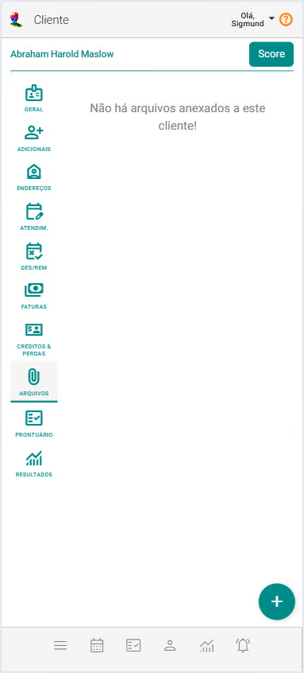
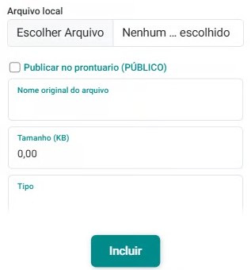

# Aba Arquivos

:::warning
A aba Arquivos não será mostrada se você não fizer antes a configuração "**[Integração com Google Drive](/docs/funcionalidades/configuracoes/integracoes/googledrive)**".
:::

O eConsult oferece um sistema integrado de gerenciamento de arquivos, diretamente conectado ao Google Drive, proporcionando uma solução centralizada, segura e eficiente para armazenar e acessar documentos de clientes ou grupos de atendimento.

Com essa integração, todos os arquivos — como documentos, relatórios, imagens e outros formatos — podem ser facilmente organizados, acessados e compartilhados pela própria plataforma. Isso otimiza o fluxo de trabalho, melhora a organização e permite a categorização lógica e personalizada dos arquivos, de acordo com as necessidades do seu atendimento.

Ao centralizar os documentos no Google Drive, você conta com sincronização em tempo real, backups automáticos e maior segurança, reduzindo o risco de perda de informações importantes.

Para ativar a integração, acesse: [Painel de Configurações > Google Drive](/docs/funcionalidades/configuracoes/integracoes/googledrive).

Na aba Arquivos, é possível anexar documentos diretamente vinculados ao cliente, facilitando o gerenciamento e o acesso rápido a informações relevantes.

## Incluir arquivo vinculado ao cliente

1. Na aba "Arquivos", acione a opção "Incluir novo arquivo" .

1. O sistema abre formulário de cadastro de novo arquivo.

    

1. Acione a opção "Escolher Arquivo".

1. Selecione o arquivo desejado do seu dispositivo.

1. Uma vez selecionado o arquivo do seu dispositivo, o sistema preencherá automaticamente os campos "Nome Original do Arquivo", "Tamanho" e "Tipo".

1. Marque a opção "Publicar no prontuário (Público)" se desejar compartilhar com seu cliente o link do arquivo para downloads.

1. Acione o botão "Incluir" .

1. A aba Arquivos mostrará o arquivo incluído vinculado ao cliente.

## Alterar arquivo vinculado ao cliente

1. Na aba "Arquivos, no *card" do arquivo que se quer alterar, acione a opção .

1. O sistema abre formulário de cadastro do arquivo.

1. Se que mudar o arquivo, acione a opção "Escolher Arquivo".

    1. Selecione o arquivo desejado do seu dispositivo.

    1. Uma vez selecionado o arquivo do seu dispositivo, o sistema preencherá automaticamente os campos "Nome Original do Arquivo", "Tamanho" e "Tipo".

1. Marque a opção "Publicar no prontuário (Público)" se desejar compartilhar com seu cliente o link do arquivo para downloads.

1. Acione o botão "Salvar" .

1. A aba Arquivos mostrará o arquivo alterado vinculado ao cliente.

## Excluir arquivo vinculado ao cliente

1. Na aba "Arquivos, no *card" do arquivo que se quer alterar, acione a opção .

1. Confirme a exclusão acionando a opção "Sim".

1. A aba Arquivos deixará de mostrar o arquivo excluído vinculado ao cliente.

Na aba Arquivos, você pode vincular quantos arquivos desejar ao cliente, sendo o único limite o espaço disponível na sua conta do Google Drive. Essa flexibilidade permite armazenar uma ampla variedade de documentos, como relatórios, imagens, contratos e outros arquivos importantes relacionados ao atendimento.

Além disso, a plataforma oferece ferramentas práticas para o gerenciamento desses arquivos. Com o botão "Alterar" , você pode substituir documentos existentes por versões atualizadas, garantindo que as informações estejam sempre corretas. Caso algum arquivo não seja mais necessário, o botão Excluir  permite removê-lo rapidamente, mantendo sua organização sempre em dia.

Para facilitar ainda mais o acesso e a consulta, a opção "Visualizar"  possibilita abrir o arquivo diretamente na plataforma, sem a necessidade de download ou uso de softwares externos. Isso torna o processo de revisão mais ágil e eficiente, otimizando o fluxo de trabalho e a comunicação com o cliente.