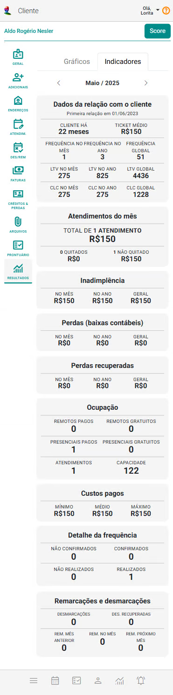

# Aba Resultados

A aba Resultados tem como objetivo fornecer à organização o acompanhamento e a evolução do cliente, permitindo que se tomem decisões informadas com base nas relações entre indicadores. Ele é crucial para entender o equilíbrio entre os ganhos financeiros, os custos operacionais e o volume de atendimentos do cliente na plataforma eConsult.

O painel está organizado em duas sub-abas: "Gráficos" e "Indicadores".

## Sub-aba Gráficos

A sub-aba Gráficos oferece uma visualização consolidada e interativa dos principais indicadores operacionais e financeiros do cliente. Os dados são apresentados em gráficos dinâmicos, abrangendo os dois meses anteriores, o mês atual e o mês seguinte, permitindo uma análise temporal detalhada e facilitando o monitoramento contínuo da evolução dos resultados.

Os gráficos disponíveis são:

- **LTV e CLC:** Apresenta dois indicadores estratégicos relacionados ao relacionamento financeiro do cliente: o LTV (Lifetime Value) e o CLC (Customer Lifetime Cost) no mês. Ele oferece uma visão do valor gerado pelo cliente ao longo do tempo em comparação com o custo para adquiri-lo ou mantê-lo.

    

- **Detalhe da Frequência:** Mostra o comportamento de comparecimento do cliente, permitindo identificar padrões de assiduidade.

    

- **Inadimplência:** Exibe o percentual de pagamentos em atraso do cliente, facilitando o acompanhamento da saúde financeira.

    

- **Perdas (Baixas Contábeis):** Representa os valores do cliente reconhecidos como perda definitiva no período.

    

- **Perdas Recuperadas:** Indica os valores do cliente previamente perdidos que foram posteriormente recuperados.

    

- **Ocupação:** Mostra a taxa de ocupação do cliente na agenda.

    

- **Valor dos Atendimentos:** Detalha os valores financeiros praticados com o cliente relacionados aos atendimentos realizados, permitindo análise de receita.

    

- **Desmarcações e Remarcações:** Aponta o número de reagendamentos, cancelamentos e alterações de horários feitos pelo cliente.

:::note Seletor de período
É possível ajustar o período analisado por meio do seletor de período, tornando a ferramenta flexível para diferentes necessidades de análise. Essa visualização gráfica facilita a identificação de tendências, anomalias e oportunidades de melhoria, apoiando decisões estratégicas e operacionais.

**Botões do seletor de período:**
​​    
-  Movimenta o período de amostragem para menos um mês.
​​
-  Movimenta o período de amostragem para mais um mês.
​​
-  Acrescenta um mês ao período de amostragem, sendo que o mês incluído é sempre o que antecede o menor mês do período.
​​
-  Exclui um mês do período de amostragem, sendo que o mês excluído é o menor mês do período.
:::

## Sub-aba Indicadores

A sub-aba Indicadores exibe os principais indicadores do cliente no mês selecionado.

Os indicadores estão organizados nos seguintes *cards*:

1. **Dados da Relação com o Cliente**

    

    - **Tempo de relacionamento:** Número de meses de vínculo até o mês selecionado.
    - **Ticket médio:** Valor médio gasto no mês.
    - **Frequência de atendimentos:** No mês, no ano e no total (global).
    - **LTV (Valor do Tempo de Vida do Cliente) e CLC (Custo de Longo Prazo):** Apresentados no mês, no ano e globalmente.

1. **Atendimentos do Mês**

    

    - Quantidade e valor total dos atendimentos realizados no mês.
    - Quantidade e valor dos atendimentos quitados e não quitados.

1. **Inadimplência**

    

    - Valor inadimplente no mês, no ano e no total.

1. **Perdas (Baixas Contábeis)**

    

    - Valor das perdas geradas pelo cliente no mês, no ano e no total.

1. **Perdas Recuperadas**

    

    - Valor das perdas recuperadas no mês, no ano e no total.

1. **Ocupação da Agenda**

    

    - Horários ocupados pelo cliente, categorizados por:
        - Remotos pagos
        - Remotos gratuitos
        - Presenciais pagos
        - Presenciais gratuitos
    - Quantidade total de atendimentos realizados no mês.
    - Capacidade total da agenda no período.

1. **Custos Pagos**

    

    - Valor mínimo, médio e máximo pago pelo cliente em atendimentos no mês.

1. **Detalhamento da Frequência**

    

    - Quantidade de atendimentos:
        - Confirmados
        - Não confirmados
        - Realizados
        - Não realizados

1. **Remarcações e Desmarcações**

    

    - Quantidade de:
        - Desmarcações
        - Desmarcações recuperadas
        - Remarcações do mês anterior
        - Remarcações dentro do mesmo mês
        - Desmarcações reagendadas para o próximo mês        

## Análises e Percepções Estratégicas a partir dos Indicadores

A visualização consolidada dos indicadores mensais do cliente permite extrair percepções valiosas sobre seu comportamento, engajamento, rentabilidade e risco. A seguir, destacam-se algumas interpretações estratégicas possíveis com base nos dados:

1. **Qualidade e Evolução da Relação com o Cliente:** Acompanhar o tempo de relacionamento, o ticket médio e o LTV ajuda a entender o valor que o cliente gera ao longo do tempo. Um aumento constante no ticket médio ou no LTV pode indicar maior confiança e adesão aos serviços. Por outro lado, uma queda súbita pode sinalizar perda de interesse ou necessidade de reengajamento.

2. **Engajamento e Participação:** A frequência de atendimentos (mensal, anual e global) e os detalhes de presença permitem avaliar o nível de comprometimento do cliente. Altos índices de faltas não justificadas ou atendimentos não confirmados podem indicar desorganização, desinteresse ou dificuldades financeiras.

3. **Indicadores Financeiros de Saúde e Risco:** A inadimplência e as perdas (baixas contábeis) oferecem sinais claros do risco financeiro associado ao cliente. Um aumento dessas métricas, especialmente se combinado com queda no ticket médio ou aumento das desmarcações, pode exigir ações preventivas, como renegociação ou mudanças na política de cobrança.

4. **Recuperação e Potencial de Retorno:** Os valores de perdas recuperadas indicam a eficácia das ações de recuperação financeira. Clientes com histórico de inadimplência, mas com boa taxa de recuperação, ainda podem ser considerados ativos estratégicos — desde que bem gerenciados.

5. **Utilização da Capacidade e Eficiência Operacional:** A análise da ocupação da agenda mostra como o cliente utiliza os serviços: se prefere atendimentos presenciais ou remotos, pagos ou gratuitos. Com esses dados, é possível identificar padrões de consumo e alinhar a oferta à demanda, otimizando recursos e tempo.

6. **Perfil de Consumo e Precificação:** Ao observar os custos pagos (mínimo, médio e máximo), compreende-se melhor o perfil de consumo do cliente. Isso pode ajudar na definição de pacotes personalizados, promoções ou ajustes de preço, baseados na disposição de pagamento e histórico de utilização.

7. **Comportamento em Remarcações e Desmarcações:** Altos índices de desmarcações e remarcações podem comprometer a organização da agenda e indicar baixa previsibilidade no comportamento do cliente. A frequência de desmarcações recuperadas e remarcações mostra a capacidade de manter o vínculo ativo, mesmo com instabilidades.

**Conclusão**

A leitura integrada desses indicadores permite não apenas avaliar o desempenho e a saúde financeira do relacionamento com cada cliente, mas também antecipar comportamentos, personalizar estratégias de atendimento, prever riscos e maximizar o valor ao longo do tempo. Com essa base, é possível tomar decisões mais assertivas e construir relacionamentos mais sólidos e sustentáveis.