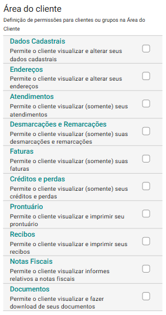

# Sobre Área do Cliente

A Área do Cliente é uma funcionalidade exclusiva do eConsult, desenvolvida para oferecer mais autonomia, transparência e praticidade aos clientes dos profissionais que utilizam a plataforma. Através de um link individual e seguro, enviado diretamente para o e-mail do cliente, é possível acessar um ambiente digital completo, onde o cliente pode acompanhar todas as informações relacionadas ao seu atendimento.

Na Área do Cliente, o cliente pode ter acesso a:

- **Dados pessoais:** Visualização e edição de informações cadastrais.

- **Endereços:** Visualização e gestão de seus endereços.

- **Atendimentos:** Consulta aos atendimentos agendados com o profissional, com detalhes de data, hora e status.

- **Remarcações e desmarcações:** Registro de remarcações  e desmarcações feitas, promovendo maior organização e controle.

- **Faturas:** Visualização de faturas emitidas.

- **Créditos e Perdas:** Créditos disponíveis, débitos em aberto e perdas contábeis (como faltas sem pagamento).

- **Prontuário:** Acesso ao histórico de atendimentos e anotações realizadas pelo profissional, garantindo continuidade e qualidade no serviço prestado.

- **Recibos:** Download de recibos disponibilizados pelo profissional.

- **Documentos:** Download de arquivos disponibilizados pelo profissional, com fácil acesso a qualquer momento.

O profissional pode configurar de forma flexível quais informações e funcionalidades estarão disponíveis para cada cliente em sua Área do Cliente. Essa personalização é feita diretamente no cadastro do cliente dentro do sistema, permitindo ao especialista definir níveis de acesso conforme a necessidade do atendimento, o tipo de serviço prestado ou o perfil do cliente.

A Área do Cliente foi pensada para facilitar a comunicação entre cliente e profissional, promover um atendimento mais transparente e fortalecer a relação de confiança, tudo isso com a comodidade de um ambiente digital intuitivo e seguro.

## Links seguros, únicos e intransferíveis

Cada cliente recebe do profissional um link exclusivo gerado especificamente para ele. Esse link é vinculado a um identificador único (token) que não pode ser adivinhado ou replicado.
Todos os acessos à "Área do Cliente" ocorrerem via HTTPS, garantindo criptografia de ponta a ponta entre o navegador e o servidor.

Como mencionado antes, o profissional pode configurar o que o cliente pode ou não acessar. Isso restringe o risco de exposição indevida de informações sensíveis.

## Configurar os acessos da Área do Cliente

1. No painel "Clientes ou Grupo" selecione a opção  no *card* do cliente ou grupo de atendimento desejado.

1. O sistema abre a tela de cadastro "Cliente" com todas as suas abas disponíveis.

1. Na aba "Geral", localize a seção destinada a "Área do Cliente" (final da tela).

    

1. Marque as opções para conceder acesso ou desmarque caso queira restringir o acesso.

## Disponibilizar link de acesso a Área do Cliente para o cliente ou grupo de atendimento

1. No painel "Clientes ou Grupo", no *card* do cliente ou grupo, a opção "Enviar link para Área do Cliente"  será exibida caso existam acessos liberados para aquele cliente ou grupo.

1. Clique no botão  correspondente para enviar o link diretamente via WhatsApp ou, se houver integração SMTP configurada, no botão  para enviar por E-mail.
