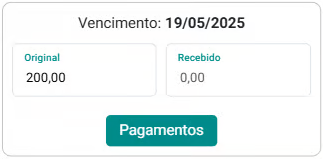
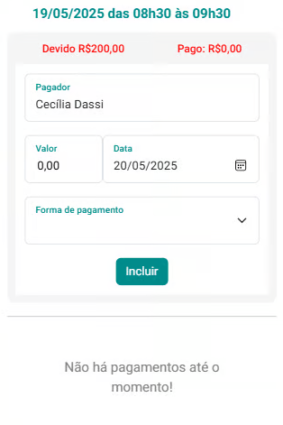
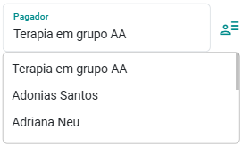
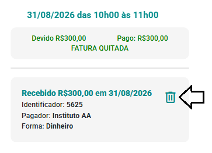
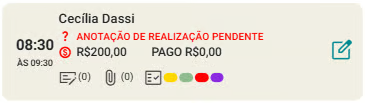

# Recebimentos de Valores dos Atendimentos

O eConsult oferece uma solução completa para a gestão de recebimentos, permitindo que os profissionais acompanhem e registrem pagamentos de forma organizada e eficiente. Essa funcionalidade é essencial para manter o controle financeiro tanto de atendimentos já realizados quanto dos que ainda estão agendados.

Após o agendamento ou a finalização de um atendimento, o sistema permite o registro imediato do recebimento correspondente. O valor total a ser pago é exibido na interface, com a opção de registrar pagamentos parciais ou integrais, conforme a necessidade.

Cada transação registrada conta com informações detalhadas, como o "nome do pagador", a "data do pagamento" e a "forma de pagamento" utilizada, garantindo transparência e rastreabilidade em todas as movimentações financeiras.

- **Saldo pendente**

    - O sistema exibe, no *card* do atendimento, ao lado do valor do atendimento, um indicador visual caso o valor ainda não tenha sido 100% (cem por cento) recebido.

        

    - Esse indicador ajuda o profissional a identificar rapidamente quais atendimentos possuem valores pendentes, facilitando o acompanhamento e a cobrança.

- **Histórico de recebimentos**

    - O eConsult mantém um histórico detalhado de todos os recebimentos associados a cada atendimento.

    - Esse histórico permite visualizar todos os pagamentos efetuados, incluindo valores parciais, para um controle financeiro preciso e completo.

    - O histórico pode ser consultado a qualquer momento para revisão e auditoria.

- **Faturas e Recibos**

    - Os registros de pagamento ficam vinculados automaticamente com a fatura do atendimento e, após pagamento total do atendimento, você pode emitir recibo para o cliente ou grupo de atendimento, garantindo transparência e formalidade nas transações.

- **Notificações de Pagamento**

    - O sistema permite o envio de notificações por whatsapp ou e-mail para lembrar os clientes sobre pagamentos pendentes.

    - Também é possível o envio de notificações por whatsapp de pagamentos já registrados.

## Incluir um recebimento

1. Acione a opção  no *card* do atendimento que deseja incluir um recebimento.

1. O sistema exibirá uma tela com uma área de informações detalhadas sobre os valores relacionados ao atendimento. 

    

1. Acione o botão "Pagamentos" .

1. O sistema abre a tela de pagamentos.

    

1. Preencha o campo "Valor", "Data" e "Forma de Pagamento" e acione o botão "Incluir" .

1. Após o recebimento, a tela será atualizada com informação sobre o pagamento que foi registrado.

1. Ao fechar esta tela, será exibido no *card* do atendimento as informações de pagamento já atualizadas.

    :::tip
    Caso o pagador seja diferente do cliente, você pode informar o nome do pagador diretamente no campo específico para esse propósito.

    Quando o atendimento for direcionado a um grupo, o sistema exibirá um botão  ao lado do campo "Pagador". Esse botão permite selecionar um dos membros do grupo ou o próprio grupo como responsável pelo pagamento.

    
    :::

## Excluir um recebimento:

1. Acione a opção  no *card* do atendimento que deseja excluir um recebimento.

1. O sistema exibirá uma tela com uma área de informações detalhadas sobre os valores relacionados ao atendimento.

    

1. Acione o botão "Pagamentos" .

1. O sistema abre a tela de pagamentos.

    

1. No final da tela de pagamentos o sistema mostra os recebimentos já feitos.

1. Acione o botão  e confirme a exclusão.

1. Após e exclusão, a tela será atualizada e mantida aberta mostrando que o recebimento foi removido.

1. Feche a tela e você verá o *card* do atendimento com as informações atualizadas.

    
