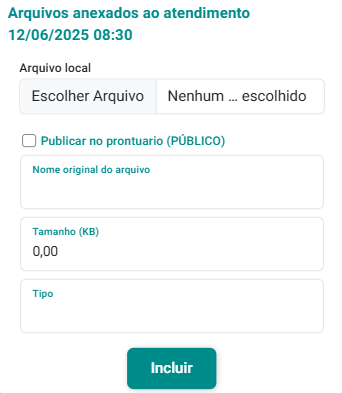

# Arquivos do Atendimento

O eConsult oferece um sistema de gerenciamento de arquivos integrado ao seu Google Drive, proporcionando uma solução centralizada e eficiente. Com essa integração, todos os seus documentos, relatórios, imagens e outros tipos de arquivos podem ser facilmente armazenados, acessados e compartilhados diretamente pela plataforma eConsult.

Essa integração não só simplifica o acesso aos arquivos, mas também melhora a organização, permitindo que você categorize e armazene seus documentos de forma estruturada e lógica, conforme suas necessidades. Com tudo centralizado no Google Drive, você garante que seus arquivos estejam protegidos e sincronizados em tempo real, com backups automáticos que evitam a perda de informações.

:::warning
Para utilizar o sistema de gerenciamento de arquivos, é necessário configurar a integração com o seu Google Drive. Você pode fazer isso acessando o [Painel Configurações => Google Drive](/docs/funcionalidades/configuracoes/visao-configuracoes).
:::

## Incluir arquivo para um atendimento

1. Acione a opção  no *card* do atendimento que deseja incluir um arquivo.

1. O sistema abre a tela "Arquivos Anexados ao Atendimento".

    

1. Acione o botão "Incluir" .

1. O sistema abre o formulário "Arquivos Anexados ao Atendimento".

    

1. Acione a opção "Escolher Arquivo".

1. Selecione o arquivo desejado do computador ou dispositivo.

1. Uma vez selecionado o arquivo do seu computador ou dispositivo, o sistema preencherá automaticamente os campos "Nome Original do Arquivo", "Tamanho" e "Tipo".

1. Marque, ou desmarque, a opção "Publicar no Prontuário".

1. Acione o botão "Incluir" .

1. O sistema abrirá a tela "Arquivos Anexados ao Atendimento" mostrando o arquivo já anexado.

1. Ao fechar esta tela, o sistema atualiza o *card* do atendimento, indicando que há arquivos anexados para o atendimento em questão.

    

:::note
- Na tela "Arquivos Anexados ao Atendimento", é possível anexar quantos arquivos desejar a cada atendimento, respeitando apenas o limite de armazenamento disponível no seu Google Drive.
- Os botões "Alterar"  e "Excluir"  permitem modificar ou remover arquivos conforme necessário. Já a opção "Visualizar"  possibilita examinar o conteúdo dos arquivos diretamente, facilitando a consulta e download dos documentos vinculados ao atendimento.
:::