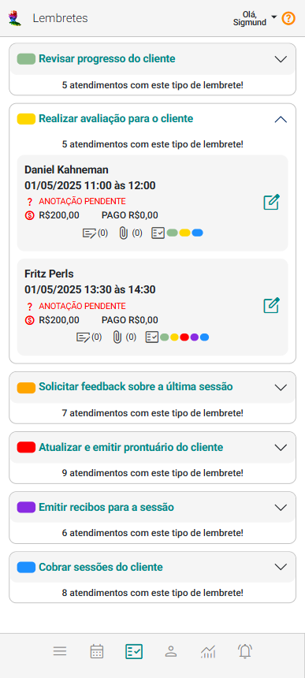
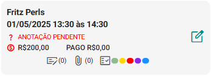

# Sobre Lembretes de Atendimentos

O painel "Lembretes de Atendimentos" do eConsult é uma ferramenta que apoia a gestão e o acompanhamento dos atendimentos de forma prática e organizada.

Ele centraliza os atendimentos que compartilham o mesmo tipo de lembrete, agrupando-os de maneira lógica e intuitiva em *cards* individuais. Essa estrutura facilita a visualização e o acesso rápido às informações mais relevantes de cada atendimento, otimizando o fluxo de trabalho do profissional.

O agrupamento dos *cards* por lembretes é uma característica essencial que melhora significativamente a organização e o fluxo de trabalho. Ao concentrar os atendimentos por lembrete, o painel proporciona uma visão clara e focada em tarefas específicas ou em séries de atendimentos com características semelhantes.

Essa abordagem facilita o gerenciamento dos compromissos, permitindo que o profissional visualize, acompanhe e aja com mais eficiência em relação aos atendimentos que exigem atenção especial.

### Exemplo prático

Imagine que você tenha dois atendimentos agendados para clientes diferentes, mas ambos estejam associados a um mesmo tipo de lembrete, como:

**"Emitir recibo"**  

Nesse caso, esses atendimentos serão exibidos dentro do mesmo grupo no painel de lembretes de atendimento, já que compartilham o mesmo foco de ação. Isso ajuda a manter o acompanhamento organizado e centrado em objetivos claros.

## *Cards* de Atendimento

Os *cards* de atendimento no painel Lembretes de Atendimentos oferece uma visão abrangente das informações essenciais de cada atendimento, tornando o acompanhamento simples e eficaz.

- **Data e Hora de Início e Fim do Atendimento:** Mostra a data, hora de início e fim do atendimento.

- **Nome do Cliente:** O nome do cliente ao qual o atendimento está relacionado é destacado no *card*. Isso facilita a identificação rápida e direta de quem será atendido, essencial para o preparo adequado antes de cada atendimento.

- **Valor e Valor Pago:**

    - **Valor:** Indica o custo total do atendimento, permitindo que o profissional tenha uma visão clara do valor financeiro envolvido.

    - **Valor Pago:** Mostra quanto já foi pago pelo cliente até o momento. Essa informação é útil para verificar se há pendências financeiras antes do atendimento ou para facilitar a cobrança posterior, se necessário.

- **Informe de Status:** O status do atendimento é claramente indicado, refletindo a situação atual, como:

    - **Confirmado:** Indica que o cliente confirmou sua presença para o atendimento.

    - **Não Confirmado:** Mostra que ainda não houve confirmação por parte do cliente, sugerindo a necessidade de uma verificação ou lembrete adicional.

    - **Realizado:** Indica que o atendimento foi concluído com a participação do cliente.

    - **Não Realizado:** Sinaliza que o atendimento não foi realizado por falta do cliente.

    - **Informe Pendente:** Caso não haja um status definido, o sistema exibirá "informe pendente", indicando que o status ainda precisa ser atualizado.

    :::tip

        Da mesma forma como no painel Atendimentos, o painel Lembretes permite você gerenciar anotações, arquivos, lembretes e informes de presença e pagamentos (no caso de grupos de atendimento) do atendimento.

        

        - **Anotações:**  Permite incluir, alterar ou excluir anotações vinculadas a cada atendimento, oferecendo um espaço para registrar observações importantes que podem ser consultadas posteriormente e até mesmo publicadas no prontuário do cliente.
        
        - **Arquivos:**  Permite incluir, alterar ou excluir arquivos vinculados a cada atendimento.
        
        - **Lembretes de Atendimentos:**  Mostra as cores de todos os tipos de lembretes vinculados ao atendimento e permite fazer a gestão destes lembretes do atendimento.
        
        - **Informes de presença e pagamentos:**  Mostrado somente quando se tratar de um grupo de atendimento. Permite informar a presença dos clientes no atendimento em questão e ainda registrar pagamentos de membros do grupo.
        
        Você também tem acesso a diversas funcionalidades relacionadas ao atendimento, como Desmarcar, Remarcar, Excluir, alterar Modalidade e Status, além de realizar Recebimentos. Tudo isso está disponível de forma prática através de um único botão .
    :::

Esses elementos visuais, informativos e interativos tornam a gestão dos atendimentos mais eficiente, reunindo todos os detalhes importantes em um único lugar, de forma organizada e acessível. Isso melhora a experiência tanto dos profissionais quanto dos clientes, diminuindo as chances de que informações importantes sejam esquecidas ou negligenciadas.