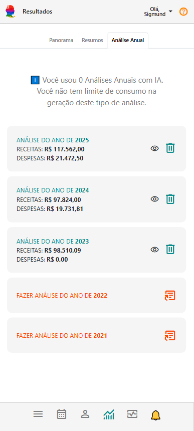
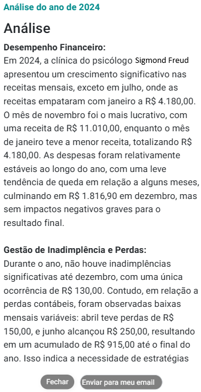

# Sobre Aba Análise Anual

A Análise Anual é uma funcionalidade exclusiva que permite gerar uma análise inteligente a partir dos dados consolidados de todos os meses de um determinado ano anterior.

Essa funcionalidade gera uma análise textual completa, com:

- Resumo das principais métricas e variações ao longo do ano

- Tendências de crescimento ou queda nos principais indicadores (ex: ticket médio, frequência, inadimplência, perdas)

- Interpretações inteligentes com base em padrões de comportamento, engajamento e saúde financeira

- Sinais de alerta ou oportunidade que merecem atenção no planejamento estratégico

Essa análise é ideal para momentos de fechamento de ciclo, avaliação de performance anual, apresentações gerenciais ou planejamento de metas.

## Analisar um ano

1. Na aba "Análise Anual", no *card* do ano que se deseja analisar, acione o botão .

1. O sistema processará a análise e atualizará o *card*.

    

1. Acione o botão  do *card*.

1. O sistema mostrará uma tela contendo a análise textual.

    

    :::note
    - Clique em "Fechar" para sair da tela de análise textual.
    - Clique em "Enviar para meu e-mail" caso deseje receber a análise diretamente na sua caixa de entrada.
    :::