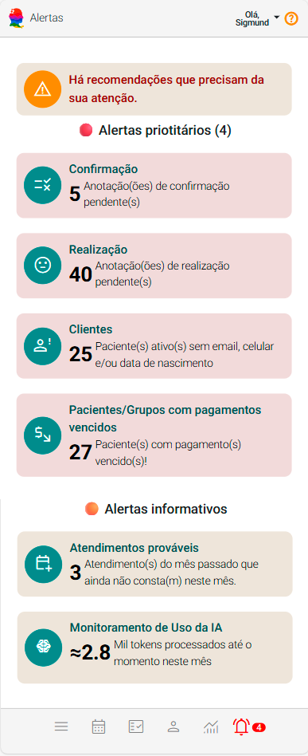
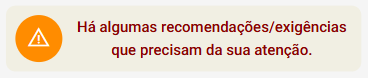
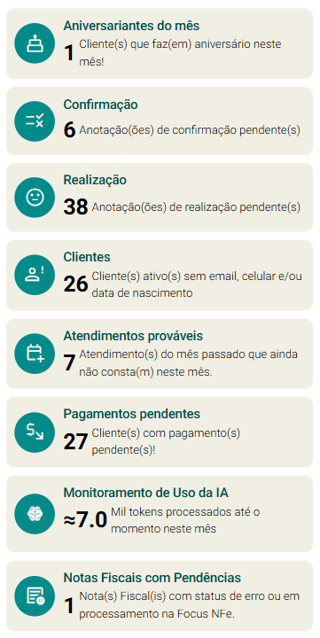

# Sobre Alertas

O Painel Alertas é uma ferramenta que auxilia na gestão proativa e eficiente da plataforma eConsult, oferecendo uma visão consolidada das principais ocorrências ou anomalias que precisam de atenção. 

O principal objetivo do painel Alertas é identificar e destacar situações que requerem alguma ação, ajudando a garantir que problemas sejam resolvidos rapidamente e que a plataforma opere com eficiência máxima. O painel visa:

- **Monitorar Problemas Potenciais:** Alertar sobre questões que podem afetar o desempenho, a qualidade do serviço ou a satisfação dos clientes.
- **Facilitar a Ação Imediata:** Proporcionar informações em tempo real para que decisões possam ser tomadas rapidamente.
- **Prevenir Impactos Negativos:** Minimizar os impactos negativos ao abordar problemas antes que eles se agravem.
  
  

## Benefícios do Painel Alertas

- **Resposta Rápida a Problemas:** Com alertas em tempo real, pode-se reagir rapidamente a problemas e evitar que se agravem, garantindo uma operação mais fluida e eficiente.
- **Melhoria na Qualidade do Serviço:** A identificação precoce de problemas relacionados a atendimentos ajuda a melhorar a experiência do cliente e a satisfação geral.
- **Eficiência Operacional:** O painel ajuda a manter o controle sobre as operações e a otimizar recursos ao focar nas áreas que realmente necessitam de intervenção.
- **Análise e Melhoria Contínua:** Oferece dados para análise posterior, permitindo ajustes e melhorias contínuas nos processos e políticas da plataforma.

## Recomendações e Exigências

O eConsult pode exibir, no Painel Alertas, as chamadas " Recomendações" ou " Exigências", que sugerem ou exigem ações para otimizar ou dar andamento na sua experiência no eConsult.

|Ícone|Descrição|
|-|-|
||**Recomendação:** Sugere uma ação que pode aprimorar sua experiência, embora não seja obrigatória.|
||**Exigência:** É necessário que você tome uma ação para atender a essa exigência|

### Recomendações e exigências possíveis

<figure style={{ margin: 0, textAlign: "left", marginBottom: "20px" }}>
  
  <figcaption style={{ fontStyle: "italic"}}>Exige a inclusão de Clientes</figcaption>
</figure>
<figure style={{ margin: 0, textAlign: "left", marginBottom: "20px" }}>
  
  <figcaption style={{ fontStyle: "italic"}}>Exige a inclusão de Agendamentos de Atendimentos</figcaption>
</figure>
<figure style={{ margin: 0, textAlign: "left", marginBottom: "20px" }}>
  
  <figcaption style={{ fontStyle: "italic"}}>Exige o cadastramento do seu Endereço Principal</figcaption>
</figure>
<figure style={{ margin: 0, textAlign: "left", marginBottom: "20px" }}>
  
  <figcaption style={{ fontStyle: "italic"}}>Recomenda a inclusão de uma Foto de Perfil</figcaption>
</figure>
<figure style={{ margin: 0, textAlign: "left", marginBottom: "20px" }}>
  
  <figcaption style={{ fontStyle: "italic"}}>Exige a inclusão do seu Logotipo</figcaption>
</figure>
<figure style={{ margin: 0, textAlign: "left", marginBottom: "20px" }}>
  
  <figcaption style={{ fontStyle: "italic"}}>Recomenda a configuração dos seus Lembretes</figcaption>
</figure>
<figure style={{ margin: 0, textAlign: "left", marginBottom: "20px" }}>
  
  <figcaption style={{ fontStyle: "italic"}}>Recomenda a inclusão de Grupos por Idade</figcaption>
</figure>
<figure style={{ margin: 0, textAlign: "left", marginBottom: "20px" }}>
  
  <figcaption style={{ fontStyle: "italic"}}>Exige a inclusão de pelo menos uma Forma de Pagamento</figcaption>
</figure>
<figure style={{ margin: 0, textAlign: "left", marginBottom: "20px" }}>
  
  <figcaption style={{ fontStyle: "italic"}}>Exige a inclusão de pelo menos um Modelo de Anamnese</figcaption>
</figure>

:::note

O próprio eConsult se encarrega de configurar automaticamente algumas dessas **recomendações/exigências** para facilitar sua jornada inicial. São eles:

- **Recomendação — Grupos por Idade:** O eConsult já vem com um cadastro completo de Grupos por Idade.
- **Exigência — Formas de Pagamento:** O eConsult cadastra previamente formas de pagamento.
- **Exigência — Modelos de Anamnese:** O eConsult já oferece diversos modelos de anamnese pré-configurados de acordo com a sua especialidade, prontos para serem utilizados nos prontuários.

:::

Quando houver alguma **recomendação ou exigência pendente**, o **eConsult exibirá um alerta destacado no painel**, chamando sua atenção de forma clara e objetiva.

Ao clicar neste alerta, você terá acesso a um **checklist detalhado**, que mostra exatamente o que precisa ser feito e permite acompanhar o andamento de cada item.

Esse checklist fica sempre disponível no painel "Alertas", enquanto houver pendências a serem resolvidas.

Assim, você é notificado de forma **prática e centralizada**, garantindo que **nenhuma etapa importante passe despercebida** no processo de configuração e uso inicial da ferramenta.

## Outros Alertas Inteligentes

O painel também exibe **outros alertas inteligentes**, que funcionam como **lembretes estratégicos para ações importantes** dentro da plataforma.

Esses alertas mantêm você informado sobre **pendências, atualizações e tarefas que pedem sua atenção**, oferecendo mais controle e agilidade no uso do eConsult.

Importante destacar que esses alertas **aparecem somente quando são de fato relevantes**, evitando distrações e mantendo seu foco no que é mais importante.

Ao clicar em qualquer um desses alertas, o sistema abre automaticamente uma interface que **permite resolver as pendências de forma rápida e prática**.