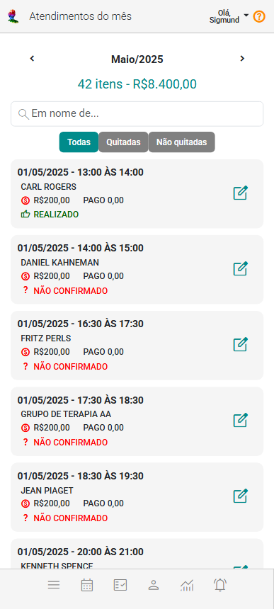
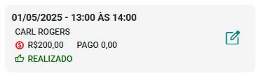

# Sobre Atendimentos do Mês

O painel Atendimentos do Mês é uma ferramenta útil para monitorar e gerenciar as receitas vinculadas a atendimentos. Ele exibe um resumo de todas as receitas relacionadas a atendimentos durante um período específico.

Com o seletor de mês, é possível alterar o período exibido no painel, selecionando diferentes meses para visualizar suas respectivas receitas, despesas e outros detalhes financeiros relevantes.

|Seletor|Descrição|
|-|-|
||Seleciona o mês anterior ao que está atualmente selecionado.|
||Seleciona o mês posterior ao que está atualmente selecionado.|

O painel, em conjunto com a funcionalidade seletor de mês, oferece uma maneira prática de visualizar atendimentos do mês, apresentando a quantidade de atendimentos e o valor total destes atendimentos.

Os atendimentos são exibidos em *cards* que apresentam informações básicas. Esses *cards* facilitam a visualização rápida e organizada dos detalhes essenciais de cada atendimento.

