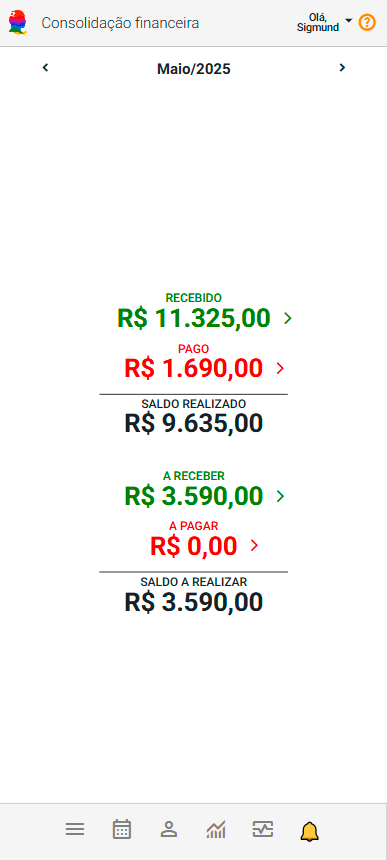

# Sobre Consolidação Financeira

O painel Consolidação Financeira é uma ferramenta estratégica indispensável para o gerenciamento eficiente das finanças da organização. Ele reúne e apresenta, de forma clara e estruturada, todas as movimentações financeiras realizadas em um determinado mês permitindo uma análise precisa da saúde financeira.

## Funcionalidades principais

- **Seletor de Mês:** Permite que você selecione o mês desejado para visualizar os dados financeiros correspondentes. Você pode navegar entre diferentes meses para comparar receitas e despesas, realizadas e previstas, ao longo do tempo.

    

    |Seletor|Descrição|
    |-|-|
    ||Seleciona o mês anterior ao que está atualmente selecionado.|
    ||Seleciona o mês posterior ao que está atualmente selecionado.|

- **Totalizadores:** O painel Consolidação Financeira apresenta os Totalizadores, que fornecem uma visão consolidada das movimentações financeiras dentro do mês selecionado.

    

    Esses totalizadores ajudam a compreender rapidamente o estado financeiro da organização no mês e incluem as seguintes métricas:

    - **Recebido:** Mostra o total de recursos financeiros que foram efetivamente recebidos durante o mês selecionado. Reflete as entradas registradas e confirmadas.
    - **Pago:** Indica o total de despesas que foram efetivamente pagas no período. Representa os valores que saíram da organização como pagamentos concluídos.
    - **Saldo Realizado:** É a soma das quantias recebidas e pagas, oferecendo uma visão geral do valor total das transações realizadas no período.
    - **A Receber:** Exibe o total de valores que ainda estão pendentes de recebimento. Inclui todas as transações que foram registradas como esperadas, mas que ainda não foram efetivamente recebidas.
    - **A Pagar:** Mostra o total de valores que a organização ainda precisa pagar. Reflete as despesas registradas que ainda não foram quitadas.
    - **Saldo a Realizar:** Calcula a diferença entre o total a receber e o total a pagar. Representa o saldo de transações futuras que precisam ser realizadas para equilibrar as finanças, ajudando a planejar o fluxo de caixa.

:::note
Os totalizadores "Recebido", "Pago", "A Receber" e "A Pagar" incluem a opção "" ou "" que, ao ser clicada, exibe os eventos correspondentes em forma de *cards*. Esses *cards* fornecem uma visão detalhada dos eventos que compõem cada totalizador, permitindo uma análise mais aprofundada do que cada métrica representa. Essa funcionalidade facilita a visualização e o acompanhamento dos detalhes específicos de cada totalizador.
:::