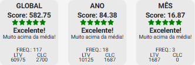
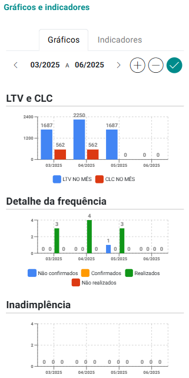

# Sobre Análise de Score

O painel **Análise de Score** exibe a pontuação e o comportamento dos clientes com base em dados históricos de relacionamento. As informações são organizadas por período e segmentadas em categorias para facilitar a tomada de decisões estratégicas.

A ferramenta avalia o desempenho dos clientes com base em três dimensões principais: **Global, Ano e Mês**. Cada dimensão fornece uma visão específica da relação do cliente com o seu negócio, considerando histórico, comportamento recente e engajamento atual.

Essas informações são acompanhadas por indicadores que facilitam a análise do **valor gerado**, da **frequência de interações** e do **custo de manutenção de cada cliente**.


## Seletor de Período


- Exibe o mês atual da análise.
- Setas permitem navegar para meses anteriores  ou futuros .
- Botão de check  aplica o mês selecionado.

## Filtros por tipo de Classificação ou Nome do Cliente

Esta seção permite ao usuário **filtrar a exibição de clientes** com base em sua **classificação comportamental** ou localizar um cliente específico pelo **nome**.


Os números entre parênteses indicam a **quantidades de clientes** em cada classificação.

### São os tipos de classificações possíveis:

- **Clientes em declínio:** Clientes que apresentam redução progressiva na frequência de interações e no valor gerado. Podem estar perdendo o interesse ou migrando para concorrentes. Exigem atenção e possíveis ações de reativação, como campanhas de retenção ou ofertas personalizadas.
- **Clientes em crescimento:** Clientes que mostram evolução positiva, com aumento na frequência de compras ou atendimentos e no valor gerado. Estão em processo de consolidação do relacionamento com a sua organização e podem ser alvos para ações de fidelização e up-sell.
- **Clientes estáveis e engajados:** Apresentam comportamento consistente, com boa frequência e geração de valor contínua. São clientes confiáveis e fiéis, já consolidados, ideais para manutenção do relacionamento, programas de recompensa e possíveis influenciadores da sua marca.
- **Clientes voláteis:** Apresentam comportamento irregular, alternando períodos de alta e baixa atividade. Podem ser sensível a fatores externos ou promoções pontuais. Requerem monitoramento e estratégias personalizadas para aumentar o engajamento e reduzir a oscilação.
- **Todos:** Todos os Clientes.

Para filtrar e exibir apenas clientes de um tipo de classificação, basta clicar sobre o link respectivo.

Você pode ainda filtrar por nome de cliente, para isso basta preencher o campo correspondente.

## *Card* de Score


O *card* de score é composto pelos seguintes elementos:

- **Nome do cliente:** Mostra o nome do cliente ao qual o *card* de score referencia.
- **Classificação:** Mostra como o cliente foi classificado.
- **Seções do *card* de score:** Sendo GLOBAL, ANO e MÊS.

### Seções do *Card* de Score

O Score do Cliente é apresentado por meio de três seções principais, que representam diferentes recortes de tempo:



- **GLOBAL**: Considera todo o histórico do cliente desde o início do relacionamento com a sua organização.
- **ANO**: Refere-se aos dados acumulados nos últimos 12 meses.
- **MÊS**: Apresenta as informações referentes ao comportamento mais recente, no mês atual.

Cada uma dessas seções exibe um conjunto de indicadores que refletem o desempenho do cliente no período correspondente, sendo:

- **Score**: Valor numérico gerado com base na fórmula:
    - ```(LTV - CLC) / 100```

- **Classificação por Estrelas**: representação de estrelas, legenda e informação, variando de 1 a 5, conforme o desempenho do cliente:
    - **★★★★★ – Excelente – Muito acima da média**: O cliente, no período, demonstrou que está muito acima da média em valor gerado, frequência e engajamento. Costuma ser altamente fiel, constante e valioso para o negócio. Ideal para programas de fidelização e reconhecimento.
    - **★★★★ – Bom – Acima da média**: No período demostrou ter um bom histórico de interações e contribuições financeiras, com potencial para se tornar um cliente excelente. Merece atenção para fortalecimento do relacionamento.
    - **★★★ – Normal – Dentro da média**: Apresentou no período um comportamento regular e estável. Ainda não demonstra sinais claros de crescimento ou risco. Estratégias de engajamento e acompanhamento podem melhorar seu desempenho.
    - **★★ – Alerta – Abaixo da média**: Pode estar diminuindo, no período, o número de interações ou o valor gerado. Requer análise e ações de reengajamento para evitar perda de relacionamento.
    - **★ – Crítico – Muito abaixo da média**: Pouca ou nenhuma interação no período e baixo valor agregado. Pode estar em risco de perda ou abandono. Recomenda-se ação imediata de recuperação.
    - **Nenhuma estrela – Sem dados**: Não há dados suficientes do período para gerar um score confiável. Isso ocorre normalmente com clientes recém-cadastrados ou com histórico incompleto. É necessário aguardar o acúmulo de informações.
- **FREQ (Frequência)**: número de atendimentos ou interações do cliente no período avaliado.
- **LTV (Lifetime Value)**: valor total gerado pelo cliente para a organização no período.
- **CLC (Customer Lifetime Cost)**: custo total no período relacionado à manutenção do cliente.

:::tip
    Ao clicar sobre o botão , o sistema abre a tela "Gráficos e Indicadores", cujo conteúdo é similar ao apresentado na tela de [Cadastro de cliente / Aba Resultados](/docs/funcionalidades/clientes-grupos/cadastro/aba-resultados).

    
:::