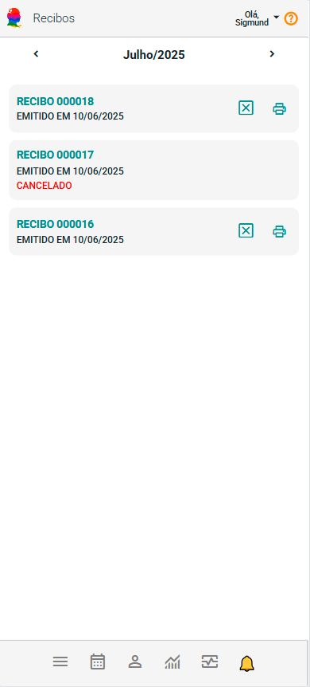
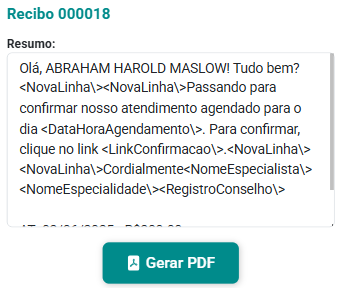

# Sobre Recibos

O painel Recibos oferece uma visão completa de todos os recibos emitidos pelo sistema, abrangendo tanto os ativos quanto aqueles que foram cancelados. Cada recibo é exibido de forma clara e organizada, apresentados em formato de *cards* individuais, facilitando a visualização rápida das informações essenciais. Essa estrutura permite ao usuário identificar facilmente o status e os detalhes de cada recibo, proporcionando maior controle e agilidade na gestão dos documentos financeiros.

## Imprimir recibo

:::warning
    O Painel de Recibos requer que você tenha um logotipo cadastrado para a impressão. Para cadastrar seu logotipo, siga as etapas descritas [aqui](/docs/funcionalidades/conta/logotipo).
:::

1. Acione a opção  do recibo que deseja imprimir.

1. O sistema mostra a tela de informação do recibo.

    

1. Acione o botão "Gerar PDF" .

1. O sistema gerará e imprimirá o recibo em um arquivo PDF, permitindo que você o salve ou o imprima conforme necessário.

:::note
    Você pode cancelar um recibo utilizando a opção "Cancelamento"  disponível nos *cards*. Essa funcionalidade permite que você marque o recibo como cancelado, atualizando automaticamente seu status e garantindo que a alteração seja refletida no sistema. É importante lembrar que o cancelamento é irreversível.
:::