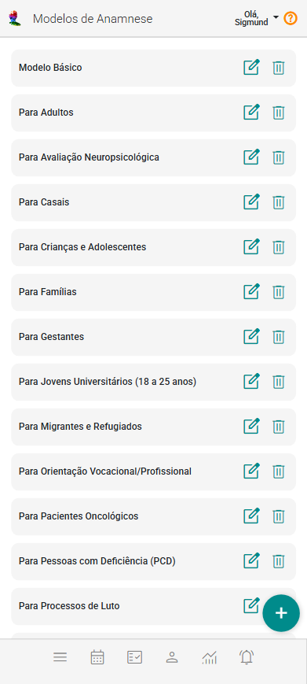

# Sobre Modelos de Anamnese

O prontuário do cliente é uma ferramenta essencial no eConsult, proporcionando um registro detalhado e organizado de todas as informações relacionadas ao histórico do cliente. O prontuário centraliza informações importantes e facilita o acompanhamento contínuo das necessidades do cliente.

Para vincular um prontuário a um cliente, é necessário que os **Modelos de Anamnese** estejam previamente cadastrados, pois estes serão utilizados como base na composição do prontuário.

:::tip Diferenças entre Prontuário e Anamnese

A diferença entre prontuário e anamnese está no conteúdo, na finalidade e no momento em que são utilizados. Veja:

### Anamnese

- **Definição:** É a entrevista inicial feita pelo profissional com seu cliente.
- **Objetivo:** Coletar informações subjetivas sobre o histórico do paciente, seus sintomas, hábitos, doenças anteriores, uso de medicamentos, antecedentes familiares, etc.
- **Importância:** Guia o raciocínio e orienta exames físicos e hipóteses diagnósticas.

### Prontuário
    - **Definição:** É o documento completo (físico ou eletrônico) que reúne todo o histórico do cliente dentro de um serviço de atendimentos.
    - **Objetivo:** Registrar todas as informações de forma organizada, contínua e legal, incluindo anamnese, exames, evoluções, prescrições, procedimentos, etc.
    - **Conteúdo típico:** 
        - Dados do profissional, 
        - Dados de identificação do cliente
        - **Anamnese**
        - Arquivos anexados vinculados ao cliente
        - Arquivos anexados vinculados aos atendimentos feitos
        - Histórico de atendimentos com suas anotações
    - **Importância:** Serve como documento legal, instrumento de comunicação entre profissionais e base para pesquisas e auditorias.
    - **Publicidade das informações do prontuário:** O prontuário reúne todas as informações e dados do cliente coletados durante os atendimentos. Como parte dessas informações pode incluir observações e anotações de uso exclusivo do profissional, cabe a ele (profissional) definir quais dados serão compartilhados (publicados) ou não com o cliente e, também, em que momento.
:::

O eConsult já vem com modelos adaptados ao seu perfil profissional, mas você pode personalizá-los ou criar novos modelos diretamente no painel "Modelos de Anamnese".

Abaixo a tela de modelos de anamnese voltados para Psicologia:

O eConsult tem mais de 50 modelos de anamnese para as diversas áreas de atuação. No caso de psicologia, por exemplo o econsult apresenta 26 modelos prontos para usar. São eles:

1. Modelo Básico
1. Para Adultos
1. Para Avaliação Neuropsicológica
1. Para Casais
1. Para Crianças e Adolescentes
1. Para Famílias
1. Para Gestantes
1. Para Jovens Universitários (18 a 25 anos)
1. Para Migrantes e Refugiados
1. Para Orientação Vocacional/Profissional
1. Para Pacientes Oncológicos
1. Para Pessoas com Deficiência (PCD)
1. Para Processos de Luto
1. Para Profissionais em Situação de Burnout
1. Para Terceira Idade (60+)
1. Para Transtornos Alimentares e da Ingestão Alimentar
1. Para Transtornos de Ansiedade
1. Para Transtornos de Espectro da Esquizofrenia e Psicóticos
1. Para Transtornos Dissociativos
1. Para Transtornos do Humor (Afetivos)
1. Para Transtornos do Neurodesenvolvimento
1. Para Transtornos do Sono-Vigília
1. Para Transtornos Obsessivo-Compulsivos e Relacionados
1. Para Transtornos Relacionados a Trauma e Estressores
1. Para Transtornos Somatoformes
1. Para Vítimas de Trauma

Cada modelo de anamnese contêm "Tópicos", e dentro desses tópicos há "Campos".

Os tópicos são seções da anamnes, permitindo que as informações sejam registradas de maneira lógica e estruturada. Dentro de cada tópico, há campos específicos que definem os dados a serem preenchidos, como observações, diagnósticos, tratamentos, ou outros detalhes relevantes.

## Estrutura dos Modelos de Anamnese:

- **Tópicos:** São as divisões principais que categorizam as informações no prontuário, facilitando a organização.
- **Campos:** Dentro de cada tópico, encontram-se os campos específicos a serem preenchidos, que podem variar conforme o tipo de atendimento.

## Como Funciona:

- **Criação do Modelo:**  
  Ao cadastrar ou utilizar um modelo de anamnese no eConsult, você tem liberdade para definir os tópicos e os campos que deverão ser preenchidos. Isso permite adaptar cada modelo ao seu estilo de atendimento.

- **Personalização de Campos:**  
  Os nomes dos campos são totalmente personalizáveis, permitindo que você os ajuste conforme as necessidades específicas da sua prática profissional.

- **Adição e Remoção de Campos:**  
  É possível incluir novos campos ou remover os existentes dentro de cada tópico, de forma flexível e adaptável à realidade de cada público ou especialidade.

- **Uso dos Modelos no Prontuário:**  
  Ao iniciar um novo prontuário para um cliente, você pode utilizar um modelo previamente cadastrado como base. Ele serve como guia para o preenchimento estruturado dos tópicos e campos.  

  Além disso, mesmo após selecionar um modelo, você ainda pode personalizá-lo conforme o perfil ou necessidade individual de cada cliente.

## Benefícios dos Modelos de Anamnese:

- **Padronização:** Garante que todas as informações sejam coletadas de forma uniforme.
- **Eficiência:** Facilita a criação e o preenchimento de prontuários, economizando tempo e reduzindo erros.
- **Organização:** Ajuda a manter as informações bem estruturadas e acessíveis.

## Inclui modelos de anamnese do eConsult

1. No painel "Modelos de Anamnese" clique no botão "Restaurar Padrões do Sistema" .

## Incluir um novo Modelo de Anamnese

1. No painel "Modelos de Anamnese" clique no botão "Incluir novo modelo de anamnese" .

1. O sistema abrirá a tela de cadastro pedindo que você selecione uma pré-definição.

    

1. Selecione uma das pré-definições disponibilizadas.

    

1. Informe ou mantenha o nome para o modelo de anamnese no campo "Título".

1. Ajuste a estrutura do modelo incluindo, alterando ou excluindo tópicos e seus respectivos campos conforme suas necessidades.

1. Acione o botão "Salvar" .

## Mostrar e ocultar campos e/ou valores de campos de um tópico

No momento do cadastro você pode mostrar ou ocultar os campos ou valores de campos de um determinado tópico (isto para melhorar sua navegação na tela apenas). Para isso use os botões  e  ao lado do tópico, onde  indica que os campos estão ocultos e  indica que os campos estão sendo mostrados.

## Incluir novos tópicos

1. Acione uma das opções "Incluir Tópico" .

1. Preencha o campo "Rótulo" com nome desejado para o novo tópico.

    

## Incluir campos num determinado tópico

1. Acione a opção "Adicionar Campo" .

1. Dê um nome para o campo.

    

1. Se preferir, opcionalmente, preencha um valor padrão para o campo.

    

## Excluir campos ou tópicos

1. Utilize os botões  para excluir campos ou tópicos.

