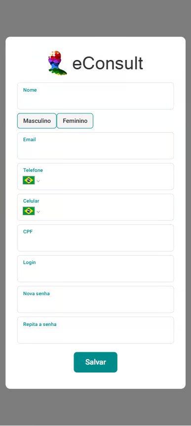
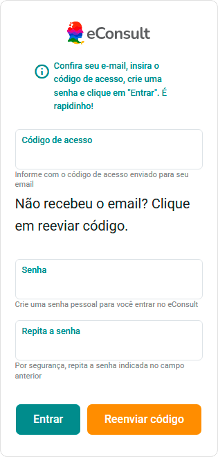

# Abrindo uma nova conta

Abrir sua conta no eConsult é rápido, seguro e o primeiro passo para aproveitar todos os recursos da nossa plataforma.

- ✅ Versão FREE — sem compromisso e sem necessidade de cartão de crédito.

- 🔒 Seus dados estão protegidos de acordo com nossa Política de Privacidade.

- ⚡ Cadastro rápido — leva menos de 2 minutos para começar.

Experimente o eConsult gratuitamente e descubra como simplificar a gestão dos seus serviços.

## Abrir uma nova conta

1. Acesse o link [*https://econsult.app.br/psicologia*](https://econsult.app.br/psicologia).

    

1. Insira as informações solicitadas: "Nome completo", "E-mail" e "Especialidade".

1. Certifique-se de que todos os dados estão corretos e clique em "Criar minha conta".

1. O sistema exibirá uma tela solicitando um código de acesso. Você receberá esse código por e-mail.

    

1. Preencha o campo "Código de acesso" com o código enviado para o seu e-mail.

1. Preencha o campo "Senha" com uma senha da sua preferência.

1. Preencha o campo "Repita a senha" com a mesma senha.

1. Clique em “Entrar” para acessar o eConsult.

:::tip
    Se você não tiver mais o e-mail com o código, basta clicar no botão "Reenviar código" e um novo código será enviado automaticamente para o seu e-mail.
:::

:::tip Dica de Segurança
**Senha Forte:** Crie uma senha forte, combinando letras maiusculas e minúsculas, números e caracteres especiais.
:::

:::note Benefícios de criar uma conta no eConsult
- **Acesso Personalizado:** Ter uma conta permite acessar funcionalidades personalizadas e salvar suas preferências.
- **Segurança:** Contas protegidas por senha garantem que apenas você tenha acesso às suas informações.
- **Comunicação Direta:** Facilita a comunicação direta com o serviço, recebendo notificações e atualizações importantes.
- **Versão FREE:** Você ganha a assinatura FREE para usar por por tempo indeterminado sem custos, sem limite de agendas e sem limite de cadastros.
- **Sem cartão de crédito:** O eConsult em nenhum momento solicita dados de cartão de crédito.
- **Seus dados estão protegidos:** o eConsult adota os mais altos padrões de segurança, com criptografia e tecnologias avançadas para garantir a confidencialidade das suas informações.

O cadastro é rápido e **leva menos de 2 minutos**.
:::

Criar uma nova conta é o primeiro passo para aproveitar todas as vantagens e funcionalidades oferecidas pelo eConsult. Siga os passos acima e comece a explorar!

