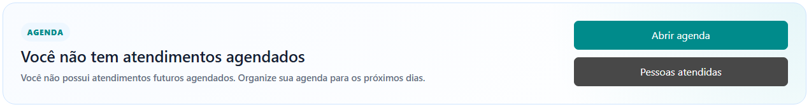
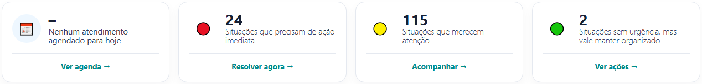
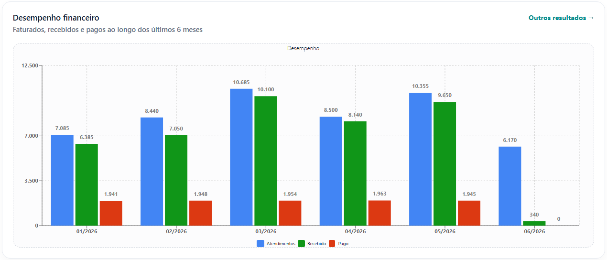
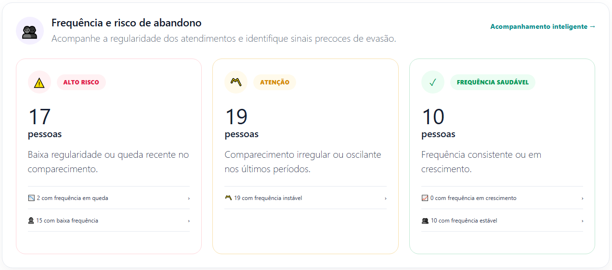
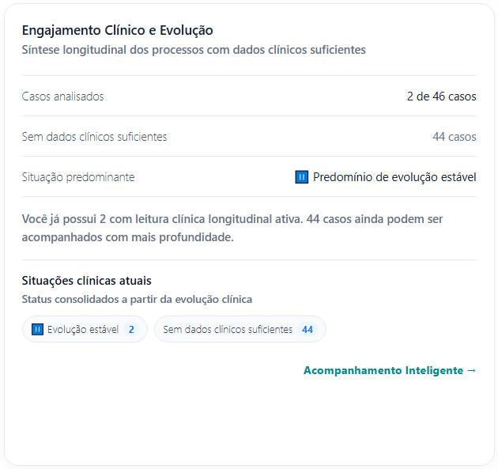
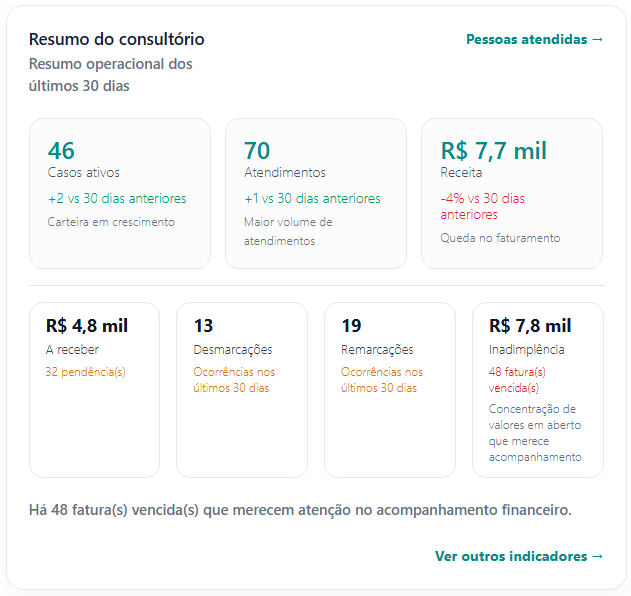
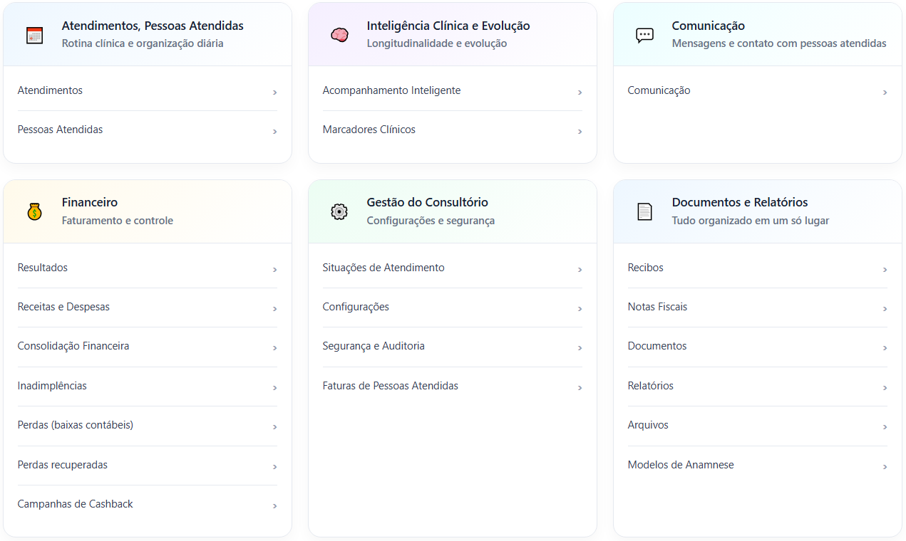

# Dashboard Inicial

O **Dashboard Inicial** é a central de acompanhamento do consultório dentro do eConsult. Nele você encontra uma visão consolidada da agenda, evolução clínica, frequência dos atendimentos, desempenho financeiro e principais situações que merecem atenção.

O objetivo é permitir que você identifique rapidamente o que precisa ser acompanhado no dia, sem precisar navegar por vários módulos.

---

## Visão Geral

Ao acessar o sistema, o dashboard apresenta:

- Situação da agenda do dia
- Indicadores de acompanhamento clínico
- Frequência e risco de abandono
- Resumo financeiro
- Síntese de evolução clínica
- Acesso rápido aos principais módulos

> O conteúdo exibido é atualizado automaticamente conforme os atendimentos, registros clínicos e movimentações financeiras são realizados no sistema.

---

## 📅 Agenda

Na parte superior da tela é exibida a situação da sua agenda.

### Informações disponíveis

- Próximos atendimentos agendados
- Quantidade de atendimentos para o dia
- Acesso rápido para abertura da agenda
- Acesso à lista de pessoas atendidas

### Quando não houver atendimentos

Caso não existam atendimentos futuros cadastrados, o sistema exibirá uma mensagem informando que não há compromissos agendados.

---

## 🚦 Indicadores Rápidos

Logo abaixo da agenda são exibidos indicadores que ajudam a identificar prioridades.

### Situações que precisam de ação imediata

Casos que apresentam maior necessidade de acompanhamento ou intervenção.

Exemplos:

- Frequência em queda
- Baixo engajamento
- Pendências clínicas
- Situações classificadas como prioritárias

### Situações que merecem atenção

Casos que não demandam ação urgente, mas devem ser acompanhados de forma mais próxima.

### Situações organizadas

Casos acompanhados regularmente e sem sinais relevantes de atenção no momento.

---

## 📋 Situações de Atendimento

O painel **Situações de Atendimento** centraliza os principais eventos e alertas relacionados aos pacientes.

Através dele é possível:

- Identificar situações pendentes
- Visualizar acompanhamentos em andamento
- Navegar para a lista completa de ocorrências

---

## 💰 Desempenho Financeiro

O gráfico de desempenho financeiro apresenta uma visão consolidada dos últimos meses.

### Indicadores exibidos

- Faturamento previsto
- Valores recebidos
- Valores pagos

### Objetivo

Permitir uma análise rápida da evolução financeira do consultório ao longo do tempo.

---

## 📉 Frequência e Risco de Abandono

O módulo de frequência acompanha a regularidade dos atendimentos e ajuda a identificar possíveis sinais de evasão.

### Alto Risco

Pacientes com baixa frequência ou redução significativa de comparecimento.

Possíveis sinais:

- Intervalos prolongados entre sessões
- Ausências recorrentes
- Queda recente de frequência

### Atenção

Pacientes com frequência irregular ou oscilante.

Possíveis sinais:

- Comparecimento inconsistente
- Oscilações entre períodos de maior e menor adesão

### Frequência Saudável

Pacientes que mantêm regularidade nos atendimentos.

Características:

- Comparecimento consistente
- Frequência estável ou crescente

> Os indicadores auxiliam na identificação precoce de possíveis abandonos terapêuticos.

---

## 🧠 Engajamento Clínico e Evolução

Este painel apresenta uma síntese longitudinal dos registros clínicos disponíveis.

### Informações exibidas

- Casos analisados
- Casos sem dados clínicos suficientes
- Situação clínica predominante
- Casos que merecem atenção clínica

### Situações Clínicas

O sistema pode consolidar informações como:

- Evolução favorável
- Evolução estável
- Baixo engajamento terapêutico
- Risco elevado associado a baixo engajamento

### Acompanhamento Inteligente

Quando existem registros clínicos suficientes, o eConsult pode produzir leituras longitudinais que auxiliam na compreensão da evolução do caso ao longo do tempo.

---

## 🏢 Resumo do Consultório

O resumo operacional apresenta indicadores dos últimos 30 dias.

### Indicadores disponíveis

- Casos ativos
- Atendimentos realizados
- Receita obtida
- Valores a receber
- Desmarcações
- Remarcações
- Inadimplência

### Objetivo

Oferecer uma visão rápida da operação clínica e financeira do consultório.

---

## 🧭 Acesso Rápido aos Módulos

Na parte inferior do dashboard estão disponíveis atalhos para os principais módulos do sistema.

### Atendimentos e Pessoas Atendidas

Acesso para:

- Agenda de atendimentos
- Cadastro de pessoas atendidas

### Inteligência Clínica e Evolução

Acesso para:

- Acompanhamento Inteligente
- Marcadores Clínicos

### Comunicação

Acesso aos recursos de comunicação com pessoas atendidas.

### Financeiro

Acesso para:

- Resultados
- Receitas e despesas
- Consolidação financeira
- Inadimplências
- Perdas financeiras
- Recuperações
- Campanhas de cashback

### Gestão do Consultório

Acesso para:

- Situações de atendimento
- Configurações
- Segurança e auditoria
- Faturas de pessoas atendidas

### Documentos e Relatórios

Acesso para:

- Recibos
- Notas fiscais
- Documentos
- Relatórios
- Arquivos
- Modelos de anamnese

---

## ✅ Boas Práticas

### Consulte o dashboard diariamente

A tela inicial foi projetada para funcionar como um painel de controle da rotina clínica e administrativa.

### Priorize os casos sinalizados

Os indicadores de atenção ajudam a identificar pacientes que podem se beneficiar de acompanhamento mais próximo.

### Utilize os dados em conjunto

Os indicadores de frequência, engajamento clínico e evolução devem ser interpretados de forma integrada ao contexto clínico e ao julgamento profissional.

---
