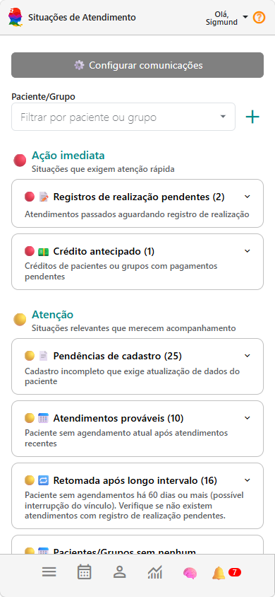
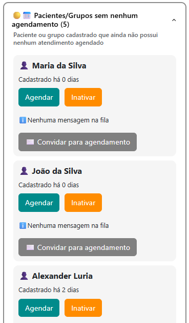

# Verifique próximas ações

📌 Acompanhe sua rotina clínica de forma mais organizada e prática.

> 💡 Manter os atendimentos organizados facilita não apenas a rotina administrativa, mas também a continuidade do processo terapêutico.

Agora que você já tem pacientes cadastrados e sua agenda organizada, surge uma pergunta natural:

👉 **o que precisa ser feito agora?**

O painel de **Situações de Atendimento** responde exatamente isso.

---

## 🎞️ Vídeo rápido (recomendado)

- explorando o painel situações de atendimento

<video controls preload="metadata" poster="/img/thumbs/video-tutorial.jpg" style={{  borderRadius: '15px', margin: '1.5rem 0', maxHeight: '670px', maxWidth: '100%', border: '1px solid whitesmoke', boxShadow: '0 10px 30px rgba(15, 23, 42, 0.10)', overflow: 'hidden', background: '#000', cursor: 'pointer' }}>
  <source src="/video/individual/situacoes-de-atendimento-clinico.mp4" type="video/mp4" />
  Seu navegador não suporta vídeo.
</video>

---

## 🎯 Como funciona o painel de Situações de Atendimento

O painel reúne, em uma única tela, as principais ações e pendências da sua rotina clínica.

Você não precisa mais acompanhar manualmente:
- agenda  
- prontuário  
- financeiro  

👉 O sistema mostra automaticamente o que está pendente.

---

## 👀 O que você vai encontrar aqui

O painel organiza sua rotina em situações como:

- Atendimentos que ainda precisam de confirmação  
- Registros de realização pendentes  
- Pagamentos em aberto  
- Pacientes sem novo agendamento  

👉 Cada item funciona como um **alerta inteligente da sua rotina clínica**.

---

## ⚡ Como usar na prática

### Passo a passo simples:

1. Acesse o painel de **Situações de Atendimento**
2. Observe os blocos com pendências
3. Clique em uma situação
4. Visualize a lista de pessoas atendidas
5. Execute a ação necessária

---

## 💡 Dica importante

Use esse painel como seu ponto de partida diário.

Uma rotina simples:

✔ Abra o painel no início do dia  
✔ Resolva as pendências  
✔ Siga sua agenda com tranquilidade  

👉 Isso reduz esquecimentos e melhora sua organização.

---

## 🔁 O sistema se atualiza automaticamente

Conforme você utiliza o sistema:

- confirma atendimentos  
- registra sessões  
- atualiza pagamentos  

👉 as situações desaparecem automaticamente do painel.

Isso significa que:

👉 **quanto mais organizado você estiver, mais limpo o painel fica**

---

## 🎯 Por que isso é importante?

Porque esse painel conecta toda a sua operação:

- Agenda  
- Financeiro  
- Atendimento  
- Continuidade do paciente  

👉 Ele evita problemas como:

- esquecimentos  
- atendimentos não registrados  
- pagamentos não acompanhados  
- interrupções no acompanhamento clínico  

---

## 🧠 Entenda a diferença (importante)

- **Situações de Atendimento** → organização da rotina (operacional)  
- **Acompanhamento Longitudinal** → evolução clínica do paciente  

👉 Juntos, eles dão uma visão completa do seu trabalho.

---

## 🚀 Comece agora

Uma boa forma de usar:

- Acesse o painel  
- Clique em uma situação  
- Resolva 1 pendência  

👉 Isso já coloca o eConsult em funcionamento no seu fluxo clínico real.

---

## 📚 Manual completo de Situações de Atendimento

Quer explorar mais possibilidades do painel de Situações de Atendimento?

No manual completo você encontra orientações sobre:

- todas as situações disponíveis no sistema
- ações possíveis para cada situação
- confirmações de atendimentos
- registros pendentes
- pagamentos em aberto
- pacientes sem novo agendamento
- lembretes automáticos
- lembretes manuais
- acompanhamento operacional da rotina clínica
- e muito mais

👉 [Acessar manual completo de Situações de Atendimento](/docs/situacoes-atendimento)

---

## ▶️ Próximo passo

Agora que sua rotina está organizada:

👉 [Entenda seus resultados](./05_resultados.md)