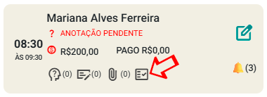
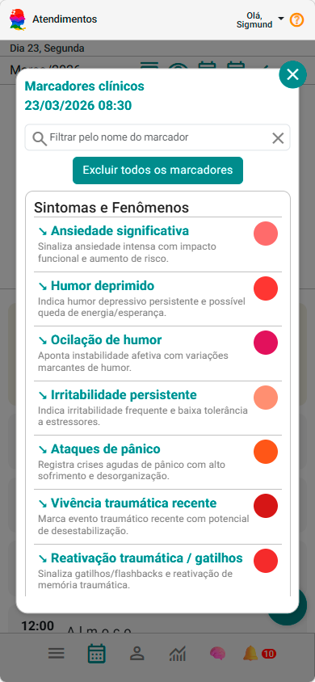
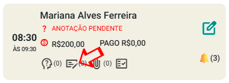

# Registre suas anotações

📝 Registre suas anotações clínicas de forma organizada e segura.

> 💡 Muitas mudanças clínicas acontecem de forma gradual. Os marcadores ajudam justamente a tornar essas mudanças mais perceptíveis ao longo do tempo.

Agora chegamos em uma das partes mais importantes do eConsult:

👉 **o registro clínico das suas sessões**

No eConsult, você pode registrar suas anotações de forma diferente do modelo tradicional:

👉 utilizando **marcadores clínicos como base**

---

## 🎞️ Vídeo rápido (recomendado)

- selecionando marcadores clínicos para um atendimento

<video controls preload="metadata" poster="/img/thumbs/video-tutorial.jpg" style={{  borderRadius: '15px', margin: '1.5rem 0', maxHeight: '670px', maxWidth: '100%', border: '1px solid whitesmoke', boxShadow: '0 10px 30px rgba(15, 23, 42, 0.10)', overflow: 'hidden', background: '#000', cursor: 'pointer' }}>
  <source src="/video/individual/anotacoes-clinicas-com-marcadores-clinicos.mp4" type="video/mp4" />
  Seu navegador não suporta vídeo.
</video>

---

## 🧠 O que muda na prática?

Em vez de começar com um texto em branco:

❌ escrever tudo manualmente  
❌ tentar organizar depois  
❌ dificuldade de revisar no futuro  

Você pode:

✔ estruturar primeiro com marcadores  
✔ gerar uma anotação automaticamente  
✔ construir registros mais consistentes ao longo do tempo  

---

## ▶️ Como funciona na prática

O processo é simples:

1. Você registra os **marcadores clínicos do atendimento**  
2. O sistema utiliza esses marcadores para gerar a anotação  

👉 Ou seja:

**Marcadores → Anotação estruturada**

---

## 🧩 Passo 1 — Defina os marcadores clínicos do atendimento

1. Acesse sua agenda  
2. Localize um atendimento  
3. Clique no botão de **Marcadores Clínicos** no card  

---

4. Selecione os marcadores mais relevantes para a sessão

- adicione uma breve descrição, se necessário  

---

💡 **Dica prática**

Você não precisa escrever muito.

👉 Foque em registrar:

- principais queixas  
- comportamentos observados  
- pontos clínicos relevantes  

---

## ✍️ Passo 2 — Gerar a anotação clínica

Agora que os marcadores estão definidos:

1. Clique em **Anotações** no atendimento  

2. Clique em **Incluir anotação**

3. Selecione a opção:

👉 **🧠 Gerar anotação estruturada (IA + marcadores)**

4. Clique em **Gerar sugestão com IA**

---

## 🤖 O que o sistema faz automaticamente

O eConsult irá:

- utilizar os marcadores que você registrou  
- organizar o conteúdo em formato clínico  
- gerar uma anotação estruturada (SOAP)

> 💡 Pequenos registros recorrentes costumam gerar uma leitura clínica longitudinal mais rica do que anotações extensas feitas apenas de forma esporádica.

---

## ✏️ Passo 3 — Revisar e salvar

1. Revise a anotação  
2. Ajuste se necessário  
3. Clique em **Aplicar**  
    
    

4. Clique em **Salvar anotação clínica**

    

---

## 💡 Compartilhar com o paciente (opcional)

Se fizer sentido:

👉 marque **Compartilhar com o paciente**

Assim, a anotação poderá ser visualizada na Área do Paciente.

---

## 🎯 Por que usar marcadores clínicos nas anotações?

Porque você passa a:

✔ organizar melhor cada sessão  
✔ padronizar seus registros  
✔ facilitar revisões futuras  
✔ construir uma base para análise longitudinal  

---

## 🚀 Comece agora

Faça isso com um atendimento real:

- defina **3 a 5 marcadores clínicos**  
- gere a anotação  
- salve  

👉 Em poucos minutos você terá um registro completo

---

## ⚠️ Importante

A IA é um apoio.

👉 Sempre revise e valide o conteúdo antes de salvar.

---

---

## 📚 Manual completo de Anotações Clínicas

Quer aprofundar a utilização das anotações clínicas e dos marcadores no eConsult?

No manual completo você encontra orientações sobre:

- marcadores clínicos
- geração de anotações com IA
- revisão e validação clínica
- compartilhamento com pacientes
- estruturação de registros clínicos
- leitura longitudinal das anotações
- modelos de anotações clínicas disponíveis

### 📝 Modelos disponíveis

- 📝 Texto livre  
- 📋 SOAP (Subjetivo, Objetivo, Avaliação, Plano)  
- 📋 PPR (Prontuário Psicológico Resumido)  
- 📋 DAR (Data, Action, Response)  
- 📋 DAP (Data, Avaliação, Plano)  
- 📋 PIE (Problema, Intervenção, Avaliação)  
- 📋 EEM (Exame do Estado Mental)  
- 📋 BIRP (Comportamento, Intervenção, Resposta, Plano)  
- 📋 GIRP (Objetivo, Intervenção, Resposta, Plano)

👉 [Acessar manual completo de Anotações Clínicas](/docs/funcionalidades/atendimentos/anotacoes)

---

## ▶️ Próximo passo

Agora que você já está registrando clinicamente suas sessões realizadas:

👉 **Acompanhe a evolução do paciente no painel longitudinal**

É lá que tudo isso começa a fazer sentido.

👉 [Acompanhe a evolução](./07_acompanhamento-clinico-longitudinal.md)
