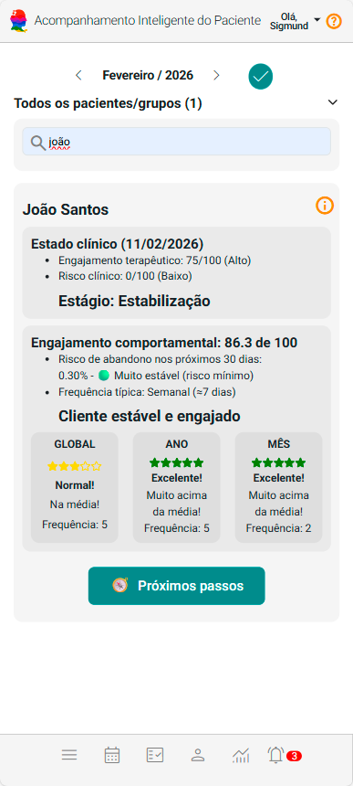
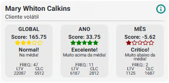
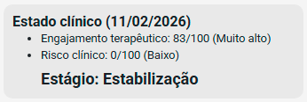
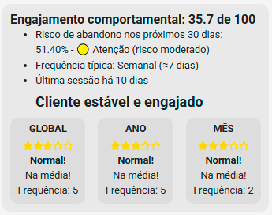
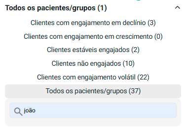
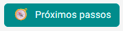
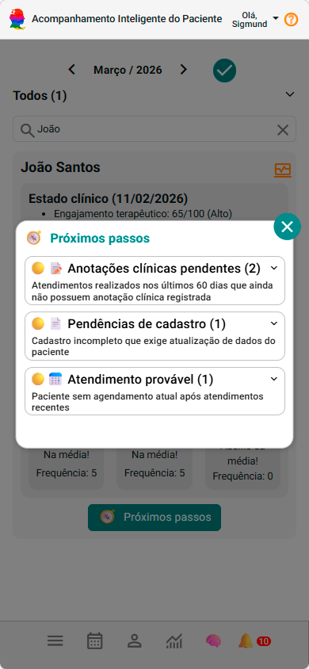
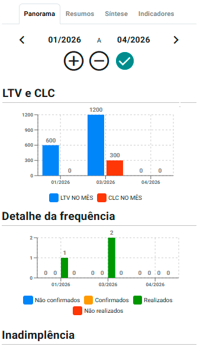
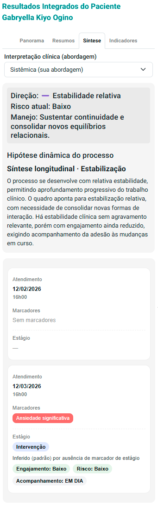

# Acompanhe a evolução

📈 Acompanhe a evolução clínica dos seus pacientes ao longo do tempo.

> 💡 Muitas mudanças clínicas fazem mais sentido quando observadas em conjunto ao longo do tempo. A leitura longitudinal ajuda justamente nisso.

Agora que você já está:

✔ cadastrando pacientes  
✔ organizando sua agenda  
✔ registrando atendimentos com marcadores  

Chegamos no ponto mais importante do eConsult:

👉 acompanhar a evolução clínica ao longo do tempo

---

## 🎞️ Vídeo rápido (recomendado)

- verificando evolução
- mudanças de padrão
- tendências clínicas do paciente

<video controls preload="metadata" poster="/img/thumbs/video-tutorial.jpg" style={{  borderRadius: '15px', margin: '1.5rem 0', maxHeight: '670px', maxWidth: '100%', border: '1px solid whitesmoke', boxShadow: '0 10px 30px rgba(15, 23, 42, 0.10)', overflow: 'hidden', background: '#000', cursor: 'pointer' }}>
  <source src="/video/individual/acompanhamento-clinico-longitudinal.mp4" type="video/mp4" />
  Seu navegador não suporta vídeo.
</video>

---

## 🧠 O que é o acompanhamento longitudinal?

É uma forma de responder perguntas como:

- Esse paciente está evoluindo?
- O engajamento está melhorando ou piorando?
- Existe risco de abandono?
- O vínculo terapêutico está se fortalecendo?

👉 Tudo isso em uma única visão longitudinal do paciente.

---

## ▶️ Onde acessar

1. Acesse o menu de pacientes  
2. Abra o painel de **Acompanhamento Inteligente do Paciente**

---

## 👀 O que você vê ao abrir o painel

Cada paciente aparece em um **card resumido**.

---

Cada card mostra três coisas principais:

1. **Estado clínico atual**
2. **Engajamento do paciente**
3. **Próximos passos sugeridos**

👉 É como um resumo inteligente do paciente.

---

## 🧩 Estado clínico (baseado nos marcadores)

O estado clínico é calculado com base nos marcadores que você registrou.

---

Aqui você verá:

- direção clínica  
- nível de risco  
- estágio do processo terapêutico  

💡 **Importante**

Se você ainda não registrou marcadores:

👉 o sistema não consegue gerar essa leitura.

---

## 📊 Engajamento comportamental

Aqui o sistema analisa o comportamento do paciente.

---

Inclui:

- frequência de atendimentos  
- risco de abandono  
- tempo desde a última sessão  
- padrão de comparecimento  

👉 Isso ajuda você a perceber sinais como:

- afastamento do paciente  
- instabilidade  
- melhora no vínculo  

---

## ⭐ Classificação do paciente

O sistema também classifica o paciente automaticamente:

- Estável e engajado  
- Em crescimento  
- Em declínio  
- Volátil  

---

👉 Isso permite priorizar rapidamente quem precisa de mais atenção.

---

## ⚡ Próximos passos sugeridos

Ao acionar a opção **Próximos Passos**, o eConsult apresenta um conjunto de ações recomendadas para o paciente.

---

👉 Essa tela funciona como um guia de ação clínica e operacional, indicando o que precisa de atenção no momento.

Entre as sugestões, você pode encontrar:

- registros de atendimento pendentes  
- agendamentos não confirmados  
- pagamentos em aberto  
- anotações clínicas ainda não realizadas  
- pendências cadastrais  
- alertas relevantes para o momento do paciente  

---

👉 Isso transforma o painel em um guia de ação, não apenas de leitura.

---

## 🔍 Acessando o detalhe do paciente

Ao clicar na opção de detalhe:

Você acessa a tela completa de resultados do paciente.

---

A tela reúne quatro visões principais:

- Panorama  
- Resumos  
- Síntese  
- Indicadores  

---

## 📈 Síntese (o mais importante no momento)

Na aba **Síntese**, você consegue visualizar:

---

- direção do caso  
- risco atual  
- manejo sugerido  
- linha do tempo das sessões  

👉 Aqui você começa a enxergar:

- hipóteses clínicas assistidas  
- mudanças ao longo do tempo  
- padrões clínicos  
- momentos de risco  
- evolução real do paciente  

---

👉 Essa leitura ajuda a:

- organizar o raciocínio clínico  
- identificar padrões  
- apoiar a leitura clínica ao longo do tempo  

---

⚠️ **Importante**

Essa análise é assistiva.

👉 A interpretação clínica é sempre sua.

---

## 🎯 Por que isso é diferente?

Porque a maioria dos sistemas:

❌ apenas registra atendimentos  

O eConsult:

✔ ajuda você a entender a evolução clínica  
✔ integra dados clínicos e comportamentais  
✔ apoia a leitura clínica ao longo do tempo  

---

## 🚀 Comece agora

Faça um teste simples:

1. Abra o painel de acompanhamento  
2. Escolha 1 paciente  
3. Analise o card  
4. Clique para ver a evolução  

👉 Você já vai perceber padrões que antes não estavam claros.

---

## ⚠️ Para melhores resultados

O painel depende de:

✔ atendimentos registrados  
✔ marcadores clínicos preenchidos  

👉 Quanto mais você utiliza o sistema, mais rica fica a leitura longitudinal.

---

## 📚 Manual completo de Acompanhamento Longitudinal

Quer aprofundar a utilização do acompanhamento longitudinal no eConsult?

No manual completo você encontra orientações sobre:

- estado clínico do paciente
- engajamento comportamental
- classificações automáticas
- risco de abandono
- síntese clínica longitudinal
- direção clínica
- manejo sugerido
- interpretação de indicadores
- leitura longitudinal do paciente
- próximos passos sugeridos
- leitura integrada de dados clínicos e comportamentais

👉 [Acessar manual completo de Acompanhamento Longitudinal](/docs/acompanhamento-inteligente-do-paciente)

---

## ▶️ Próximo passo

Agora que você já consegue acompanhar seus pacientes:

👉 Utilize os insights para conduzir melhor seus atendimentos.

É aqui que o eConsult realmente se torna parte da sua prática clínica.

👉 [Organize o prontuário](./08_prontuario-eletronico.md)