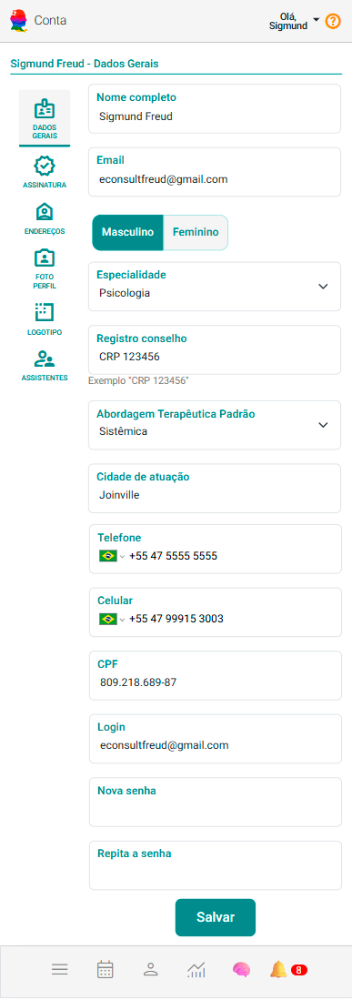

# Dados Gerais da Conta

Para alteração de seus dados gerais, acesse a opção correspondente a **Dados gerais da conta** no menu **Conta**, localizada no canto superior direito da tela.

## Alterar dados gerais da sua conta

1. Atualize os dados necessários, como nome, sexo, especialidade, registro no conselho (se for o caso), tipo de atendimento padrão, cidade de atuação, e-mail, telefone, celular e CPF.

    

2. Após realizar as mudanças, certifique-se de salvar as alterações para que sejam efetivadas.

:::warning
    O campo **"Abordagem Terapêutica Padrão"** é exclusivo para psicólogos.
:::

:::tip Dica
**Alterar senha:** Se desejar alterar sua senha basta preencher os campos "Senha" e "Repita a Senha".
:::

:::note Mantenha seu cadastro atualizado
- **Revisão Regular:** Verifique periodicamente suas informações cadastrais para garantir que estão corretas.
- **Notificação de Mudanças:** Informe imediatamente qualquer mudança de telefone ou e-mail.
- **Segurança dos Dados:** Utilize senhas fortes.
:::
