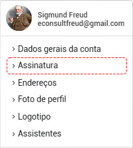
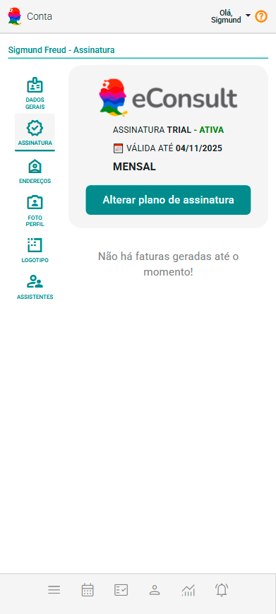
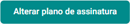
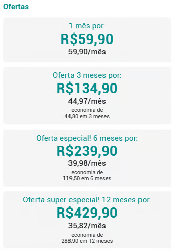
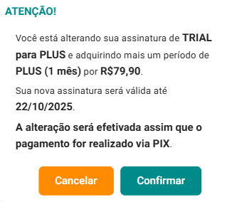
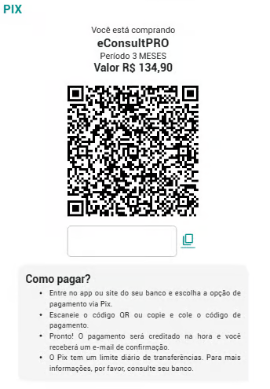

# Assinatura

Ao criar uma nova conta no eConsult, você recebe automaticamente a assinatura **FREE**.

Uma assinatura FREE oferece funcionalidades suficientes para uma boa gestão do consultório por tempo ilimitado. Esse tipo de assinatura permite que os usuários experimentem as funcionalidades fundamentais do produto antes de decidir pela compra de uma assinatura paga.

Para adquirir ou ver informações de suas assinaturas, acesse a opção correspondente a **Assinatura** no menu **Conta**, localizada no canto superior direito da tela.

Na tela **Assinatura** é possível ver informações da sua assinatura atual e ainda alterar seu plano de assinatura.

## Assinatura FREE

- **Cadastro:** O usuário cria uma conta no eConsult, fornecendo informações básicas (não são solicitadas informações de cartão de crédito).
- **Versão FREE:** O usuário tem acesso completo a versão FREE do eConsult por tempo indeterminado.
- **Conversão:** O usuário pode, a qualquer tempo, optar por um plano de assinatura pago que melhor se adapte as suas necessidades.

## Assinaturas Pagas PRO, PLUS e PREMIUM

As assinaturas pagas têm validade conforme o plano escolhido.

Ao encerrar o período gratuito, será necessário renovar para continuar utilizando a plataforma.

Você pode escolher entre os planos disponíveis nas versões PRO, PLUS ou PREMIUM, com opções de periodicidade mensal, trimestral, semestral ou anual — selecionando o plano de assinatura que melhor se adapta às suas necessidades e ao seu investimento.

## Comprar um Plano de Assinatura

1. Acione a opção ALTERAR em .

2. O sistema abrirá uma tela contendo os períodos que você pode adquirir.

    

    :::note
    _Os preços apresentados aqui são meramente ilustrativos e podem não refletir os preços atuais._
    :::

3. Clique sobre o plano desejado (por exemplo PLU - 1 mês).

4. O sistema mostra tela de confirmação informando o que você está alterando.

    

5. Clique na opção "Confirmar" .

6. O sistema abrirá tela de pagamento (PIX).

    

7. Proceda o pagamento em sua instituição financeira.

:::warning   
O eConsult **não solicita informações de pagamento**, como cartão de crédito. Os pagamentos das assinaturas PRO, PLUS e PREMIUM são realizados **exclusivamente via PIX** no momento da aquisição. A vigência da assinatura é imediata após a confirmação do pagamento.
:::

:::note
    1. Ao adquirir um plano pago durante o uso da assinatura FREE, a conversão é imediata: o sistema migra para o novo plano escolhido e adiciona os dias restantes do período FREE à nova assinatura.

    2. Em caso de upgrade de plano (ex.: de PRO para PREMIUM), aplica-se a mesma regra de conversão.

    3. Em caso de downgrade de plano, o sistema recalcula os valores já pagos e os converte em dias adicionais no novo plano escolhido.

    4. O eConsult não realiza devolução de valores em nenhuma hipótese, mas garante compensações em dias equivalentes a créditos já adquiridos.
:::

