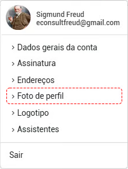
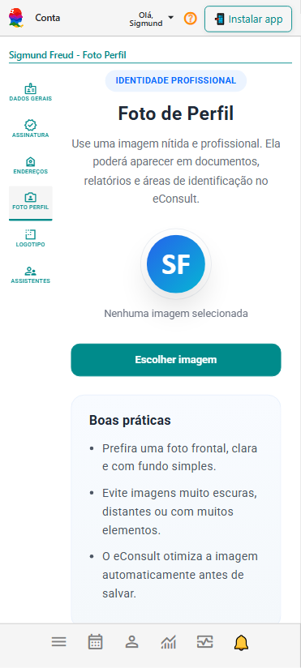

# Foto de perfil

A foto de perfil é a imagem que você escolhe para representar a si mesmo no eConsult.

Para sua foto de perfil, considere os seguintes pontos:

- **Qualidade da imagem:** Use uma foto nítida e bem iluminada.
- **Contexto:** Escolha um fundo que complemente, mas não distraia.
- **Expressão facial:** Um sorriso genuíno pode fazer toda a diferença.
- **Autenticidade:** Seja você mesmo! Fotos que refletem quem você realmente é tendem a ser mais atraentes.

Para incluir ou alterar a sua foto de perfil, acesse a opção correspondente a **Foto de Perfil** no menu **Conta**, localizada no canto superior direito da tela.

O sistema mostrará a tela **Foto de Perfil**.

## Incluir foto de perfil

1. Acione a opção **Escolher Imagem**.

2. Selecione um arquivo de imagem do seu dispositivo.

3. Clique no botão **Salvar Imagem**.

## Alterar foto de perfil

1. Acione o botão **Alterar Imagem**.

2. Selecione um arquivo de imagem do seu dispositivo.

4. Clique no botão **Salvar Imagem**.