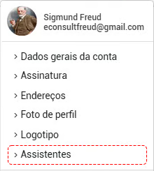
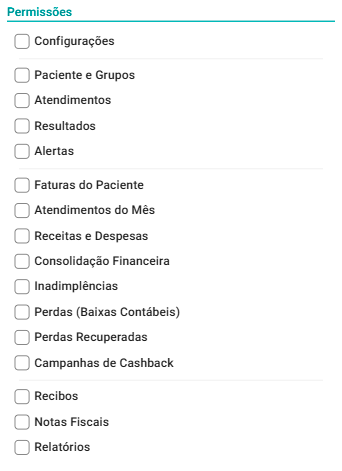

# Assistentes

O eConsult permite que você adicione assistentes para realizar atividades específicas dentro do sistema.

O assistente pode, por exemplo, auxiliar na administração da organização, gerenciando tarefas como agendamento, cobrança, emissão de recibos, cadastramento de pacientes, entre outras.

Você convida um assistente por e-mail para ajudar em atividades específicas que você configura no sistema.

O assistente receberá um e-mail com um link específico para aceitar o convite. Ao clicar no link, ele será direcionado para criar uma senha de acesso ao eConsult. Vale ressaltar que 
o assistente terá acesso apenas às funcionalidades que você previamente configurou.

Para convidar assistentes, acesse a opção correspondente a **Assistentes** no menu **Conta**, localizada no canto superior direito da tela.

:::warning
As assinaturas FREE, TRIAL e PRO não inclui esta funcionalidade. Ela está disponível apenas nos planos PLUS e PREMIUM.
:::

## Convidar um assistente

1. Acione a opção **Novo Assistente** .

2. Preencha os campos "E-mail" e "Nome".

3. Selecione as permissões que serão dadas ao assistente.

    

4. Clique no botão **Salvar e enviar convite** .

Um e-mail será enviado ao assistente, convidando-o a se juntar ao eConsult. Ao aceitar o convite, ele terá a opção de criar uma senha para acessar o sistema. Após configurar a senha, o assistente poderá fazer login no eConsult e utilizar suas funcionalidades conforme as permissões concedidas.

:::note   
Para alterar as permissões de um assintente basta acionar a opção  no *card* correspondente, escolher as opções desejadas e acionar o botão **Salvar** .
:::

## Restrições de Acesso do Assintente

No eConsult, cada perfil de usuário foi cuidadosamente estruturado para refletir responsabilidades reais dentro da prática psicológica e garantir a conformidade ética e legal prevista pelo CFP e pela LGPD. Por isso, o sistema diferencia de forma rigorosa as permissões de **psicólogos** e **assistentes**, preservando a segurança das informações e a autonomia profissional.

### Atribuições do Psicólogo

O psicólogo é o responsável técnico pelo atendimento e, portanto, possui acesso completo às funcionalidades clínicas e de gestão, incluindo por exemplo:

- Consulta, edição e registro de dados clínicos no prontuário.

- Criação e edição de anotações clínicas (incluindo uso de IA).

- Emissão de documentos clínicos oficiais (declarações, atestados, relatórios, TCI, etc.).

- Visualização e gerenciamento de arquivos clínicos do paciente.

- Realização de atendimentos presenciais e online (teleconsulta).

- Acesso integral ao histórico clínico, indicadores, marcadores e evoluções.

Essas ações **são exclusivas do psicólogo**, pois envolvem atos privativos da profissão e exigem responsabilidade técnica.

### Atribuições do Assistente

O assistente possui um papel administrativo dentro da clínica e, por isso, seu acesso é limitado a atividades de apoio à gestão, como:

- Agendamento e reagendamento de atendimentos.

- Atualização de dados cadastrais do paciente (informações não clínicas).

- Gestão de pendências administrativas, pagamentos e status de presença.

- Consulta a relatórios gerenciais.

- Comunicação administrativa com os pacientes.

Essas permissões (dadas pelo psicólogo) permitem que o assistente exerça suas funções operacionais sem acessar conteúdos clínicos, mantendo a privacidade e o rigor ético que o trabalho psicológico exige.

### O que o Assistente não pode fazer e não tem acesso

Para preservar a confidencialidade dos dados clínicos e garantir que apenas profissionais habilitados executem atos psicológicos, o assistente não pode, em nenhuma circunstância:

- Acessar prontuários ou visualizar informações clínicas do paciente.

- Registrar, editar ou excluir anotações clínicas.

- Emitir documentos clínicos de qualquer natureza.

- Realizar ou iniciar atendimentos (presenciais ou online).

- Acessar indicadores clínicos, marcadores, escalas ou qualquer item de natureza técnica.

Essas restrições são aplicadas automaticamente pelo eConsult e fazem parte do compromisso do sistema em promover segurança, ética profissional e conformidade normativa.